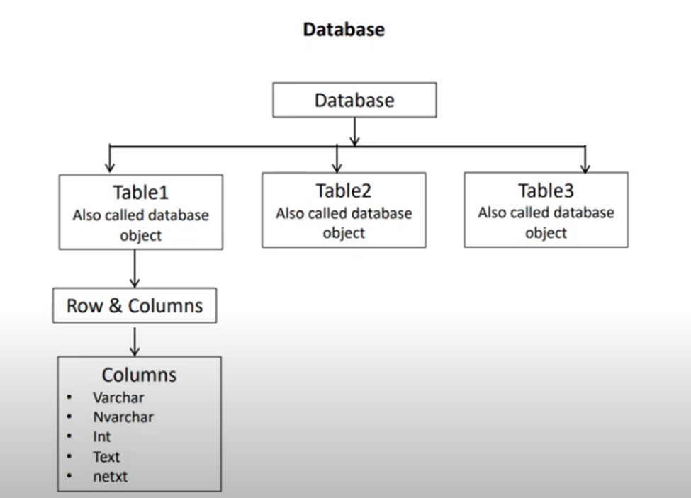

# 1. Sql Server Introduction
### What is database?
jaha aap info store kar sakte aur later on retreive bhi kar sakte. Sath sath manupulate bhi kar sakte.
### What is RDBMS?
multiple object mein relationship taiyyar kar sakte, aur data aap relationship ke sath access kar sakte.  
- SQl Server is RDBMS
- Sql server ki apni language hai i.e T-SQL


SQL Server Enterprize 
- large volume ke data ko handle karne ke liye use hota hia.  
- advanced analytics aur m/c learning ke liye use kiya jata hia

Sql server devloper 
 - aap production mein use nhi kar sakte

 

 Database Engine
  - db object ko store & execute bhi kar sakte ho
  - Transaction mgm ye bhi kaam hai iska

  

  Sql Server VSs writer 
   - db ko restore karna aur backup lena
# 2. Create alter and drop db

Database 
 - collection of data
 - structure form (table format mein)
 - table consist of row and column
 - db structure help karta hia info access karne ke liye 
 - aur data manipulate karne ke liye bhi


System db
 - na drop kiya ja sakta hia na rename

 
 ### Create db
 
 ### Drop db
 
 ### Rename db
 
 ### More specific rename command
 
 ### Microsoft UI ke via kaise db create kare
 

 
 
 
### U can add filegroup


### For delete or rename
  
### delete ke liye close existing connection.

# 3. Creating table in Sql


- Ek db ke andar aap multiple table rakh sakte ho
- basharte Table  name unique ho 
- table format consist of row and column
- Column define karte waqt aap datatype defined karte ho.. ki kis type ka data save honga.

#### char(n)  
 - char ki length apne define kari hai 10 charchter  & aapki value hai 5 character tab bhi memory mein 10 char lenga.
 #### varchar(n)
- variable character, apki length hai 100 and value hai 20 so sql server 80 spaces ko memory se remove kar denga.
#### Nchar aur char mein space diff hai 4000 & 8000 ka, reason is 1 byte / 2byte
- aap unicode character ie Non-ackii character like china/russsia language aap store kar skate ho
### bit
- boolean value ko store karene ke liye

RDBMS mein data table ke form mein store hota hai. 
which furthur bifurcate into row and column.  


### Show database & create db and use it

### Create table


### Table name must be unique. 1 db 1 unique table name.
### If you want to use reserve word as column name

### Solution

### Select statement

### DROP TABLE COMMAND

Physically data samet table remove ho gya apke db se.
### Error's

### Creating table

### Select query

### Alter the table

### Modify the table

#### Abhi city ki length hai 10

### DROP COLUMN

## AAP UI ke thorugh bhi table create kar skate ho


### Ab apko column ko edit karna hia via UI

#### dob ko hatana hia

after save it
# 4. Sql Constraint
constraint 
- something that limits you
- अवरोधकारी तत्‍व; प्रतिबंध; सीमित करने वाले नियंत्रण
#### Sql Constraint ye rules hote hai jo aapke data ko validate karte hai
- eg. har data collect karke joh table create karte hai to uska ek purpose hota hia..  
yadi usme 8th 9th standard ka data raha to galat ho javenga..  
 For this you need to create a rule such that your system only accept 12th standard data  
 This is called constraint
 - employee table mein wohi employee ka data chaiye jiske age 40 se kam ho.

  
 
 ### Remember Not Null ye space nahi hai.. dono diff hote hai
 ### Primary key aur unique key ka diff 
 - primary key mein null value allow nhi hoti 
 - unique key mein 1 null value allow
 ### Foreign key-
  - 2 table mein relationship create karte hai
### Check
- check mein aap rule bana sakte ho(emp > 40 ) ye rule bana sakte ho
### Defualt 
- mein aap initial value set kar sakte hai kisi bhi column ke liye.(column aapka not null hai)
### Table level
- hum multiple column par constraint create kar sakte hai
```sql
use MyDatabase;

-- 1) Not NULL
--   Ensures column cannot have null values

Create Table Test
(
	RollNo INT NOT NULL,
	NAme VARCHAR(100),
	Class Varchar(10)
)

-- janbhujkar roll no skip kiya
insert into Test(NAme,Class) Values ('King','12');

```
### ***Error***
```sql
Cannot insert the value NULL into column 'RollNo', table 'MyDatabase.dbo.Test'; column does not allow nulls. INSERT fails.
The statement has been terminated.
```
### Proper query
```sql
insert into Test(RollNo,NAme,Class) Values (1,'King','12');
```
### Yaha table structure mein dikh raha hia ki Rollno not null hai.

### Aap null jaha allow hai column skip kar sakte.
```sql
insert into Test(RollNo,Class) Values (1,'12');
Output:
No issue
```
## Same thing you achieve via UI


## Aisa table create karte jisme koyi constraint nhi
```sql
Create Table Test2
(
	RollNo INT ,
	NAme VARCHAR(100),
	Class Varchar(10)
)

insert into Test2(Name,Class) Values ('Adit','12');

select * from Test2;

Output:
NULL	Adit	12
```
### Ab yadi hume Test2 table ke RollNo col ko Not Null karna hai, 
 - table to create hue hai
 - usme 1 record bhi insert ho chuki hai
 ```sql
 insert into Test2(Name,Class) Values ('Adit','12');

select * from Test2;

alter table Test2
   alter column RollNo INT NOT NULL;
```
### Error
```sql
Cannot insert the value NULL into column 'RollNo', table 'MyDatabase.dbo.Test2'; column does not allow nulls. UPDATE fails.
```
#### Apne pehle hi record insert kiya hai joh null value le raha hia 
#### aur app abhi column ko modify kar rahe ho not null so problem denga
### Solution 1st data ko clear karo then query chalao
```sql
delete from Test2;

alter table Test2
   alter column RollNo INT NOT NULL;
```
### Unique constraint
```sql
-- Unique
--  All the values in the column must be unique.

Create Table TestUnique
(
	rollNo INT UNIQUE,
	name VARCHAR(100),
	class VARCHAR(10)
)

insert into TestUnique(rollNo,name,class) 
						values(1,'King',12);

select * from TestUnique;

Output:
1	King	12
```
### Ab yadi hum fhirse same insert query chalate hai tab.
```sql
insert into TestUnique(rollNo,name,class) 
						values(1,'King',12);
```
#### Error
```sql
Violation of UNIQUE KEY constraint 'UQ__TestUniq__FABBB772AE9DE7E1'. Cannot insert duplicate key in object 'dbo.TestUnique'. The duplicate key value is (1).
```

### Insert more values
```sql
insert into TestUnique(rollNo,name,class) 
						values(2,'King',12);

select * from TestUnique;
Output:
1	King	12
2	King	12

Name & class ye column unique nhi hai so duplicate value bhi ja sakta + null bhi.
```

### Apka table create ho chuka aur aapko unique constraint add karni hai-ya constrain name change karna hia
```sql
-- alter(K) table(K) tableName
          -- add(K) constraint(K) constraintName(USER_DEfined)  Unique(K)(columnName) 

alter table TestUnique
       add constraint UniqueRollNO UNIQUE(rollNo);
```

## Primary Key
```sql
-- Primary Key
     -- A primary key is the field which can uniquely identify each row in a table
	 -- Only 1 primary key is allwoed in a table.
	 -- You may have multiple unique key in a table.
	 -- Primary key does not allow any null value but unique key can allow NULL value.


-- Multiple primary key
create table DemoPK
(
	rollNo int Primary key,
	mobileNo int primary key,
	city varchar(100)
)
Error:
Cannot add multiple PRIMARY KEY constraints to table 'DemoPK'.
-----------------------------------------
-- Multiple unique key
create table DemoPK
(
	rollNo int Unique,
	mobileNo int Unique,
	city varchar(100)
)
Output:
Success table created.
------------------------------------
drop table DemoPK;
-- About null value
create table DemoPK
(
	rollNo int Primary key,
	mobileNo int Unique,
	city varchar(100)
)

-- Yaha humne rollNo jo primary key hai usse nhi liya..
-- yadi aap skip karte hai kisi col ko so null value usme dali jati hai
--     Yaha aisa kuch nahi
insert into DemoPK(mobileNo,city) 
                  values(44334,'LONDON');
Error:
Cannot insert the value NULL into column 'rollNo', table 'MyDatabase.dbo.DemoPK'; column does not allow nulls. INSERT fails.
---------------------------------------------------
-- Proper query
insert into DemoPK(rollno,mobileNo,city) 
                  values(1,44334,'LONDON');
Output:
Success record is inserted.
-------------------------------------------
-- regarding null value for unique key
insert into DemoPK(rollno,city) 
                  values(2,'New York');

select * from DemoPK;
Output:
1	44334	LONDON
2	NULL	New York

Observation:
Null is allowed in unique key but only once.

-- inserting again null value for unique key
insert into DemoPK(rollno,city) 
                  values(3,'Japan');
Error:
Violation of UNIQUE KEY constraint 'UQ__DemoPK__4D7970A8C39373BE'. Cannot insert duplicate key in object 'dbo.DemoPK'. 
The duplicate key value is (<NULL>).
----------------------------------------------

-- inserting non null value for unique key

insert into DemoPK(rollno,mobileNo,city) 
                  values(4,777,'Japan');

select * from DemoPK;

Output:
1	44334	LONDON
2	NULL	New York
4	777	     Japan
--------------------------------
-- inserting same non null value for unique key

insert into DemoPK(rollno,mobileNo,city) 
                  values(5,777,'Japan');

Error:
Violation of UNIQUE KEY constraint 'UQ__DemoPK__4D7970A8C39373BE'. Cannot insert duplicate key in object 'dbo.DemoPK'.
 The duplicate key value is (777).

Observation:
Unique contian unique elements only.
-----------------------------------
```
### Via UI- check in Design Mode

#### jab bhi aap table create karte hai UI se to yaha se add/remove kar sakte hai i.e PK


## Check Constraint
- We can specify a condition for a field,   
   which should be satisfied at the time of entering value for     
      particualr field.
```sql
-- Check Constraint
/*
We can specify a condition for a field, 
   which should be satisfied at the time of entering value for 
      particualr field.
*/
use MyDatabase;

-- Koyi bhi employee ki age 40 se jyada nhi honi chaiye.

create table DemoCheck
(
	rollNo int primary key,
	age int NOT NULL CHECK(age <= 40)
)

-- insert data
insert into DemoCheck(rollNo,age) 
                values(1,45);

```
 ### Error
 ```sql
 The INSERT statement conflicted with the CHECK constraint "CK__DemoCheck__age__59063A47". The conflict occurred in database "MyDatabase", table "dbo.DemoCheck", column 'age'.
 ```
 ```sql
 -- proper query 
insert into DemoCheck(rollNo,age) 
                values(1,35);
Ouput:
1 row affected

-- check it
select * from DemoCheck;
1	35

 ```
## Default constraint
- This constraint is used to define default value for the field.
```sql
-- Default Constraint
-- This constraint is used to define default value for the field.

use MyDatabase;

create table DemoDefault
(
  rollNo int Primary Key,
  age int NOT NULL Default 22,
  recordDate DateTime  Default GetDate()
)

insert into  DemoDefault(rollNo)
                 values (1);

select * from DemoDefault;
/*
Yaha aapne keval rollNo mention kiya hai baki ka    data toh diya bhi nahi.   Usne sabki default value utha li.
Output:
 1	22	2024-02-20 08:17:07.863
*/

-- par yadi aap value de rahe hai to default value ko skip kar denga.
insert into  DemoDefault(rollNo,age,recordDate)
                 values (2,34,'2020-02-20');

-- check
select * from DemoDefault;
/*
Output:
1	22	2024-02-20 08:17:07.863
2	34	2020-02-20 00:00:00.000
*/

```

## Foreign key Constraint
- 2 table mein relationship create karta hai.


### Advantage of Foreign key
- Aap manmaana koyi bhi rollNo StudentMarksFK mein enter nahi kar sakte, Yadi wo uske Master table ie StudentPK mein exist nahi karta ho to.
- Aap StudentPk table i.e master table se koyi bhi rollNo randomly delete nahi kar sakte, yadi uska data child table i.e StudentMarksFK mein existe karta ho.
- Aapko pehle child table se data delete karna honga then master table se.
- Ye concept se hamare data mein accuracy aa gayi. Jo data master table mein hai uske traces i.e data child table mein mil javenge..

```sql
-- Foreign key Constraint
/*
Foreign Key is a field in a table which uniquely identified each row in another table.
That is, this field points to primary key of another table.
This usually creates a kind of link between the tables.
Data type of both key must be same.
*/

use MyDatabase;

Create Table StudentPk
(
  RollNo Int Primary Key
)

Create Table StudentMarksFK
(
	RollNo Int,
	Term Varchar(100),
	Science Int,
	Math Int,
	Eng Int,
	Foreign Key (RollNo) References StudentPK(RollNo)
)

-- 2 tables are created

-- Sabse pehle hum StudentMarksFK Table mein data insert karte hai.
-- Rule kya bolta
--   yadi aapki primary key exist nahi karti StudentPK table mein
--  to aap StudentMarksFK table mein data insert nhi kar sakte.

Insert Into StudentMarksFK(RollNo,Term,Science,Math,Eng)
            Values(1,'Final',55,78,89);

/*
The INSERT statement conflicted with the FOREIGN KEY constraint 
"FK__StudentMa__RollN__60A75C0F". The conflict occurred in database 
"MyDatabase", table "dbo.StudentPk", column 'RollNo'.
*/
```
#### sabse pehle Master table mein data enter karna honga.
```sql

Insert Into StudentPk(RollNo)
               Values(1);
Insert Into StudentMarksFK(RollNo,Term,Science,Math,Eng)
            Values(1,'Final',55,78,89);

--Check data for both
Select * from StudentPk;
-- 1
Select * from StudentMarksFK;
-- 1	Final	55	78	89

-- again inserting data jo master table mein nhi hai..
Insert Into StudentMarksFK(RollNo,Term,Science,Math,Eng)
            Values(2,'Half Yearly',55,78,89);
/*
Error:
The INSERT statement conflicted with the FOREIGN KEY constraint 
"FK__StudentMa__RollN__60A75C0F". The conflict occurred in database "MyDatabase",
table "dbo.StudentPk", column 'RollNo'
*/

-- Correct query
Insert Into StudentPk(RollNo)
               Values(2);

Insert Into StudentMarksFK(RollNo,Term,Science,Math,Eng)
            Values(2,'Half Yearly',55,78,89);
--Check data for both
Select * from StudentPk;
-- 1
-- 2
Select * from StudentMarksFK;
-- 1	Final	55	78	89
-- 2	Half Yearly	55	78	89
```
```sql
-- let say hum StudenPK se data delete karte hai.
delete from StudentPk where RollNo=1;
/*
Error:
The DELETE statement conflicted with the REFERENCE constraint 
"FK__StudentMa__RollN__60A75C0F". The conflict occurred in database 
"MyDatabase", table "dbo.StudentMarksFK", column 'RollNo'.

Mane=
RollNo ka data aapka child table mein bhi hai
jab tak waha se delete nhi honga.. hum master table se delete nhi
kar sakte.
*/
-- Correct query
delete from StudentMarksFK where RollNo=1;

--Check data for both
Select * from StudentPk;
-- 1
-- 2
Select * from StudentMarksFK;
-- 2	Half Yearly	55	78	89

-- Ab aap aasani se master table ka data delete kar sakte.
-- kyuki child class mein uska fk trace exist nhi karta.
delete from StudentPk where RollNo=1;

--Check data for both
Select * from StudentMarksFK;
-- 2	Half Yearly	55	78	89

Select * from StudentPk;
-- 2
```
## Table level Constraint.
```sql
-- Table level Constraint
-- Constraint can be specified for the groups of columns as a part of table.

use MyDatabase;

-- hume rollNo aur moblie column ki sahayata se table ko unique banana hai

Create Table DemoTableLevel
(
  RollNo Int,
  MobileNo Int,
  City Varchar(100),
  Constraint Roll_Mobile_Unique Unique(RollNo,MobileNo)
)

-- ab apke table ka RollNo aur mobileNo ka combination hamesha unique honga

Insert into DemoTableLevel(RollNo,MobileNo,City)
                 Values(1,222,'London');

-- Check data
Select * from DemoTableLevel;
-- 1	222	London

-- ab yadi phir se same record insert karu to
Insert into DemoTableLevel(RollNo,MobileNo,City)
                 Values(1,222,'London');
/*Error
Violation of UNIQUE KEY constraint 'Roll_Mobile_Unique'. Cannot insert duplicate 
key in object 'dbo.DemoTableLevel'. The duplicate key value is (1, 222).

Mane:
Jo combination ki value hai wo duplicate hai.
*/

-- Another query
Insert into DemoTableLevel(RollNo,MobileNo,City)
                 Values(2,222,'London');

-- Check data
Select * from DemoTableLevel;
-- 1	222	London
-- 2	222	London

--Observation:
--Roll No change kiya but mobile no same hai.. chal javenga.
--Combination must be unique

--Another query
Insert into DemoTableLevel(RollNo,MobileNo,City)
                 Values(2,333,'London');

-- Check data
Select * from DemoTableLevel;
-- 1	222	London
-- 2	222	London
-- 2	333	London

--Observation:
--Combination is unique.
```
# 5. Sql Identity column


