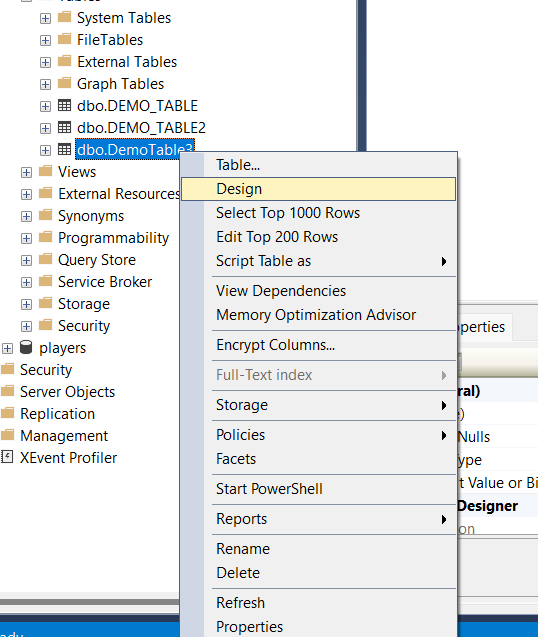
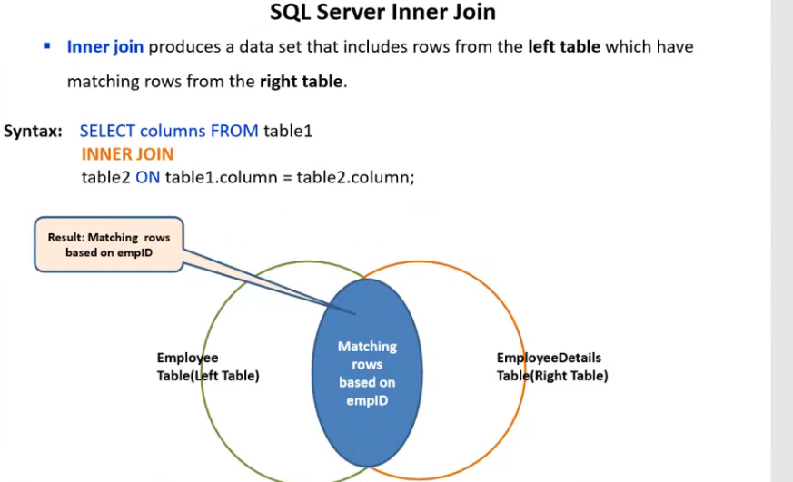
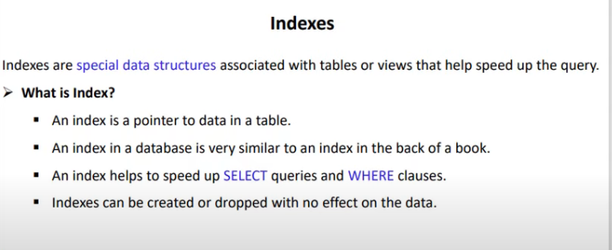
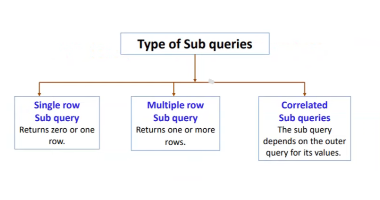
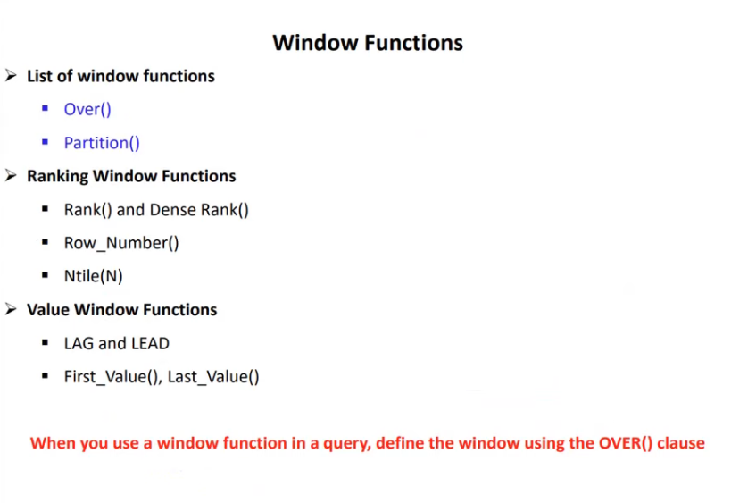
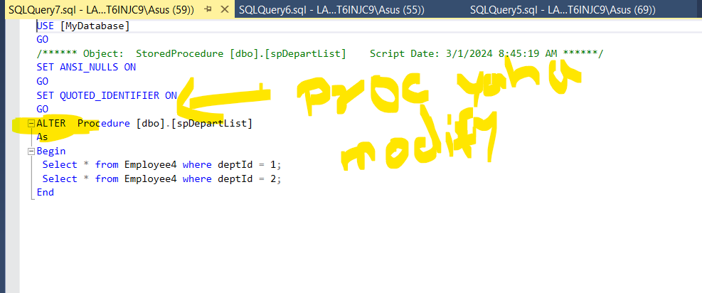

# 1. Sql Server Introduction
### What is database?
jaha aap info store kar sakte aur later on retreive bhi kar sakte. Sath sath manupulate bhi kar sakte.
### What is RDBMS?
multiple object mein relationship taiyyar kar sakte, aur data aap relationship ke sath access kar sakte.  
- SQl Server is RDBMS
- Sql server ki apni language hai i.e T-SQL


SQL Server Enterprize 
- large volume ke data ko handle karne ke liye use hota hia.  
- advanced analytics aur m/c learning ke liye use kiya jata hia

Sql server devloper 
 - aap production mein use nhi kar sakte

 

 Database Engine
  - db object ko store & execute bhi kar sakte ho
  - Transaction mgm ye bhi kaam hai iska

  

  Sql Server VSs writer 
   - db ko restore karna aur backup lena
# 2. Create alter and drop db

Database 
 - collection of data
 - structure form (table format mein)
 - table consist of row and column
 - db structure help karta hia info access karne ke liye 
 - aur data manipulate karne ke liye bhi


System db
 - na drop kiya ja sakta hia na rename

 
 ### Create db
 
 ### Drop db
 
 ### Rename db
 
 ### More specific rename command
 
 ### Microsoft UI ke via kaise db create kare
 

 
 
 
### U can add filegroup


### For delete or rename
  
### delete ke liye close existing connection.

# 3. Creating table in Sql


- Ek db ke andar aap multiple table rakh sakte ho
- basharte Table  name unique ho 
- table format consist of row and column
- Column define karte waqt aap datatype defined karte ho.. ki kis type ka data save honga.

#### char(n)  
 - char ki length apne define kari hai 10 charchter  & aapki value hai 5 character tab bhi memory mein 10 char lenga.
 #### varchar(n)
- variable character, apki length hai 100 and value hai 20 so sql server 80 spaces ko memory se remove kar denga.
#### Nchar aur char mein space diff hai 4000 & 8000 ka, reason is 1 byte / 2byte
- aap unicode character ie Non-ackii character like china/russsia language aap store kar skate ho
### bit
- boolean value ko store karene ke liye

RDBMS mein data table ke form mein store hota hai. 
which furthur bifurcate into row and column.  


### Show database & create db and use it

### Create table


### Table name must be unique. 1 db 1 unique table name.
### If you want to use reserve word as column name

### Solution

### Select statement

### DROP TABLE COMMAND

Physically data samet table remove ho gya apke db se.
### Error's

### Creating table

### Select query

### Alter the table

### Modify the table

#### Abhi city ki length hai 10

### DROP COLUMN

## AAP UI ke thorugh bhi table create kar skate ho


### Ab apko column ko edit karna hia via UI

#### dob ko hatana hia

after save it
# 4. Sql Constraint
constraint 
- something that limits you
- अवरोधकारी तत्‍व; प्रतिबंध; सीमित करने वाले नियंत्रण
#### Sql Constraint ye rules hote hai jo aapke data ko validate karte hai
- eg. har data collect karke joh table create karte hai to uska ek purpose hota hia..  
yadi usme 8th 9th standard ka data raha to galat ho javenga..  
 For this you need to create a rule such that your system only accept 12th standard data  
 This is called constraint
 - employee table mein wohi employee ka data chaiye jiske age 40 se kam ho.

  
 
 ### Remember Not Null ye space nahi hai.. dono diff hote hai
 ### Primary key aur unique key ka diff 
 - primary key mein null value allow nhi hoti 
 - unique key mein 1 null value allow
 ### Foreign key-
  - 2 table mein relationship create karte hai
### Check
- check mein aap rule bana sakte ho(emp > 40 ) ye rule bana sakte ho
### Defualt 
- mein aap initial value set kar sakte hai kisi bhi column ke liye.(column aapka not null hai)
### Table level
- hum multiple column par constraint create kar sakte hai
```sql
use MyDatabase;

-- 1) Not NULL
--   Ensures column cannot have null values

Create Table Test
(
	RollNo INT NOT NULL,
	NAme VARCHAR(100),
	Class Varchar(10)
)

-- janbhujkar roll no skip kiya
insert into Test(NAme,Class) Values ('King','12');

```
### ***Error***
```sql
Cannot insert the value NULL into column 'RollNo', table 'MyDatabase.dbo.Test'; column does not allow nulls. INSERT fails.
The statement has been terminated.
```
### Proper query
```sql
insert into Test(RollNo,NAme,Class) Values (1,'King','12');
```
### Yaha table structure mein dikh raha hia ki Rollno not null hai.

### Aap null jaha allow hai column skip kar sakte.
```sql
insert into Test(RollNo,Class) Values (1,'12');
Output:
No issue
```
## Same thing you achieve via UI


## Aisa table create karte jisme koyi constraint nhi
```sql
Create Table Test2
(
	RollNo INT ,
	NAme VARCHAR(100),
	Class Varchar(10)
)

insert into Test2(Name,Class) Values ('Adit','12');

select * from Test2;

Output:
NULL	Adit	12
```
### Ab yadi hume Test2 table ke RollNo col ko Not Null karna hai, 
 - table to create hue hai
 - usme 1 record bhi insert ho chuki hai
 ```sql
 insert into Test2(Name,Class) Values ('Adit','12');

select * from Test2;

alter table Test2
   alter column RollNo INT NOT NULL;
```
### Error
```sql
Cannot insert the value NULL into column 'RollNo', table 'MyDatabase.dbo.Test2'; column does not allow nulls. UPDATE fails.
```
#### Apne pehle hi record insert kiya hai joh null value le raha hia 
#### aur app abhi column ko modify kar rahe ho not null so problem denga
### Solution 1st data ko clear karo then query chalao
```sql
delete from Test2;

alter table Test2
   alter column RollNo INT NOT NULL;
```
### Unique constraint
```sql
-- Unique
--  All the values in the column must be unique.

Create Table TestUnique
(
	rollNo INT UNIQUE,
	name VARCHAR(100),
	class VARCHAR(10)
)

insert into TestUnique(rollNo,name,class) 
						values(1,'King',12);

select * from TestUnique;

Output:
1	King	12
```
### Ab yadi hum fhirse same insert query chalate hai tab.
```sql
insert into TestUnique(rollNo,name,class) 
						values(1,'King',12);
```
#### Error
```sql
Violation of UNIQUE KEY constraint 'UQ__TestUniq__FABBB772AE9DE7E1'. Cannot insert duplicate key in object 'dbo.TestUnique'. The duplicate key value is (1).
```

### Insert more values
```sql
insert into TestUnique(rollNo,name,class) 
						values(2,'King',12);

select * from TestUnique;
Output:
1	King	12
2	King	12

Name & class ye column unique nhi hai so duplicate value bhi ja sakta + null bhi.
```

### Apka table create ho chuka aur aapko unique constraint add karni hai-ya constrain name change karna hia
```sql
-- alter(K) table(K) tableName
          -- add(K) constraint(K) constraintName(USER_DEfined)  Unique(K)(columnName) 

alter table TestUnique
       add constraint UniqueRollNO UNIQUE(rollNo);
```

## Primary Key
```sql
-- Primary Key
     -- A primary key is the field which can uniquely identify each row in a table
	 -- Only 1 primary key is allwoed in a table.
	 -- You may have multiple unique key in a table.
	 -- Primary key does not allow any null value but unique key can allow NULL value.


-- Multiple primary key
create table DemoPK
(
	rollNo int Primary key,
	mobileNo int primary key,
	city varchar(100)
)
Error:
Cannot add multiple PRIMARY KEY constraints to table 'DemoPK'.
-----------------------------------------
-- Multiple unique key
create table DemoPK
(
	rollNo int Unique,
	mobileNo int Unique,
	city varchar(100)
)
Output:
Success table created.
------------------------------------
drop table DemoPK;
-- About null value
create table DemoPK
(
	rollNo int Primary key,
	mobileNo int Unique,
	city varchar(100)
)

-- Yaha humne rollNo jo primary key hai usse nhi liya..
-- yadi aap skip karte hai kisi col ko so null value usme dali jati hai
--     Yaha aisa kuch nahi
insert into DemoPK(mobileNo,city) 
                  values(44334,'LONDON');
Error:
Cannot insert the value NULL into column 'rollNo', table 'MyDatabase.dbo.DemoPK'; column does not allow nulls. INSERT fails.
---------------------------------------------------
-- Proper query
insert into DemoPK(rollno,mobileNo,city) 
                  values(1,44334,'LONDON');
Output:
Success record is inserted.
-------------------------------------------
-- regarding null value for unique key
insert into DemoPK(rollno,city) 
                  values(2,'New York');

select * from DemoPK;
Output:
1	44334	LONDON
2	NULL	New York

Observation:
Null is allowed in unique key but only once.

-- inserting again null value for unique key
insert into DemoPK(rollno,city) 
                  values(3,'Japan');
Error:
Violation of UNIQUE KEY constraint 'UQ__DemoPK__4D7970A8C39373BE'. Cannot insert duplicate key in object 'dbo.DemoPK'. 
The duplicate key value is (<NULL>).
----------------------------------------------

-- inserting non null value for unique key

insert into DemoPK(rollno,mobileNo,city) 
                  values(4,777,'Japan');

select * from DemoPK;

Output:
1	44334	LONDON
2	NULL	New York
4	777	     Japan
--------------------------------
-- inserting same non null value for unique key

insert into DemoPK(rollno,mobileNo,city) 
                  values(5,777,'Japan');

Error:
Violation of UNIQUE KEY constraint 'UQ__DemoPK__4D7970A8C39373BE'. Cannot insert duplicate key in object 'dbo.DemoPK'.
 The duplicate key value is (777).

Observation:
Unique contian unique elements only.
-----------------------------------
```
### Via UI- check in Design Mode

#### jab bhi aap table create karte hai UI se to yaha se add/remove kar sakte hai i.e PK


## Check Constraint
- We can specify a condition for a field,   
   which should be satisfied at the time of entering value for     
      particualr field.
```sql
-- Check Constraint
/*
We can specify a condition for a field, 
   which should be satisfied at the time of entering value for 
      particualr field.
*/
use MyDatabase;

-- Koyi bhi employee ki age 40 se jyada nhi honi chaiye.

create table DemoCheck
(
	rollNo int primary key,
	age int NOT NULL CHECK(age <= 40)
)

-- insert data
insert into DemoCheck(rollNo,age) 
                values(1,45);

```
 ### Error
 ```sql
 The INSERT statement conflicted with the CHECK constraint "CK__DemoCheck__age__59063A47". The conflict occurred in database "MyDatabase", table "dbo.DemoCheck", column 'age'.
 ```
 ```sql
 -- proper query 
insert into DemoCheck(rollNo,age) 
                values(1,35);
Ouput:
1 row affected

-- check it
select * from DemoCheck;
1	35

 ```
## Default constraint
- This constraint is used to define default value for the field.
```sql
-- Default Constraint
-- This constraint is used to define default value for the field.

use MyDatabase;

create table DemoDefault
(
  rollNo int Primary Key,
  age int NOT NULL Default 22,
  recordDate DateTime  Default GetDate()
)

insert into  DemoDefault(rollNo)
                 values (1);

select * from DemoDefault;
/*
Yaha aapne keval rollNo mention kiya hai baki ka    data toh diya bhi nahi.   Usne sabki default value utha li.
Output:
 1	22	2024-02-20 08:17:07.863
*/

-- par yadi aap value de rahe hai to default value ko skip kar denga.
insert into  DemoDefault(rollNo,age,recordDate)
                 values (2,34,'2020-02-20');

-- check
select * from DemoDefault;
/*
Output:
1	22	2024-02-20 08:17:07.863
2	34	2020-02-20 00:00:00.000
*/

```

## Foreign key Constraint
- 2 table mein relationship create karta hai.


### Advantage of Foreign key
- Aap manmaana koyi bhi rollNo StudentMarksFK mein enter nahi kar sakte, Yadi wo uske Master table ie StudentPK mein exist nahi karta ho to.
- Aap StudentPk table i.e master table se koyi bhi rollNo randomly delete nahi kar sakte, yadi uska data child table i.e StudentMarksFK mein existe karta ho.
- Aapko pehle child table se data delete karna honga then master table se.
- Ye concept se hamare data mein accuracy aa gayi. Jo data master table mein hai uske traces i.e data child table mein mil javenge..

```sql
-- Foreign key Constraint
/*
Foreign Key is a field in a table which uniquely identified each row in another table.
That is, this field points to primary key of another table.
This usually creates a kind of link between the tables.
Data type of both key must be same.
*/

use MyDatabase;

Create Table StudentPk
(
  RollNo Int Primary Key
)

Create Table StudentMarksFK
(
	RollNo Int,
	Term Varchar(100),
	Science Int,
	Math Int,
	Eng Int,
	Foreign Key (RollNo) References StudentPK(RollNo)
)

-- 2 tables are created

-- Sabse pehle hum StudentMarksFK Table mein data insert karte hai.
-- Rule kya bolta
--   yadi aapki primary key exist nahi karti StudentPK table mein
--  to aap StudentMarksFK table mein data insert nhi kar sakte.

Insert Into StudentMarksFK(RollNo,Term,Science,Math,Eng)
            Values(1,'Final',55,78,89);

/*
The INSERT statement conflicted with the FOREIGN KEY constraint 
"FK__StudentMa__RollN__60A75C0F". The conflict occurred in database 
"MyDatabase", table "dbo.StudentPk", column 'RollNo'.
*/
```
#### sabse pehle Master table mein data enter karna honga.
```sql

Insert Into StudentPk(RollNo)
               Values(1);
Insert Into StudentMarksFK(RollNo,Term,Science,Math,Eng)
            Values(1,'Final',55,78,89);

--Check data for both
Select * from StudentPk;
-- 1
Select * from StudentMarksFK;
-- 1	Final	55	78	89

-- again inserting data jo master table mein nhi hai..
Insert Into StudentMarksFK(RollNo,Term,Science,Math,Eng)
            Values(2,'Half Yearly',55,78,89);
/*
Error:
The INSERT statement conflicted with the FOREIGN KEY constraint 
"FK__StudentMa__RollN__60A75C0F". The conflict occurred in database "MyDatabase",
table "dbo.StudentPk", column 'RollNo'
*/

-- Correct query
Insert Into StudentPk(RollNo)
               Values(2);

Insert Into StudentMarksFK(RollNo,Term,Science,Math,Eng)
            Values(2,'Half Yearly',55,78,89);
--Check data for both
Select * from StudentPk;
-- 1
-- 2
Select * from StudentMarksFK;
-- 1	Final	55	78	89
-- 2	Half Yearly	55	78	89
```
```sql
-- let say hum StudenPK se data delete karte hai.
delete from StudentPk where RollNo=1;
/*
Error:
The DELETE statement conflicted with the REFERENCE constraint 
"FK__StudentMa__RollN__60A75C0F". The conflict occurred in database 
"MyDatabase", table "dbo.StudentMarksFK", column 'RollNo'.

Mane=
RollNo ka data aapka child table mein bhi hai
jab tak waha se delete nhi honga.. hum master table se delete nhi
kar sakte.
*/
-- Correct query
delete from StudentMarksFK where RollNo=1;

--Check data for both
Select * from StudentPk;
-- 1
-- 2
Select * from StudentMarksFK;
-- 2	Half Yearly	55	78	89

-- Ab aap aasani se master table ka data delete kar sakte.
-- kyuki child class mein uska fk trace exist nhi karta.
delete from StudentPk where RollNo=1;

--Check data for both
Select * from StudentMarksFK;
-- 2	Half Yearly	55	78	89

Select * from StudentPk;
-- 2
```
## Table level Constraint.
```sql
-- Table level Constraint
-- Constraint can be specified for the groups of columns as a part of table.

use MyDatabase;

-- hume rollNo aur moblie column ki sahayata se table ko unique banana hai

Create Table DemoTableLevel
(
  RollNo Int,
  MobileNo Int,
  City Varchar(100),
  Constraint Roll_Mobile_Unique Unique(RollNo,MobileNo)
)

-- ab apke table ka RollNo aur mobileNo ka combination hamesha unique honga

Insert into DemoTableLevel(RollNo,MobileNo,City)
                 Values(1,222,'London');

-- Check data
Select * from DemoTableLevel;
-- 1	222	London

-- ab yadi phir se same record insert karu to
Insert into DemoTableLevel(RollNo,MobileNo,City)
                 Values(1,222,'London');
/*Error
Violation of UNIQUE KEY constraint 'Roll_Mobile_Unique'. Cannot insert duplicate 
key in object 'dbo.DemoTableLevel'. The duplicate key value is (1, 222).

Mane:
Jo combination ki value hai wo duplicate hai.
*/

-- Another query
Insert into DemoTableLevel(RollNo,MobileNo,City)
                 Values(2,222,'London');

-- Check data
Select * from DemoTableLevel;
-- 1	222	London
-- 2	222	London

--Observation:
--Roll No change kiya but mobile no same hai.. chal javenga.
--Combination must be unique

--Another query
Insert into DemoTableLevel(RollNo,MobileNo,City)
                 Values(2,333,'London');

-- Check data
Select * from DemoTableLevel;
-- 1	222	London
-- 2	222	London
-- 2	333	London

--Observation:
--Combination is unique.
```
# 5. Sql Identity column


```sql
use MyDatabase;

-- How to create Identity column

Create Table Test1
(
-- Primary key= unique and not null
	ID Int Primary Key,
	FNAME Varchar(100)
)

--Insert Data
Insert into Test1 Values(1,'John');

-- Check
Select * from Test1;
--1	John

--Problem kya hai
-- 1)Humko insert karte waqt last Unique ID kya tha wo yaad rakhna padenga
--    Hume Tile add karna hai humne aise query likhe.
Insert into Test1 Values(1,'Tile');
/*
Error:
Violation of PRIMARY KEY constraint 'PK__Test1__3214EC2797C07F83'.
Cannot insert duplicate key in object 'dbo.Test1'. The duplicate key value is (1).
*/

-- 2) Problem
--     yadi humne random number likh diya
Insert into Test1 Values(19,'Tile');
-- Check
Select * from Test1;
--1	    John
--19	Tile
--     To yaha data to insert ho gya, but unique value sequence mein nhi hai.
--  So mujko yadi data ko sequentially enter karna hia.. To last value yadd
--     rakhna honga.

Drop Table Test1;
```
### Solution is go for Identity column
#### via UI


#### So aap increment aur seed yaha se bhi specify kar sakte hai.
```sql
-- Create via DDL statement
Create Table Test1
(
--Identity(seed value,Increment)
	ID Int Identity(1,1),
	FNAME Varchar(100)
)

-- Rule no 1.
--   Identity column ke andar value aap explicitly insert nahi kar sakte
--    If i try this command
Insert into Test1 Values(1,'John');
/*
Error:
An explicit value for the identity column in table 'Test1' can only be specified 
when a column list is used and IDENTITY_INSERT is ON.

Identity column ke andar aap value explicitly insert nahi kar sakte
kyuki  isko system generate karta hai.
*/

-- so our correct query is
Insert into Test1 Values('John');
Insert into Test1 Values('King');
Insert into Test1 Values('Miler');

-- Check
Select * from Test1;
--1	    John
--2  	King
--3	    Miler

-- Observation
--  Data is generated in sequence 
--    aur id ki value bhi unique hai
```
### Suppose i delete the data
```sql
Delete Test1 where id=2;

-- Check
Select * from Test1;
--1	    John
--3	    Miler

-- Ab yadi mein record insert karta hu
Insert into Test1 Values('King');

-- Check
Select * from Test1;
--1	    John
--4	    King
--3	    Miler

-- Observation:
--  Ab ki baar King to add hua but id =4 par

-- Yadi hum 2 par insert karna chahe to
Insert into Test1(ID,FNAME) Values(2,'King');

-- Error:
--   Cannot insert explicit value for identity column in table 'Test1'
     --  when IDENTITY_INSERT is set to OFF.\
	 --       IDENTITY_INSERT abhi off hai boss.

-- Id  Insert karna hi hai

-- Set IDENTITY_INSERT Table_Name ON
Set IDENTITY_INSERT Test1 ON

Insert into Test1(ID,FNAME) Values(2,'King');

-- Check
Select * from Test1;
--1	    John
--4	    King
--3	    Miler
--2		King

-- Is tarh se Identity column ke andar value ko Explicitly insert kar sakte.

-- Abhi hum yadi query chalaye.
Insert into Test1 Values('Aditya');
/*
Error:
Explicit value must be specified for identity column in table 'Test1' either when 
IDENTITY_INSERT is set to ON or when a replication user is inserting into a 
    NOT FOR REPLICATION identity column.

Why?
kyuki IDENTITY_INSERT is set to ON hai.
*/

-- Make it off
Set IDENTITY_INSERT Test1 OFF

Insert into Test1 Values('Aditya');


-- Check
Select * from Test1;
--1	    John
--4	    King
--3	    Miler
--2		King
--5		Aditya
```
### How to reset Identity column
```sql
-- How to reset Identity column
   -- Yane starting value ko reset kaise kare.

-- Check
Select * from Test1;
--1	    John
--4	    King
--3	    Miler
--2		King
--5		Aditya

-- Ye hamara existing record hai 
    -- ab hume iske aage ka next record 10 se insert karna hia

 -- ab yadi hum query chalaye
 Insert into Test1 Values('Abhi');

 -- Check
Select * from Test1;
--1	    John
--4	    King
--3	    Miler
--2		King
--5		Aditya
--6		Abhi

 -- Observation
      -- next sequence row mein insert ho raha hia.

-- hum chahte hai iske baad direct 10th row se insert ho
DBCC CheckIdent(Test1,RESEED,10);

 Insert into Test1 Values('King-2');
  Insert into Test1 Values('King-3');

-- Check
Select * from Test1;
--1	    John
--4	    King
--3	    Miler
--2		King
--5		Aditya
--6		Abhi
--11	King-2
--12	King-3

-- Observation:
   -- Aap kisi bhi state se Identity reset kar sakte.
```
### How to get last inserted identity value

- ye ek system function hai jo last identity ko retrun karta hia.
- current session mein kayi sare scope hai, sabme procedure hai. Usme se kisi mein latest identity update hue hai. Ye function wo value return karenga.
```sql
/*
	How to get last inserted identity value
	 - @@identity
	 - Scope_identy
	 - Idnt_current
*/

Drop Table test1;
Drop Table test2;
Drop Table test3;

--Hum 3 naye table create karte hai
Create Table Test1
(
	ID Int Identity(1,1),
	FNAME Varchar(100)
)
Create Table Test2
(
	ID Int Identity(200,1),
	FNAME Varchar(100)
)
Create Table Test3
(
	ID Int Identity(300,1),
	FNAME Varchar(100)
)

-- ab data insert karte hai
Insert Into Test1 Values('T1');
Insert Into Test2 Values('T2');
Insert Into Test3 Values('T3');

Select @@IDENTITY 
-- 300

-- Ye latest value apki insert hue hai Test3 table mein so it return that..

-- ab yadi hum iska sequence change karde
Insert Into Test1 Values('T1');
Insert Into Test3 Values('T3')
Insert Into Test2 Values('T2');

Select @@IDENTITY 
-- 201

-- Observation :  Ab ye table 2 ki identity value provide kar raha hia.


Insert Into Test3 Values('T3')
Insert Into Test2 Values('T2');
Insert Into Test1 Values('T1');

Select @@IDENTITY 
-- 4

-- Observatation: table 1 ki latest identity value provide kar riya hai.
```
### Some more things.
```sql
--Create Procedure

Create Proc p1
As
Begin
    Insert Into Test1 Values('T1');
End

Create Proc p2
As
Begin
    Insert Into Test2 Values('T2');
End

-- Procedure 1 ka scope diff hai than procedure 2 
     -- so hum Procedure 1 mein ki value proc 2 mein use nhi kar sakte.

-- Now Execute Procedures.
EXEC p1;
EXEC p2;

Select @@IDENTITY;
-- 203

-- Yaha Proc2 mein table2 i.e Test2 ka latest identity value diya.

-- If i change the execution sequence
EXEC p2;
EXEC p1;

Select @@IDENTITY;
-- 6

-- kisi bhi scope mein ho yaha fark nahi pad raha hai.
```
### Par ha ye current session ke liye hi honga. If you open another window then that is another session.

## Scope_identity

```sql
Delete from Test1;
Delete from Test2;

-- abhi data check kiya sara blank hai
Select * from Test1;
Select * from Test2;

-- procedure create kari
Create Proc p1
As
Begin
    Insert Into Test1 Values('T1');
End

Create Proc p2
As
Begin
    Insert Into Test2 Values('T2');
End

-- ab data insert karte aur sath hi procedure execute kartea

-- ye insert kiya hua value abhi default scope mein hai.
Insert Into Test1 Values('T1');
EXEC p2;
EXEC p1;

-- check data
Select * from Test1;
--7		T1
--8		T1

Select * from Test2;
--205	 T2

Select Scope_Identity();
-- 7
    -- ye default scope ki identity de raha hai.
	   -- current scope mein jo last value generate hue hai usko ye fetch karta.


-- Yaha aap kis sequence mein data insert kar rahe hai ye matter nhi karta.
EXEC p2;
Insert Into Test1 Values('T1');
EXEC p1;

-- check data
Select * from Test1;
--7		T1
--8		T1
--9		T1
--10	T1

Select * from Test2;
--205	 T2
--206	T2

Select SCOPE_IDENTITY();
-- 9
     -- default scope ne jo value enter hue regardless of sequence of execution wo aayi.
```
### Ident_current

- koyi bhi connection ho, aur koyi bhi scope iske liye matter nhi karta.
- jo table name aapne supply kiya hia.. uski last identity value ko ye fetch karke de deta.
```sql
EXEC p2;
Insert Into Test1 Values('T1');
EXEC p1;

-- check data
Select * from Test1;
--7		T1
--8		T1
--9		T1
--10	T1
--11	T1
--12	T1

Select * from Test2;
--205	T2
--206	T2
--207	T2

Select IDENT_CURRENT('Test1');
-- 12
  -- isme aapka koyi bhi sequence ho, ya koyi connection ho
      -- koyi matter nahi karta
	   -- ye latest identity for particular table provide karta hai.

	   
Select IDENT_CURRENT('Test2');
--207
```
# 6. Super Key, Candidate key,Composite, Unique etc

### Super key
- attribute kahe to column in a table
- aise single / multiple / combination of attributes mila kar ke yadi kisi row ko hum uniquely identifies kar sake to i.e super key 


- hum id se uniquely identify kar sakte row ko, so this is super key
- hum id aur name ko combine kar le, so super key ban javenga.
- id + gender; id + city; yane hum single attribute ya multiple attribute combine kar ke yadi row ko uniquely identify kar sake to i.e super  key.
### Candidate key
- ye table ke andar single ho sakti ya multiple
- koyi bhi attribute(field or column name) candidate key ho sakta hia
- make sure column ke andar value unique ho


- ye table mein bcaz of duplicacy koyi candidate key nahi hai.


### Primary key
- unique value ko maintain karta hia column ke andar
- null value are not allowed
- 1 primary key for 1 entire table


- aap usko primary bana sakte jo unique ho entire table mein aur usme null na ho
- yaha empid primary key liya
- so remaining unique key is alternate candidate keys or alternate key kehlati.
### Unique key
- unique value ko maintain karta
- ek table mein multiple unique key ho sakta hai
- 1 null value is allowed in a column


- jo green color mein hai wo sare unique key hai
### Composite key
- kabhi kbahi table ke andar composite key ki jarurat padti hai
- kisi table ke data ko uniquely identify karne ke liye composite key hota hai
- contians 2 or more column jo uniquely identify kare row ko


- ksis bhi teacher ki id aur qualification id combinely duplicate enter nahi hona chaiye.
### Foreign key
- 2 ya 2 se jayda table mein relationship create karta hai.
- master-details or parent- child relationship kehte hai.
- foreign key ka purpose data integrity ko maintain karne ke liye hota hai.


- dono table independent hai
- ab mujhe query fire karni hai(dono table se data lekar anna hai- but yaha koyi relationship nahi hia.)


- yaha relationship create hua hai
- foreign key apka duplicate ho sakta hia
- primary key ek hi honga entire table ke liye.
# 7. Temprary table in sql server.
- ye table aap create karte hai, fhir uspar aap processing karte hai; tatpashat aapka task khatam ho jata hai
- so aap connection ko close karte hai, aur aapke sare temprary table drop ho jate hai.


#### Local Table
- Yadi particular session mein table create kiye. toh usi session mein appko access ho sakti hai wo table.
- ek baar session close then table drop automatically.
- use # to create table.
#### Global table
- ek baar table create hue kisi bhi session mein, aap multiple session mein bhi table acess kar sakte 
- read dig


- faster than permanant table.
- agar apke pass kisi table ke rights nahi hai. So aap uska temprary table create karke, usko manipulate kar sakte.
- aap chahte ho ki apka data kisi ko visible na ho us case mein bhi aap temprary table create kar sakte.
```sql
use MyDatabase;

/*
	Local Temprary table

	For creating temp use # as prefix
	It is created in tempDb

	2 tarike se create kar sakte aap local temp table
	  - Select Into and
	  - create table statements
*/

Create table Student_Marks
(
	RollNo Int Identity(1,1),
	Science Int,
	Math Int,
	Eng Int
)

Insert into Student_Marks Values(34,78,54);
Insert into Student_Marks Values(78,43,87);
Insert into Student_Marks Values(45,32,78);
Insert into Student_Marks Values(36,78,32);
Insert into Student_Marks Values(12,22,67);
Insert into Student_Marks Values(21,65,43);
Insert into Student_Marks Values(34,78,54);
Insert into Student_Marks Values(89,78,54);
Insert into Student_Marks Values(76,78,54);
Insert into Student_Marks Values(22,56,54);

select * from Student_Marks;

-- Ab suppose hume ek temprary table create karni hai iss table se

-- select * into  tempTableName from tableName
     -- apne * diya for all column
	  -- particular column bhi provide kar sakte.
Select * Into #localTemp from Student_Marks;
```
### Humko localTemp temprary table kaha dikhenga?

### furthur more..
```sql
-- Ab yadi hum ispar select statement chalate hai 
select * from #localTemp;
/*
Output:
RNo Sc  Mat Eng
1	34	78	54
2	78	43	87
3	45	32	78
4	36	78	32
5	12	22	67
6	21	65	43
7	34	78	54
8	89	78	54
9	76	78	54
10	22	56	54
*/

-- Observation: Temprary table mein sara data aa gya 
```
### Ab yadi ek aur session create karke hum ye same command chalate hai tab

#### Remember : aapka local temprary object wahi mane ussi session mein access honga jaha create hua hai. dusre session mein nhi
#### Ab yadi hum current session mein- jaha localtemp ka object create hai waha se data delete karta hu.
```sql
delete from #localTemp where RollNo=1;

--check
select * from #localTemp;
/*
Output:
RNo Sc  Mat Eng
2	78	43	87
3	45	32	78
4	36	78	32
5	12	22	67
6	21	65	43
7	34	78	54
8	89	78	54
9	76	78	54
10	22	56	54
*/

-- Check original table
select * from Student_Marks;
/*
Output:
RNo Sc  Mat Eng
1	34	78	54
2	78	43	87
3	45	32	78
4	36	78	32
5	12	22	67
6	21	65	43
7	34	78	54
8	89	78	54
9	76	78	54
10	22	56	54
*/

-- Observation :  There is no impact on original table, 
           -- yaha RollNo 1 exist kar raha hai
		     -- jab we deleted RollNo=1 from temprary table.
-- There will be no impact on original table.
```
### Aapka table drop kab honga.
1. jab aap connection/session close kar de.
2. drop table #localTemp i.e Temprary_tableName;
### Create temprary table directly
```sql
use MyDatabase;

--Create  temprary table directly
Create table #TempStudent
(
	RollNo Int,
	City Varchar(100)
)

-- Insert data
Insert into #TempStudent(RollNo,City) Values(1,'London');

--Check data
Select * from #TempStudent;
/*
Output:
RNo  City
1	London
*/

```

### Drop this table via direct command
Drop Table #TempStudent;
- table drop
### How to create global Temprary table.
```sql
use MyDatabase;

--Create  Global Temprary Table
Create table ##GlobalTempStudent
(
	RollNo Int,
	City Varchar(100)
)
```

```sql
-- Insert data
Insert into ##GlobalTempStudent(RollNo,City) Values(1,'Delhi');
Insert into ##GlobalTempStudent(RollNo,City) Values(2,'London');
Insert into ##GlobalTempStudent(RollNo,City) Values(3,'London');

--Check data
Select * from ##GlobalTempStudent;
/*
Output:
RNo  City
1	Delhi
2	London
3	London
*/
```
### Hamara global temp table kisi bhi session/connection mein access ho jata hai.

### Drop kab honga
- sabhi connection close ho jaye.Jo isse use kar rahe hai to automatic GlobalTempTable drop ho javenga.
- Manually drop bhi kar sakte like local temp table.
# 8. Sql Select Statement with Comparison operator


- db se data ko fetch karne ke liye select statement use karte
```sql
/*
Select Statement
   - Specific row
   - all row
   - Top n row
   - Top n% of row
   - Distinct row
*/
Use MyDatabase;

Create Table Employee
(
	empId Int,
	empName Varchar(50),
	dept Varchar(20),
	salary Int,
	City Varchar(50),
	joinYear Int
)

Insert into Employee(empId,empName,dept,salary,City,joinYear)
					Values(1005,'Linda','IT',3200,NULL,2022);
Insert into Employee(empId,empName,dept,salary,City,joinYear) 
					Values(1006,'Tony','HR',6700,'Delhi',1990);
Insert into Employee(empId,empName,dept,salary,City,joinYear) 
					Values(1007,'Joshep','Account',7800,'Delhi',2020);
Insert into Employee(empId,empName,dept,salary,City,joinYear) 
					Values(1009,'Alice','Sales',2100,'London',2021);
Insert into Employee(empId,empName,dept,salary,City,joinYear)  
				Values(1009,'Mangu','IT',2200,NULL,2022);
Insert into Employee(empId,empName,dept,salary,City,joinYear)  
			Values(1010,'David','HR',1100,'Dhaka',2022);
Insert into Employee(empId,empName,dept,salary,City,joinYear)  
				Values(1011,'Taylor','Dev',78966,'NewYork',2022);
Insert into Employee(empId,empName,dept,salary,City,joinYear) 
					Values(1012,'Mike','Dev',7654,'DC',2019);
Insert into Employee(empId,empName,dept,salary,City,joinYear) 
						Values(1013,'Susan','Welfare',7538,'London',2022);
Insert into Employee(empId,empName,dept,salary,City,joinYear) 
					Values(1014,'Zacab','IT',6886,'Kabul',2018);
Insert into Employee(empId,empName,dept,salary,City,joinYear) 
					Values(1015,'Minton','IT',6789,'Kabul',2012);

--To fetch all rows
Select * from Employee;
/*
1005	Linda	IT		3200	NULL	2022
1006	Tony	HR		6700	Delhi	1990
1007	Joshep	Account	7800	Delhi	2020
1009	Alice	Sales	2100	London	2021
1009	Mangu	IT		2200	NULL	2022
1010	David	HR		1100	Dhaka	2022
1011	Taylor	Dev		78966	NewYork	2022
1012	Mike	Dev		7654	DC		2019
1013	Susan	Welfare	7538	London	2022
1014	Zacab	IT		6886	Kabul	2018
1015	Minton	IT		6789	Kabul	2012
*/

-- Fetch specific row
   -- humko keval empId aur empName hi chaiye
Select empId,empName from Employee;
/*
1005	Linda
1006	Tony
1007	Joshep
1009	Alice
1009	Mangu
1010	David
1011	Taylor
1012	Mike
1013	Susan
1014	Zacab
1015	Minton
*/

-- Humko yadi iska order change karna hai
  -- empName ko pehle display karna hia
Select empName,empId,dept,salary,joinYear from Employee;
/*
Linda	1005	IT	3200	2022
Tony	1006	HR	6700	1990
Joshep	1007	Account	7800	2020
Alice	1009	Sales	2100	2021
Mangu	1009	IT	2200	2022
David	1010	HR	1100	2022
Taylor	1011	Dev	78966	2022
Mike	1012	Dev	7654	2019
Susan	1013	Welfare	7538	2022
Zacab	1014	IT	6886	2018
Minton	1015	IT	6789	2012
*/

--Observation : 
     -- Ye kahli display ki liye hota hai
	 -- but physical table par iska koyi impact nahi hota.
	 -- yaha resultSet data ko change karke aapko data show karta hai.

--Data bahut jyada hota hai
  -- hume sirf specific number of data hi dekhna hai
    -- only 4 records hi dekhna hai tab
Select Top 4 * from Employee;
/*
1005	Linda	IT		3200	NULL	2022
1006	Tony	HR		6700	Delhi	1990
1007	Joshep	Account	7800	Delhi	2020
1009	Alice	Sales	2100	London	2021

observation:
    Employee Table ek resultSet create karenga.
	 ye resultSet 4 row ko show kar denga.
*/

-- aap * ki jagah column ka name bhi de sakte
Select Top 2 empId,empName from Employee;
/*
1005	Linda
1006	Tony
*/

-- Jo bhi Entire hamara ResultSet hai 
   -- uska hume 20% ye 50% hi data dekhna hai
Select Top 2 Percent * from Employee;
--Ouptut:
--1005	Linda	IT	3200	NULL	2022

-- 20% of specific data
Select Top 20 Percent empName from Employee;
/*
Linda
Tony
Joshep
*/
```
### About distinct
```sql
--Total Dept kitne hai? kyuki dept mein kafi repeat ho rahe hai.
  -- mane unique value nikalni hai
    -- so use Distinct
-- Select Distinct Which_Col_Unique_Value_U_Requrie from Table
Select Distinct dept from Employee;
/*
Account
Dev
HR
IT
Sales
Welfare

Observation:
   Repeated chije na dikhake, unique value ko display kar diya.
*/

-- hume multiple col ki uniuque value ko display karana hai
 -- dept aur empId  isko mila  kar ke 
     -- unique value ko generate karenga.
 Select Distinct dept,empId from Employee;
 /*
Account	1007
Dev		1011
Dev		1012
HR		1006
HR		1010
IT		1005
IT		1009
IT		1014
IT		1015
Sales	1009
Welfare	1013

-- Observation:
     -- Total hamare paas 11 record hai
	 -- empId unique hai and combo mein sare unique hi hia.
 */

  Select Distinct dept,city from Employee;
  /*
Account	Delhi
Dev		DC
Dev		NewYork
HR		Delhi
HR		Dhaka
IT		NULL
IT		Kabul
Sales	London
Welfare	London

Observation:
       - abhi 9 records hi mil rahe hai.
	   - city aur dept mein unique value 9 hai aur 2 repeated value hai..
	          isiliye usko diplay nhi kiya gya
			  IT NULL
			  IT Kabul  - ye duplicacy hai
  */
```
### Concept of fully qualified name
```sql
-- Concept of full qualified name
   -- Employee table hamare MyDatabase mein create hai
   -- yadi aapne current database change kar liya

   -- 1) via command
   create database TestDatabase;
   use TestDatabase;
```
### 2) via ui

```sql
 -- and try
   Select * from Employee;
   --Error: Invalid object name 'Employee'.

   --DatabaseName.UserName.TableName  = Fully qualified Name
    Select * from MyDatabase.dbo.Employee;
	/*
1005	Linda	IT		3200	NULL	2022
1006	Tony	HR		6700	Delhi	1990
1007	Joshep	Account	7800	Delhi	2020
1009	Alice	Sales	2100	London	2021
1009	Mangu	IT		2200	NULL	2022
1010	David	HR		1100	Dhaka	2022
1011	Taylor	Dev		78966	NewYork	2022
1012	Mike	Dev		7654	DC	2019
1013	Susan	Welfare	7538	London	2022
1014	Zacab	IT		6886	Kabul	2018
1015	Minton	IT		6789	Kabul	2012
	*/
```
### Where clause
- data ko filter karne ke liye, 
- data ko limit karne ke liye 
- resultset ko narrow karne ke liye, we use where clause

```sql
Use MyDatabase;
/*
Where clause
   Comparison operator: =,>,>=,<,<=,<>
*/
Select  * from Employee;

-- hume sirf slective data ko check karna hai
  -- Hume pura record nikalna hai jiska empId 1005 hai
Select * from Employee Where empId = 1005;
--1005	Linda	IT	3200	NULL	2022

-- find record whose name is Linda
Select * from Employee Where empName='Linda';
--1005	Linda	IT	3200	NULL	2022

-- find record whose dept is IT
Select * from Employee Where dept='IT';
/*
1005	Linda	IT	3200	NULL	2022
1009	Mangu	IT	2200	NULL	2022
1014	Zacab	IT	6886	Kabul	2018
1015	Minton	IT	6789	Kabul	2012
*/

--Greater Than operator
--Jiski 4K ke upar salary hai unke naam
Select * from Employee Where salary > 4000;
/*
1006	Tony	HR		6700	Delhi	1990
1007	Joshep	Account	7800	Delhi	2020
1011	Taylor	Dev		78966	NewYork	2022
1012	Mike	Dev		7654	DC		2019
1013	Susan	Welfare	7538	London	2022
1014	Zacab	IT		6886	Kabul	2018
1015	Minton	IT		6789	Kabul	2012
*/

--Greater than equal to
-- jiska salary 7800 utni ya usse upar ho
Select * from Employee Where salary >= 7800;
/*
1007	Joshep	Account	7800	Delhi	2020
1011	Taylor	Dev		78966	NewYork	2022
*/

--Less than
--  salary less than 4K
Select * from Employee Where salary < 4000;
/*
1005	Linda	IT		3200	NULL	2022
1009	Alice	Sales	2100	London	2021
1009	Mangu	IT		2200	NULL	2022
1010	David	HR		1100	Dhaka	2022
*/

--less than equal to
--    find sale less than equal to 3200
Select * from Employee Where salary <= 3200;
/*
1005	Linda	IT		3200	NULL	2022
1009	Alice	Sales	2100	London	2021
1009	Mangu	IT		2200	NULL	2022
1010	David	HR		1100	Dhaka	2022
*/

--Not equal
-- 3200 nahi hai jinki sal
Select * from Employee Where salary <> 3200;
/*
1006	Tony	HR		6700	Delhi	1990
1007	Joshep	Account	7800	Delhi	2020
1009	Alice	Sales	2100	London	2021
1009	Mangu	IT		2200	NULL	2022
1010	David	HR		1100	Dhaka	2022
1011	Taylor	Dev		78966	NewYork	2022
1012	Mike	Dev		7654	DC	    2019
1013	Susan	Welfare	7538	London	2022
1014	Zacab	IT		6886	Kabul	2018
1015	Minton	IT		6789	Kabul	2012
*/
```

### Logical operator with where clause
- multiple condition ko join karne ke liye, where clause ke sath AND use karte hai.
- Between operator, particualr value search karta hai from the set of values.


```sql
/*
Logical operators
    AND	, OR, IN, BETWEEN,EXISTS,LIKE,NOT,IS NULL
*/
Select * from Employee;
/*
1005	Linda	IT		3200	NULL	2022
1006	Tony	HR		6700	Delhi	1990
1007	Joshep	Account	7800	Delhi	2020
1009	Alice	Sales	2100	London	2021
1009	Mangu	IT		2200	NULL	2022
1010	David	HR		1100	Dhaka	2022
1011	Taylor	Dev		78966	NewYork	2022
1012	Mike	Dev		7654	DC		2019
1013	Susan	Welfare	7538	London	2022
1014	Zacab	IT		6886	Kabul	2018
1015	Minton	IT		6789	Kabul	2012
*/

-- AND operator
-- Hume wo employee chaiye jinki city Delhi aur sal 3k se upar
Select * from Employee where City='Delhi' AND salary > 3000;
/*
1006	Tony	HR		6700	Delhi	1990
1007	Joshep	Account	7800	Delhi	2020

Observation:
   Yadi aapki dono condition satisfy ho gyi.
     tabhi wo data resultSet mein add kar denga
	  and aap result set ko dekh paonge.
*/

--OR operator
-- Hume wo employee chaiye jinki city Delhi ho ya sal 3k se upar ho
Select * from Employee where City='Delhi' OR salary > 3000;
/*
1005	Linda	IT		3200	NULL	2022
1006	Tony	HR		6700	Delhi	1990
1007	Joshep	Account	7800	Delhi	2020
1011	Taylor	Dev		78966	NewYork	2022
1012	Mike	Dev		7654	DC		2019
1013	Susan	Welfare	7538	London	2022
1014	Zacab	IT		6886	Kabul	2018
1015	Minton	IT		6789	Kabul	2012
*/

--Between Operator
-- 2K aur 5K  ke bich ke salary nikalni hai 
Select * from Employee where  salary  BETWEEN 2000 AND 5000;
/*
1005	Linda	IT		3200	NULL	2022
1009	Alice	Sales	2100	London	2021
1009	Mangu	IT		2200	NULL	2022

 ye dono value include hoti hai search mein
   indono ke range ki bich ki value add hongi result set mein
*/

Select * from Employee where  salary  BETWEEN 1100 AND 3200;
/*
1005	Linda	IT		3200	NULL	2022
1009	Alice	Sales	2100	London	2021
1009	Mangu	IT		2200	NULL	2022
1010	David	HR		1100	Dhaka	2022

1100(minimum range) bhi include hue
  3200(maximum range) bhi
   aur unke bich ki sal bhi result set mein add hue
*/

--Exist operator
  -- return type true or false
   -- use with condtions
IF EXISTS(Select * from Employee where empId=1001)
Print 'YES'
ELSE
Print 'NO'
--Output : NO

IF EXISTS(Select * from Employee where empId=1007)
Print 'YES'
ELSE
Print 'NO'
--Output : YES

--NOT operator
  -- apke logical operator ke menaing ko reverse kar deta hai
IF NOT EXISTS(Select * from Employee where empId=1007)
Print 'YES'
ELSE
Print 'NO'
--Output : NO

--IS NULL
 -- Null value or blank ke andar diff hota hai

 -- For blank
 Select * from Employee where city='';
 -- Output: Since we dont have any record whose city is blank, so no data 
      -- but query is fine 

-- for null
 Select * from Employee where city is null;
 /*
 1005	Linda	IT	3200	NULL	2022
1009	Mangu	IT	2200	NULL	2022
 */

 -- Like operator
   -- used for complex searching
-- wo empName jiska starting charcter A hai
Select * from Employee where empName LIKE 'A%';
/*
LIKE 'A%';
      % ye ek sustitue hai dusri value ke liye
Jise A se name start hua, uska baad ka character kuch bhi ho sakta hia
    % usse replace marta.

1009	Alice	Sales	2100	London	2021
*/

-- aisa name fetch karo, jisme D letter exist karta ho 
    -- kisi bhi position par
Select * from Employee where empName LIKE '%D%';
/*
1005	Linda	IT	3200	NULL	2022
1010	David	HR	1100	Dhaka	2022
*/

-- aisa name fetch karo, jisme D letter exist karta ho 
    -- last position par
Select * from Employee where empName LIKE '%D';
/*
1010	David	HR	1100	Dhaka	2022
*/
```
# 9. Like Command
- like operator ye ek logical operator hai
- jo string ko kisi pattern ke sath match karne ka kam karta hai
- pattern may be expression or wild card char
- eg emp name search karna hai joh A se suru hote hai.


- like operator ke sath kisi bhi character String ko pattern ke sath match karte.


```sql
use MyDatabase;
/*
	Wild Character :  % (Percent)
	    % means any String of 0 or more character
*/
Select * from Employee;
/*
1005	Linda	IT		3200	NULL	2022
1006	Tony	HR		6700	Delhi	1990
1007	Joshep	Account	7800	Delhi	2020
1009	Alice	Sales	2100	London	2021
1009	Mangu	IT		2200	NULL	2022
1010	David	HR		1100	Dhaka	2022
1011	Taylor	Dev		78966	NewYork	2022
1012	Mike	Dev		7654	DC		2019
1013	Susan	Welfare	7538	London	2022
1014	Zacab	IT		6886	Kabul	2018
1015	Minton	IT		6789	Kabul	2012
*/
-- Find Employee details whose name is Linda
Select * from Employee where empName = 'Linda';
--1005	Linda	IT	3200	NULL	2022

--Find employee details whose name starts with a character like a
  -- aise query ke liye use karte hai like operator with pattern
Select * from Employee where empName Like 'a%';
/*
1009	Alice	Sales	2100	London	2021

   a% - a ke kitne bhi charcter ho, but pehla a ho
*/

--Find employee details whose name starts with a character like ma
Select * from Employee where empName Like 'ma%';
--1009	Mangu	IT	2200	NULL	2022

--Find employee details whose name ends with a character like a
Select * from Employee where empName Like '%a';
--1005	Linda	IT	3200	NULL	2022

--Find employee details whose name ends with a character like ab
Select * from Employee where empName Like '%ab';
--1014	Zacab	IT	6886	Kabul	2018

--Find employee details whose name contains a
   -- kisi bhi position par ho a
Select * from Employee where empName Like '%a%';
/*
1005	Linda	IT		3200	NULL	2022
1009	Alice	Sales	2100	London	2021
1009	Mangu	IT		2200	NULL	2022
1010	David	HR		1100	Dhaka	2022
1011	Taylor	Dev		78966	NewYork	2022
1013	Susan	Welfare	7538	London	2022
1014	Zacab	IT		6886	Kabul	2018
*/
```
### Underscore
```sql
/*
	Wild card : _ Underscore
	_  ==> It represent single charcter
*/
-- aisa empName jisme 1 hi charcter ho
Select * from Employee where empName like '_';
-- Output: Query executed succssfully but in our db no employee having 
   -- single charcter name

-- aisa empName jisme 4 hi charcter ho
Select * from Employee where empName like '____';
/*
1006	Tony	HR	6700	Delhi	1990
1012	Mike	Dev	7654	DC		2019

so 4 baar underscore use kiya hai query mein.
*/

-- aisa empName jisme 4 hi charcter ho aur uska starting charcter T se suru ho
Select * from Employee where empName like 'T___';
/*
1006	Tony	HR	6700	Delhi	1990

T___ ===> T ke sath 3 underscore liye.
*/
```
### More wildcard charcters
```sql
/*
	Wildcard - [list of charcter]
	  Represents any single charcter within specified set
*/

-- Hume multiple name lene hai
   -- jiska name a l m se start hota hai
Select * from Employee where empName like '[alm]%';
/*
1005	Linda	IT		3200	NULL	2022
1009	Alice	Sales	2100	London	2021
1009	Mangu	IT		2200	NULL	2022
1012	Mike	Dev		7654	DC		2019
1015	Minton	IT		6789	Kabul	2012

[alm]% ==> a se, l se and m se start hota ho wo sare name
*/

/*
	WildCard : ^ Negate Operator
*/

-- hume aise name chaiye 
   -- jiska charcter a/l/m se suru nhi hota hai
    -- isko chodke sare name

Select * from Employee where empName like '[^alm]%';
/*
1006	Tony	HR		6700	Delhi	1990
1007	Joshep	Account	7800	Delhi	2020
1010	David	HR		1100	Dhaka	2022
1011	Taylor	Dev		78966	NewYork	2022
1013	Susan	Welfare	7538	London	2022
1014	Zacab	IT		6886	Kabul	2018
*/

/*
	Wildcard [charcter-charcter]:
	   represents any single charcter within the specfied range.
*/
--hume wo sare name chiaye
  -- jo ki a se lekar d tak aate ho
Select * from Employee where empName like '[a-d]%';
/*
1009	Alice	Sales	2100	London	2021
1010	David	HR		1100	Dhaka	2022

[a-d] ==> a-d tak ke range ke 
   mane isme a,b,c,d 
     agar koyi name start ho raha hai a/b/c/d 
to wo result set me aa javenga.
*/

--hume wo sare name chiaye
  -- jo ki a se lekar m tak aate ho
Select * from Employee where empName like '[a-m]%';
/*
1005	Linda	IT		3200	NULL	2022
1007	Joshep	Account	7800	Delhi	2020
1009	Alice	Sales	2100	London	2021
1009	Mangu	IT		2200	NULL	2022
1010	David	HR		1100	Dhaka	2022
1012	Mike	Dev		7654	DC		2019
1015	Minton	IT		6789	Kabul	2012
*/
```
# 10. Exist and Not Exist sub queries in sql
- kisi value ko table mein check karna
- ki vo value table mein exist karti hai ya nahi


```sql
use MyDatabase;

update  Employee set empName='Joshef' where empId=1007;
update  Employee set empName='Mikea' where empId=1012;
update  Employee set empName='Mac_Son' where empId=1014;
update  Employee set empName='Mac_Gill' where empId=1015;

select * from Employee;
/*
1005	Linda	IT		3200	NULL	2022
1006	Tony	HR		6700	Delhi	1990
1007	Joshef	Account	7800	Delhi	2020
1009	Alice	Sales	2100	London	2021
1009	Mangu	IT		2200	NULL	2022
1010	David	HR		1100	Dhaka	2022
1011	Taylor	Dev		78966	NewYork	2022
1012	Mikea	Dev		7654	DC		2019
1013	Susan	Welfare	7538	London	2022
1014	Mac_Son	 IT		6886	Kabul	2018
1015	Mac_Gill IT		6789	Kabul	2012
*/

Select 1;
/*
   1  - Result me aa raha hai
   aur message mein (1 row affected)

   yaha return 1 row ho rahi hai
*/

Select 0;
/*
   0  - Result me aa raha hai
   aur message mein (1 row affected)

   yaha return 1 row ho rahi hai
*/

Select Null;
/*
   Null  - Result me aa raha hai
   aur message mein (1 row affected)

   yaha return 1 row ho rahi hai
*/
select * from Employee where EXISTS(Select 1);
select * from Employee where EXISTS(Select 0);
select * from Employee where EXISTS(Select Null);
/*
1005	Linda	IT		3200	NULL	2022
1006	Tony	HR		6700	Delhi	1990
1007	Joshef	Account	7800	Delhi	2020
1009	Alice	Sales	2100	London	2021
1009	Mangu	IT		2200	NULL	2022
1010	David	HR		1100	Dhaka	2022
1011	Taylor	Dev		78966	NewYork	2022
1012	Mikea	Dev		7654	DC	2	019
1013	Susan	Welfare	7538	London	2022
1014	Mac_Son	IT		6886	Kabul	2018
1015	Mac_Gill	IT	6789	Kabul	2012

1 row return ho rahi 
   mane exist ye true return kar raha hai.
*/

Create Table #temp
(
	Id Int
)

insert into #temp values(1);

Select * from #temp;
--1  id mein 1 aaya ResultSet ke andar

select * from Employee where EXISTS(Select Id from #temp);
/*
1005	Linda	IT		3200	NULL	2022
1006	Tony	HR		6700	Delhi	1990
1007	Joshef	Account	7800	Delhi	2020
1009	Alice	Sales	2100	London	2021
1009	Mangu	IT		2200	NULL	2022
1010	David	HR		1100	Dhaka	2022
1011	Taylor	Dev		78966	NewYork	2022
1012	Mikea	Dev		7654	DC	2019
1013	Susan	Welfare	7538	London	2022
1014	Mac_Son	IT		6886	Kabul	2018
1015	Mac_Gill	IT	6789	Kabul	2012
*/

-- ab yadi mein temprary table drop kardu 
drop table #temp;

--ab fhir se temp table create karte 
  -- par koyi row add nahi karte
Create Table #temp
(
	Id Int
)

Select Id from #temp
-- Result set mein kuch nhi aaya

-- ab select query chalao exist wali
select * from Employee where EXISTS(Select Id from #temp);
-- Query executed but no output is there

select * from Employee where EXISTS(Select empId from Employee where salary > 4000);
/*
1005	Linda	IT		3200	NULL	2022
1006	Tony	HR		6700	Delhi	1990
1007	Joshef	Account	7800	Delhi	2020
1009	Alice	Sales	2100	London	2021
1009	Mangu	IT		2200	NULL	2022
1010	David	HR		1100	Dhaka	2022
1011	Taylor	Dev		78966	NewYork	2022
1012	Mikea	Dev		7654	DC		2019
1013	Susan	Welfare	7538	London	2022
1014	Mac_Son	IT		6886	Kabul	2018
1015	Mac_Gill	IT	6789	Kabul	2012

ye to sara data return kar raha hai
   since exist mein joh subquery chal rahi hai
     wo non zero row provide kar rahi hai

Select * from employee where Exist(subquery)

Select * from employee where True
   so return all thing

  Funda:
     0 row - false
	 1 or multiple - true
*/

-- for 0 row
select * from Employee where EXISTS(Select empId from Employee where salary > 80000);
/*
Query executed but blank output
 since subquery return 0 row
  for 0 row exist return false

 Select * from employee where Exist(subquery)

Select * from employee where False
   so return nothing
*/
```
```sql
use MyDatabase;
/*
   Exist in If condition
	How to use Exist operator with If condition
*/
If EXISTS(Select * from Employee where empId=1001)
 Begin
  Select * from  Employee where empId=1009
 End
Else 
 Begin
  Select * from  Employee where empId=1012
 End

/*
1012	Mikea	Dev	7654	DC	2019

Simple If-else condition
  yaha else block chala hai
*/

If EXISTS(Select * from Employee where empId=1005)
 Begin
  Select * from  Employee where empId=1009
 End
Else 
 Begin
  Select * from  Employee where empId=1012
 End
/*
1009	Alice	Sales	2100	London	2021
1009	Mangu	IT		2200	NULL	2022

Yaha If block chal gya 
  since condition is true.
*/

/*
	Not Exists
*/
If NOT EXISTS(Select * from Employee where empId=1005)
 Begin
  Select * from  Employee where empId=1009
 End
Else 
 Begin
  Select * from  Employee where empId=1012
 End
/*
1012	Mikea	Dev	7654	DC	2019

Not exists reverse kar denga output ko
  isiliye yaha else chalenga.
*/
```
### Co-related query
- depened on outer query
- ye main query ke data ko use karti hai, uske refrence ko use karti hai
- isiliye isko corelated subquery kehte hai

### Diff
### 1. Non correlated query 
- aap isse indiviudal/independently  execute kar sakte hai.

### 2. Corelated subquery
- aap isse indiviudal/independently  execute nhi kar sakte hai.
- kyuki iske andar refrence outer query ka use hota hai.


- aapke main table aapke 10 record hai
- to har baar 1 row ke liye 10 baar sub query execute hongi.
- mane 10*10 = 100 baar subquery chalengi.


```sql
/*
	EXISTS Corelated subquery
*/

--Non corelated subquery
Select * from Employee where EXISTS(Select * from Employee where salary > 7000);
/*
1005	Linda	IT		3200	NULL	2022
1006	Tony	HR		6700	Delhi	1990
1007	Joshef	Account	7800	Delhi	2020
1009	Alice	Sales	2100	London	2021
1009	Mangu	IT		2200	NULL	2022
1010	David	HR		1100	Dhaka	2022
1011	Taylor	Dev		78966	NewYork	2022
1012	Mikea	Dev		7654	DC		2019
1013	Susan	Welfare	7538	London	2022
1014	Mac_Son	IT		6886	Kabul	2018
1015	Mac_Gill	IT	6789	Kabul	2012

Jo subquery hai wo non zero element return kar rahi hai.
 so Exists mein true aaya
Thats why sare records display ho rahe hai ResultSet mein

ye jo subquery individually bhi run ho rahi hai

yaha sara data show ho raha hai
*/

-- Ab meri requirement hai
  -- ki Exist ke sath mein wohi data aaye
    -- jo subquery mein aa raha hai.
     -- for that use co-related subquery

 -- coreleated subquery mein jo data hota hai
     -- wo outer query ke data ko reflect karta hai
Select * from Employee emp 
	where EXISTS(Select * from Employee 
	    where 
		   empId=emp.empId AND salary > 7000);
/*
1007	Joshef	Account	7800	Delhi	2020
1011	Taylor	Dev		78966	NewYork	2022
1012	Mikea	Dev		7654	DC		2019
1013	Susan	Welfare	7538	London	2022

empId --> ye subquery se hai 
  emp --> alias name
emp.empId --> ye outerquery se hai (ye outer query ke col ko refer karenga)

Hume data wohi mil raha jiski salary 7k se upar hai.

ye query outer query ke ref ke bina execute ho nhi sakti

And operation ke wajah se hume desired data mil raha hai.
*/
```
### Corelated subquery kaam kaise kar rahi hai.

- CQT se empId 1001 MQT se compare karenga
- yadi match kar gya tab salary comparison honga
- to 3k > 5k false, so data add nhi honga resultset mein
- fhir CQT ka empId 1001 MQT ke remaining empId se compare honga
- match na hone ke karan, koyi data rst mein add nhi honga.


- CQT se empId 1002 MQT se compare karenga
- yadi match kar gya tab salary comparison honga
- to 4k > 5k false, so data add nhi honga resultset mein
- fhir CQT ka empId 1002 MQT ke remaining empId se compare honga
- match na hone ke karan, koyi data rst mein add nhi honga.


- CQT se empId 1003 MQT se compare karenga
- yadi match kar gya tab salary comparison honga
- to 6k > 5k true, so data add  honga resultset mein
- fhir CQT ka empId 1003 MQT ke remaining empId se compare honga
- match na hone ke karan, koyi data rst mein add nhi honga.


# 11. Foreign key with Cascade Delete and update.
- 2 table ke andar yadi aapka primary key aur foreign key ka relationship hai.
- So aap yadi master table se koyi data ko delete karte ho
- to uska related data jo child table mein hai wo automatically delete hota hai.
-In case of cascade.


- On Delete Cascade/ On update cascade both are optional
- iske sath action hote hai, jaise in case of delte cascade
-  no action/  cacade / set null /set defualt

- by default no action hota hai
-  In case of No Action ==> master table se wo row ka data aap delete nhi kar sakte jiska refrence child table mein hai. Normal behaviour.
- Cascade ==> parent table se data delete to child se bhi honga
- Set NUll ==> Parent table mein foreign key ke value wo Null set kar denga. So data delete nhi hua, but fk null ho gyi..
- Set Default ==> Parent table se data delete honga but child table mein col ke defualt value set ho javengi.


```sql
use MyDatabase;

--Parent_ child relation create karte.

Create table Customers
(
	Cust_Id Int Primary Key,
	Cust_Name Varchar(100)
)

Insert into Customers(Cust_Id,Cust_Name) Values(1,'Singh');
Insert into Customers(Cust_Id,Cust_Name) Values(2,'John');
Insert into Customers(Cust_Id,Cust_Name) Values(3,'Smith');
Insert into Customers(Cust_Id,Cust_Name) Values(4,'Linda');

Create table Orders
(
	Order_Id Int Identity(1,1),
	cust_Id Int,
	Item Varchar(100)
	FOREIGN KEY(cust_Id) REFERENCES Customers(Cust_Id) 
)

-- once relationship established
 -- hum wohi data Order table mei daal sakte
   -- mane jo cust_id Customers table mein hongi
    -- ussi se related id aur item hum Order mein daal pavenge.
Insert Into Orders(cust_Id,Item) values (1,'Pen');
Insert Into Orders(cust_Id,Item) values (2,'Mouse');
Insert Into Orders(cust_Id,Item) values (2,'Keyboard');
Insert Into Orders(cust_Id,Item) values (3,'CPu');
Insert Into Orders(cust_Id,Item) values (4,'Pad');

--ek aisi value ki cust_id insert karte jo 
 -- Customers table mein exist nahi karti ho.
Insert Into Orders(cust_Id,Item) values (10,'Pad');
/*
Error:
The INSERT statement conflicted with the FOREIGN KEY constraint
"FK__Orders__Item__2A164134". The conflict occurred in database "MyDatabase",
table "dbo.Customers", column 'Cust_Id'.
*/

--Check data
Select * from Customers;
/*
1	Singh
2	John
3	Smith
4	Linda
*/

Select * from Orders;
/*
Or_id  C_id Item
1		1	Pen
2		2	Mouse
3		2	Keyboard
4		3	CPu
5		4	Pad
*/

--Default behaviour ==> NO action
-- Yadi hum parent table se koyi data delete karte hai
  -- tab child table se data delte hota hai?
delete from Customers where Cust_Id=1;
/*
The DELETE statement conflicted with the REFERENCE constraint "FK__Orders__Item__2A164134".
The conflict occurred in database "MyDatabase", table "dbo.Orders", column 'cust_Id'.

Nhi delete karne diya.
  jis key ko hum delete kar rahe hai
    wo key hamara child table mein exist karta hai so conflict paida honga.
*/
```
### ON Delete CAscade
```sql
-- requirement 
-- hum parent table se key delete karte hai yadi
 -- to uska child table ka key bhi delete ho jave
   -- use Option of On Cascase Delete 
    -- we have 2 option for this
	 -- 1. Table Alter kare
	 -- 2. Table Drop karke iski defination ko change kare.

--2) let's drop child table 
   -- and recreate it while changing it's defination
drop table Orders;

Create table Orders
(
	Order_Id Int Identity(1,1),
	cust_Id Int,
	Item Varchar(100)
	FOREIGN KEY(cust_Id) REFERENCES Customers(Cust_Id) 
	ON DELETE CASCADE
)
/*
aB iska behaviour aisa honga.
   ki apne parent table se key delete kari
    to child table se bhi apne aap wo key delete ho javengi
*/

--Now insert the data
Insert Into Orders(cust_Id,Item) values (1,'Pen');
Insert Into Orders(cust_Id,Item) values (2,'Mouse');
Insert Into Orders(cust_Id,Item) values (2,'Keyboard');
Insert Into Orders(cust_Id,Item) values (3,'CPu');
Insert Into Orders(cust_Id,Item) values (4,'Pad');

--Check data
Select * from Customers;
/*
1	Singh
2	John
3	Smith
4	Linda
*/

Select * from Orders;
/*
Or_id  C_id Item
1		1	Pen
2		2	Mouse
3		2	Keyboard
4		3	CPu
5		4	Pad
*/

-- Now delete sth from master table and check the result
  -- parent se id 1 delte
delete from Customers where Cust_Id=1;
-- 1 row affected

--Check data
Select * from Customers;
/*
2	John
3	Smith
4	Linda
*/

Select * from Orders;
/*
Or_id  C_id Item
2		2	Mouse
3		2	Keyboard
4		3	CPu
5		4	Pad
*/
/*
 On Delete Cascade mein data child table se bhi delete ho jata hai
*/
```
### Set NULL
```sql
-- meri requirement 
 -- Parent table se data delete ho jave
  -- but child table se key ye Null set ho jave.

drop table Orders;

Create table Orders
(
	Order_Id Int Identity(1,1),
	cust_Id Int,
	Item Varchar(100)
	FOREIGN KEY(cust_Id) REFERENCES Customers(Cust_Id) 
	ON DELETE SET NULL
)

-- Insert data
 -- Remember: cust_Id 1 ye master table se delete ho chuka hai.So ignore it
Insert Into Orders(cust_Id,Item) values (2,'Mouse');
Insert Into Orders(cust_Id,Item) values (2,'Keyboard');
Insert Into Orders(cust_Id,Item) values (3,'CPu');
Insert Into Orders(cust_Id,Item) values (4,'Pad');

--Check data
Select * from Customers;
/*
2	John
3	Smith
4	Linda
*/

Select * from Orders;
/*
Or_id  C_id Item
1		2	Mouse
2		2	Keyboard
3		3	CPu
4		4	Pad
*/

--delete sth from master table and see result
delete from Customers where Cust_Id=2;

--Check data
Select * from Customers;
/*
3	Smith
4	Linda
*/

Select * from Orders;
/*
Or_id  C_id Item
1	  NULL	Mouse
2	  NULL	Keyboard
3		3	CPu
4		4	Pad

Yaha child table i.e Order table mein
 customer_id ka column mein 
   particular value null set ho gyi
*/
```
### Set Default
```sql
drop table Orders;
drop table Customers;

Create table Customers
(
	Cust_Id Int Primary Key,
	Cust_Name Varchar(100)
)

Insert into Customers(Cust_Id,Cust_Name) Values(1,'Singh');
Insert into Customers(Cust_Id,Cust_Name) Values(2,'John');
Insert into Customers(Cust_Id,Cust_Name) Values(3,'Smith');
Insert into Customers(Cust_Id,Cust_Name) Values(4,'Linda');

-- aap chahte hai
  -- ki parent table se data to delete ho jave
  -- lekin child table mein Instead of Null value 
  -- default value set ho jave.

Create table Orders
(
	Order_Id Int Identity(1,1),
	cust_Id Int NOT	NULL DEFAULT 1,
	Item Varchar(100)
	FOREIGN KEY(cust_Id) REFERENCES Customers(Cust_Id) 
	ON DELETE SET DEFAULT
)
/*
  	cust_Id Int NOT	NULL DEFAULT 1,==> 
	    1 ye wo key hai jo aapka master table mein hai..
	yaha par aap koyi bhi wo key mention kar sakte jo Master table mein hai
	 since child table mein jo FK hai 
	   basically wo master table ki primary key hai 
*/
Insert Into Orders(cust_Id,Item) values (1,'Pen');
Insert Into Orders(cust_Id,Item) values (2,'Mouse');
Insert Into Orders(cust_Id,Item) values (2,'Keyboard');
Insert Into Orders(cust_Id,Item) values (3,'CPu');
Insert Into Orders(cust_Id,Item) values (4,'Pad');


--Check data
Select * from Customers;
/*
ciD  cName
1	Singh
2	John
3	Smith
4	Linda
*/

Select * from Orders;
/*
Or_id  C_id Item
1		1	Pen
2		2	Mouse
3		2	Keyboard
4		3	CPu
5		4	Pad
*/

-- ab yadi hum master table se custid 2 delete kare
  -- so child table mein custId 2 ke jagah
   -- default id 1 aane ko hona
delete from Customers where Cust_Id=2;

--Check data
Select * from Customers;
/*
ciD  cName
1	Singh
3	Smith
4	Linda
*/

Select * from Orders;
/*
Or_id  C_id Item
1		1	Pen
2		1	Mouse
3		1	Keyboard
4		3	CPu
5		4	Pad
*/
```
### On Update
```sql
--ON Update
drop table Orders;
drop table Customers;

Create table Customers
(
	Cust_Id Int Primary Key,
	Cust_Name Varchar(100)
)

Insert into Customers(Cust_Id,Cust_Name) Values(1,'Singh');
Insert into Customers(Cust_Id,Cust_Name) Values(2,'John');
Insert into Customers(Cust_Id,Cust_Name) Values(3,'Smith');
Insert into Customers(Cust_Id,Cust_Name) Values(4,'Linda');

--child table mein change kare
Create table Orders
(
	Order_Id Int Identity(1,1),
	cust_Id Int,
	Item Varchar(100)
	FOREIGN KEY(cust_Id) REFERENCES Customers(Cust_Id) 
	ON UPDATE CASCADE
)
/*
	ON UPDATE CASCADE ==>
	  Yadi aapka master table mein primary key mein change hota hai
	    to uska reflection child table mein bhi aavenga.
*/

Insert Into Orders(cust_Id,Item) values (1,'Pen');
Insert Into Orders(cust_Id,Item) values (2,'Mouse');
Insert Into Orders(cust_Id,Item) values (2,'Keyboard');
Insert Into Orders(cust_Id,Item) values (3,'CPu');
Insert Into Orders(cust_Id,Item) values (4,'Pad');


--Check data
Select * from Customers;
/*
ciD  cName
1	Singh
2	John
3	Smith
4	Linda
*/

Select * from Orders;
/*
Or_id  C_id Item
1		1	Pen
2		2	Mouse
3		2	Keyboard
4		3	CPu
5		4	Pad
*/

-- Yadi hum master table mein custId 2 ki jagha 25 karte hai
  -- to child table mein bhi 25 custId reflect hona mangta
   -- instead of 2
Update Customers set Cust_Id = 25 where Cust_Id=2;

--Check data
Select * from Customers;
/*
ciD  cName
1	Singh
3	Smith
4	Linda
25	John
*/

Select * from Orders;
/*
Or_id  C_id Item
1		1	Pen
2		25	Mouse
3		25	Keyboard
4		3	CPu
5		4	Pad
*/
```
# 12. Sql String function


```sql
use MyDatabase;

/*
  ASCII : retrun the  ASCII code value of a character
    Lower case character : 97 - 122
	Upper Case Character : 65 - 90
*/
Select ASCII('a');
-- 97

Select ASCII('A');
-- 65

Select ASCII('z');
-- 122

-- Char: Convert an ASCII  value to a character
Select Char(97);
-- a

Select Char(77);
-- M

/*
	CHARINDEX : Search for a substring inside a String;
	              starting from a specified location  and 
				    return the position of the substring
	Syntax :
	    CHARINDEX(expressionToFind, expressionToSearch);
*/

SELECT CHARINDEX('ze','Loutsamaze');
-- 9  ==> left side se aapki 9th position par hai ze

SELECT CHARINDEX('ma','Loutsamaze');
-- 7 

/*
	CONCAT : Join two or more String into one string
	Syntax :
	      CONCAT(String_value1,String_value2,. ....... [String_valuen]);
*/

Select CONCAT('LotusAmaze','Solutions');
-- LotusAmazeSolutions

-- aap space ke liye 1 value le sakte
  --3 value/argument concat
Select CONCAT('LotusAmaze',' ','Solutions');
-- LotusAmaze Solutions

-- another approach
Select CONCAT('LotusAmaze',' Solutions');
-- LotusAmaze Solutions

/*
		CONCAT_WS() : Concatenate multiple String with a separator
		                   into a Single string
		Syn : CONCAT_WS(separator, argument1,argument2,...... [argumentN] )
*/
Select  CONCAT_WS('*','Lotus','Amaze','IT');
-- Lotus*Amaze*IT

Select  CONCAT_WS('_','Lotus','Amaze','IT');
-- Lotus_Amaze_IT

/*
   LEFT : Extract a given number of characters  from a character String
              starting from the Left
	Syntax :
	      LEFT(character_expression, integer_expression);
*/
Select LEFT('LotusAmaze',5);
-- Lotus

/*
   RIGHT : Extract a given number of characters  from a character String
              starting from the RIGHT
	Syntax :
	      RIGHT(character_expression, integer_expression);
*/
Select RIGHT('LotusAmaze',5);
-- Amaze

--LEN : Return a number of characters from a character String
Select LEN('Lotusamaze IT Solutions');
-- 23

--Lower : Convert a given string to lowerCase;
Select Lower('Lotusamaze IT Solutions');
-- lotusamaze it solutions

--Upper : Convert a given string to UpperCase
Select Upper('Lotusamaze IT Solutions');
-- LOTUSAMAZE IT SOLUTIONS


--LTRIM : Return a new String from a specified String 
            -- after removing all 
			  -- leading blank spaces.
Select LTRIM('       Aditya');
-- Aditya

--RTRIM : Return a new String from a specified String 
            -- after removing all 
			  -- trailing blank spaces.
Select RTRIM('Rathor        ');
-- Rathor

--Normal Space problem
Select CONCAT('Lotusamaze      ','           solutions');
-- Lotusamaze                 solutions

Select CONCAT(RTRIM('Lotusamaze      '),'           solutions');
-- Lotusamaze           solutions

Select CONCAT('Lotusamaze      ',LTRIM('           solutions'));
-- Lotusamaze      solutions

Select CONCAT(RTRIM('Lotusamaze      '),LTRIM('           solutions'));
--Lotusamazesolutions

/*
	PATINDEX : Return the starting position of the first occurence 
	             of  a pattern in a String
	Syntax :
	       PATINDEX('%pattern%',expression);
*/
Select PATINDEX('%ama%','lotusamaze');
-- 6

Select PATINDEX('ama%','lotusamaze');
-- 0 
-- ama% ==> aapka pattern ama se start hona chiaye 
-- 0 ==> nhi hai start isse 


Select PATINDEX('ama%','amalotusamaze');
-- 1

Select PATINDEX('%ama','lotusamaze');
-- 0 
-- %ama ==> aapka expression ama se end hona chiaye 
-- 0 ==> nhi hai isiliyte

Select PATINDEX('%ama','lotusamazeama');
-- 11

/*
   REPLACE : Replace the all ocurrences of a subString,
                   within a String,
				    with another SubString
	Syntax:
	   REPLACE(String_exprssion,String_Pattern, String replacement)
*/

Select REPLACE('Lotusamaze123','123',' IT Solutions');
-- Lotusamaze IT Solutions

/*
	STUFF : DElete a part of String  and then insert 
	          another subString into the String,
			Starting at the specified position.
	Syntax :
	     STUFF(Character_Expression,start, length, replace_with_expression)
		
	       Character_Expression 
	        start - kaha se delete karna start karna hai
	       length - kaha tak delete karna hai
	       replace_with_expression
*/
Select STUFF('Lotusamaze123',3,4,'IT Solutions');
-- LoIT Solutionsmaze123
/*
        ('Lotusamaze123',3,4,'IT Solutions');
Character_Expression  : Lotusamaze123
start - kaha se delete karna start karna hai : 3
length - kaha tak delete karna hai  : 4

                  so delte hua     : tusa
replace_with_expression : 'IT Solutions'
*/
```
# 13. Cast and Convert function in sql
- kuch aisi specific requirements hoti hai jaha hume sirf convert function ko use karna hota hai.

 
### Cast 
- ANSI standard mane global function, kisi bhi data base mein apply hota.


```sql
use MyDatabase;

create table Employee1
(
	empId int,
	date_of_join DateTime,
	First_Name Varchar(70),
	Last_Name Varchar(70),
	Education_Id Int,
	Salary Int,
	joinYear Int,
	DeptId Int,
	City_Id Int
)

Insert Into Employee1(empId,date_of_join,First_Name,Last_Name,Education_Id,Salary,
   joinYear,DeptId,City_Id) Values(1001,'2020-09-24 12:11:30.233',
   'John','Yang',1,3000,2021,1,1);
Insert Into Employee1(empId,date_of_join,First_Name,Last_Name,Education_Id,Salary,
   joinYear,DeptId,City_Id) Values(1002,'2020-04-11 11:12:35.233',
   'Smith','Ting',2,4000,2020,3,2);
Insert Into Employee1(empId,date_of_join,First_Name,Last_Name,Education_Id,Salary,
   joinYear,DeptId,City_Id) Values(1003,'2020-03-03 09:11:30.233',
   'King','Amaze',4,6000,2019,2,4);
Insert Into Employee1(empId,date_of_join,First_Name,Last_Name,Education_Id,Salary,
   joinYear,DeptId,City_Id) Values(1004,'2020-02-22 09:11:30.233',
   'Millia','King',7,5500,2021,5,8);
Insert Into Employee1(empId,date_of_join,First_Name,Last_Name,Education_Id,Salary,
   joinYear,DeptId,City_Id) Values(1005,'2020-01-15 12:11:30.233',
   'Linda','Reina',4,5500,2022,5,6);
Insert Into Employee1(empId,date_of_join,First_Name,Last_Name,Education_Id,Salary,
   joinYear,DeptId,City_Id) Values(1006,'2020-05-09 09:11:30.233',
   'Tony','Blele',2,5500,1990,3,4);
Insert Into Employee1(empId,date_of_join,First_Name,Last_Name,Education_Id,Salary,
   joinYear,DeptId,City_Id) Values(1007,'2020-09-12 12:11:30.233',
   'Joshep','Desuja',5,7800,2020,4,8);
Insert Into Employee1(empId,date_of_join,First_Name,Last_Name,Education_Id,Salary,
   joinYear,DeptId,City_Id) Values(1009,'2020-09-11 06:11:30.233',
   'Alice','Rocky',6,2100,2021,6,3);
Insert Into Employee1(empId,date_of_join,First_Name,Last_Name,Education_Id,Salary,
   joinYear,DeptId,City_Id) Values(1009,'2020-09-12 05:11:30.233',
   'Mangu','Desa',6,2200,2022,8,7);
Insert Into Employee1(empId,date_of_join,First_Name,Last_Name,Education_Id,Salary,
   joinYear,DeptId,City_Id) Values(1010,'2020-09-12 04:11:30.233',
   'David','Kulum',7,1100,2022,2,7);
Insert Into Employee1(empId,date_of_join,First_Name,Last_Name,Education_Id,Salary,
   joinYear,DeptId,City_Id) Values(NULL,'2020-09-12 06:11:30.233',
   NULL,NULL,NULL,NULL,NULL,NULL,NULL);

 Select * from Employee1;
/*
empId   date_of_join           FName    LName  EId  Sal    JYear  DId  CId  
1001	2020-09-24 12:11:30.233	John	Yang	1	3000	2021	1	1
1002	2020-04-11 11:12:35.233	Smith	Ting	2	4000	2020	3	2
1003	2020-03-03 09:11:30.233	King	Amaze	4	6000	2019	2	4
1004	2020-02-22 09:11:30.233	Millia	King	7	5500	2021	5	8
1005	2020-01-15 12:11:30.233	Linda	Reina	4	5500	2022	5	6
1006	2020-05-09 09:11:30.233	Tony	Blele	2	5500	1990	3	4
1007	2020-09-12 12:11:30.233	Joshep	Desuja	5	7800	2020	4	8
1009	2020-09-11 06:11:30.233	Alice	Rocky	6	2100	2021	6	3
1009	2020-09-12 05:11:30.233	Mangu	Desa	6	2200	2022	8	7
1010	2020-09-12 04:11:30.233	David	Kulum	7	1100	2022	2	7
NULL	2020-09-12 06:11:30.233	NULL	NULL  NULL	NULL	NULL  NULL  NULL
*/

-- Abhi hume empId,date_of_join,First_Name aur Last_name itna dikahana hai
Select empId,date_of_join,First_Name,Last_Name from Employee1;
/*
1001	2020-09-24 12:11:30.233	John	Yang
1002	2020-04-11 11:12:35.233	Smith	Ting
1003	2020-03-03 09:11:30.233	King	Amaze
1004	2020-02-22 09:11:30.233	Millia	King
1005	2020-01-15 12:11:30.233	Linda	Reina
1006	2020-05-09 09:11:30.233	Tony	Blele
1007	2020-09-12 12:11:30.233	Joshep	Desuja
1009	2020-09-11 06:11:30.233	Alice	Rocky
1009	2020-09-12 05:11:30.233	Mangu	Desa
1010	2020-09-12 04:11:30.233	David	Kulum
NULL	2020-09-12 06:11:30.233	NULL	NULL
*/

--Hume Date_Of_Join as a varchar display karna hai
   -- so use cast() for casting DateTime datatype to Varchar
Select empId,CAST(date_of_join As Varchar),First_Name,Last_Name from Employee1;
/*
eId      (No coloumn Name) 
1001	Sep 24 2020 12:11PM	John	Yang
1002	Apr 11 2020 11:12AM	Smith	Ting
1003	Mar  3 2020  9:11AM	King	Amaze
1004	Feb 22 2020  9:11AM	Millia	King
1005	Jan 15 2020 12:11PM	Linda	Reina
1006	May  9 2020  9:11AM	Tony	Blele
1007	Sep 12 2020 12:11PM	Joshep	Desuja
1009	Sep 11 2020  6:11AM	Alice	Rocky
1009	Sep 12 2020  5:11AM	Mangu	Desa
1010	Sep 12 2020  4:11AM	David	Kulum
NULL	Sep 12 2020  6:11AM	NULL	NULL

Observation : 
   Cast karne baad column name (No coloumn Name) aisa 
      display ho raha..
  Give it proper name
*/
Select empId,CAST(date_of_join As Varchar)as join_date,
               First_Name,Last_Name from Employee1;
/*
eId      join_date          FName   LName
1001	Sep 24 2020 12:11PM	John	Yang
1002	Apr 11 2020 11:12AM	Smith	Ting
1003	Mar  3 2020  9:11AM	King	Amaze
1004	Feb 22 2020  9:11AM	Millia	King
1005	Jan 15 2020 12:11PM	Linda	Reina
1006	May  9 2020  9:11AM	Tony	Blele
1007	Sep 12 2020 12:11PM	Joshep	Desuja
1009	Sep 11 2020  6:11AM	Alice	Rocky
1009	Sep 12 2020  5:11AM	Mangu	Desa
1010	Sep 12 2020  4:11AM	David	Kulum
NULL	Sep 12 2020  6:11AM	NULL	NULL
*/

-- If i want to convert function here
  -- Convert(DataType_U_Want_To_Conver, ColumnName)
Select empId,CONVERT(Varchar,date_of_join)as join_date,
               First_Name,Last_Name from Employee1;
/*
eId      join_date          FName   LName
1001	Sep 24 2020 12:11PM	John	Yang
1002	Apr 11 2020 11:12AM	Smith	Ting
1003	Mar  3 2020  9:11AM	King	Amaze
1004	Feb 22 2020  9:11AM	Millia	King
1005	Jan 15 2020 12:11PM	Linda	Reina
1006	May  9 2020  9:11AM	Tony	Blele
1007	Sep 12 2020 12:11PM	Joshep	Desuja
1009	Sep 11 2020  6:11AM	Alice	Rocky
1009	Sep 12 2020  5:11AM	Mangu	Desa
1010	Sep 12 2020  4:11AM	David	Kulum
NULL	Sep 12 2020  6:11AM	NULL	NULL
*/

--Yadi hume join_date ko varchar mein keval 10 charcter tak display karana hai
Select empId,CAST(date_of_join As Varchar(10))as join_date,
               First_Name,Last_Name from Employee1;
Select empId,CONVERT(Varchar(10),date_of_join)as join_date,
               First_Name,Last_Name from Employee1;
/*
1001	Sep 24 202	John	Yang
1002	Apr 11 202	Smith	Ting
1003	Mar  3 202	King	Amaze
1004	Feb 22 202	Millia	King
1005	Jan 15 202	Linda	Reina
1006	May  9 202	Tony	Blele
1007	Sep 12 202	Joshep	Desuja
1009	Sep 11 202	Alice	Rocky
1009	Sep 12 202	Mangu	Desa
1010	Sep 12 202	David	Kulum
NULL	Sep 12 202	NULL	NULL
*/

--Target: hume empId aur FirstName ko join karke
   -- 1 col display karna hai
select First_Name + '-' + empId,date_of_join,Last_Name,Salary,JoinYear from Employee1;
/*
Conversion failed when converting the varchar value 'John-' to data type int.

==> First_Name datatype is Varchar
    empId datatype is Integer

	So aap combine nhi kar sakte.. 
	 Yaha implicit conversion hua but successfull nhi hone ke karna
	   Error throw kiya

	Aapko cast/convert karna honga
*/

select First_Name + '-' + CAST(empId as Varchar),
      date_of_join,Last_Name,Salary,JoinYear from Employee1;

select (First_Name + '-' + CAST(empId as Varchar)) as FNameIdCombo ,
      date_of_join,Last_Name,Salary,JoinYear from Employee1;

/*
FNameIdCombo
John-1001	2020-09-24 12:11:30.233	Yang	3000	2021
Smith-1002	2020-04-11 11:12:35.233	Ting	4000	2020
King-1003	2020-03-03 09:11:30.233	Amaze	6000	2019
Millia-1004	2020-02-22 09:11:30.233	King	5500	2021
Linda-1005	2020-01-15 12:11:30.233	Reina	5500	2022
Tony-1006	2020-05-09 09:11:30.233	Blele	5500	1990
Joshep-1007	2020-09-12 12:11:30.233	Desuja	7800	2020
Alice-1009	2020-09-11 06:11:30.233	Rocky	2100	2021
Mangu-1009	2020-09-12 05:11:30.233	Desa	2200	2022
David-1010	2020-09-12 04:11:30.233	Kulum	1100	2022
NULL		2020-09-12 06:11:30.233	NULL	NULL	NULL
*/

--Hume pata karna hai ki ek hi date ke andar kitne logo ne join kiya
-- since abhi hamara datatype datetime hai
Select count(empId) from Employee1 Group By date_of_join;
/*
1
1
1
1
1
1
1
1
0
1
1

Observation:
 har date ka group bana hai, date same hia and time alag hai..

 So hum date_of_Join ko datetime se date mein convert kar sakte
*/
Select count(empId) from Employee1 Group By Cast(date_of_join as Date);
Select count(empId) from Employee1 Group By Convert(date,date_of_join);
/*
1
1
1
1
1
1
3
1

Observation: 
   apki 3 date same hai

check karna phir se..lotusAmaze mein 4 date aa rahi hai.
  
*/
```
### Specific Convert() requirement
```sql
/*
  CONVERT
   CONVERT(DATATYPE [(LEN)],EXPRESSION,[STYLE])

   8	-	hh:mm:ss
   101	-	mm/dd/yyyy
   102	-	yyyy.mm.dd
   103	-	dd/mm/yyyy
   104	-	dd.mm.yyyy

specific requirement ke liye hum Covert() dhadlle se use karte
 har country format hota hia
   us ka mm/dd/yyyy hai
   hamara dd/mm/yyyy
har country ke format ka code hota hai
*/
-- hume date format ko change karna hai
Select empId,CONVERT(Varchar,date_of_join,8)as join_date,
               First_Name,Last_Name from Employee1;
/*
1001	12:11:30	John	Yang
1002	11:12:35	Smith	Ting
1003	09:11:30	King	Amaze
1004	09:11:30	Millia	King
1005	12:11:30	Linda	Reina
1006	09:11:30	Tony	Blele
1007	12:11:30	Joshep	Desuja
1009	06:11:30	Alice	Rocky
1009	05:11:30	Mangu	Desa
1010	04:11:30	David	Kulum
NULL	06:11:30	NULL	NULL
*/
Select empId,CONVERT(Varchar,date_of_join,101)as join_date,
               First_Name,Last_Name from Employee1;
/*
1001	09/24/2020	John	Yang
1002	04/11/2020	Smith	Ting
1003	03/03/2020	King	Amaze
1004	02/22/2020	Millia	King
1005	01/15/2020	Linda	Reina
1006	05/09/2020	Tony	Blele
1007	09/12/2020	Joshep	Desuja
1009	09/11/2020	Alice	Rocky
1009	09/12/2020	Mangu	Desa
1010	09/12/2020	David	Kulum
NULL	09/12/2020	NULL	NULL
*/

Select empId,CONVERT(Varchar,date_of_join,102)as join_date,
               First_Name,Last_Name from Employee1;
/*
1001	2020.09.24	John	Yang
1002	2020.04.11	Smith	Ting
1003	2020.03.03	King	Amaze
1004	2020.02.22	Millia	King
1005	2020.01.15	Linda	Reina
1006	2020.05.09	Tony	Blele
1007	2020.09.12	Joshep	Desuja
1009	2020.09.11	Alice	Rocky
1009	2020.09.12	Mangu	Desa
1010	2020.09.12	David	Kulum
NULL	2020.09.12	NULL	NULL
*/

Select empId,CONVERT(Varchar,date_of_join,103)as join_date,
               First_Name,Last_Name from Employee1;
/*
1001	24/09/2020	John	Yang
1002	11/04/2020	Smith	Ting
1003	03/03/2020	King	Amaze
1004	22/02/2020	Millia	King
1005	15/01/2020	Linda	Reina
1006	09/05/2020	Tony	Blele
1007	12/09/2020	Joshep	Desuja
1009	11/09/2020	Alice	Rocky
1009	12/09/2020	Mangu	Desa
1010	12/09/2020	David	Kulum
NULL	12/09/2020	NULL	NULL
*/

Select empId,CONVERT(Varchar,date_of_join,104)as join_date,
               First_Name,Last_Name from Employee1;
/*
1001	24.09.2020	John	Yang
1002	11.04.2020	Smith	Ting
1003	03.03.2020	King	Amaze
1004	22.02.2020	Millia	King
1005	15.01.2020	Linda	Reina
1006	09.05.2020	Tony	Blele
1007	12.09.2020	Joshep	Desuja
1009	11.09.2020	Alice	Rocky
1009	12.09.2020	Mangu	Desa
1010	12.09.2020	David	Kulum
NULL	12.09.2020	NULL	NULL
*/
```
# 14. Merge Statement

- update case mein 2 key hai 
 1) key bole to pk
 2) non key bole to baki ke column
 - so non key src mein alag aur target mein jab alag ho tab hum update use karte.
 
 ```sql
 Use MyDatabase;

Create table product_source
(
	p_id Int Primary key,
	p_name Varchar(100),
	p_price Int
)

Create table product_target
(
	p_id Int Primary key,
	p_name Varchar(100),
	p_price Int
)

insert into product_source(p_id,p_name,p_price) 
              values(101,'Mouse',100);
insert into product_source(p_id,p_name,p_price) 
              values(102,'Pad',110);
insert into product_source(p_id,p_name,p_price) 
              values(103,'Cpu',250);
insert into product_source(p_id,p_name,p_price) 
              values(104,'hardDisk',300);

insert into product_target(p_id,p_name,p_price) 
              values(101,'Mouse',100);
insert into product_target(p_id,p_name,p_price) 
              values(102,'Pad',110);
insert into product_target(p_id,p_name,p_price) 
              values(103,'Cpu',250);
insert into product_target(p_id,p_name,p_price) 
              values(106,'Keyboard',300);

select * from product_source;
/*
101	Mouse		100
102	Pad			110
103	Cpu			250
104	hardDisk	300
*/

select * from product_target;
/*
101	Mouse		100
102	Pad			110
103	Cpu			250
106	Keyboard	300
*/

-- soruce table ki 104 id ye target table mein exist nhi karti
  -- so insert karo target table mein merge karke
      -- hume data ko sync karna hai

/*
	Merge Into target_table_Name  trg_table_alias 
	 Using source_table-Name src_table_alias
	 (then_condition) i.e On(conditon)
When Not Matched By Target (AGAR aapka target table mein data koyi match nhi ho ra)
  Then
  Insert (TARGET TABLE MEIN= PROVde target_co info)
Values(srouce se fetch karke dena)

*/
MERGE INTO product_target trg
USING product_source src
ON(trg.p_id = src.p_id)
WHEN NOT MATCHED BY TARGET
THEN
INSERT(p_id,p_name,p_price)
Values(src.p_id,src.p_name,src.p_price);

select * from product_source;
/*
101	Mouse		100
102	Pad			110
103	Cpu			250
104	hardDisk	300
*/
select * from product_target;
/*
101	Mouse		100
102	Pad			110
103	Cpu			250
104	hardDisk	300
106	Keyboard	300

Observation: 
 Ab target table mein 104 ye id ka sara data aa gya
 table sync ho gya
*/

update  product_source 
    set p_name = 'Mouse-II' where p_id=101;

update  product_source 
    set p_price = 450 where p_id=103;

select * from product_source;
/*
101	Mouse-II	100
102	Pad			110
103	Cpu			450
104	hardDisk	300
*/
select * from product_target;
/*
101	Mouse		100
102	Pad			110
103	Cpu			250
104	hardDisk	300
106	Keyboard	300
*/

/*
Scenario -2 
  product_source 101 id mein  Mouse-II
    and in target mein Mouse
 
  Similary for id 103 
     src - 450 price
	 trg  - 250

	Non primary key mein data change hai so we need 
	 to syn the data via update merge it
*/

/*
 WHEN MATCHED THEN UPDATE( key match hai tab update karo)
 SET (kis column ko update karna hai) trg col = src col

   
*/
MERGE INTO product_target trg
USING product_source src
ON(trg.p_id = src.p_id)
WHEN NOT MATCHED BY TARGET
THEN
INSERT(p_id,p_name,p_price)
Values(src.p_id,src.p_name,src.p_price)
WHEN MATCHED THEN UPDATE
SET trg.p_name = src.p_name,
    trg.p_price = src.p_price;

select * from product_source;
/*
101	Mouse-II	100
102	Pad			110
103	Cpu			450
104	hardDisk	300
*/

select * from product_target;
/*
101	Mouse-II	100
102	Pad			110
103	Cpu			450
104	hardDisk	300
106	Keyboard	300
*/

/*
   106	id ka data
   target mein hai but src mein nahi hai
   so delte it in order to sync

   WHEN NOT MATCHED BY SOURCE
     THEN DELETE
*/
MERGE INTO product_target trg
USING product_source src
ON(trg.p_id = src.p_id)
WHEN NOT MATCHED BY TARGET
THEN
INSERT(p_id,p_name,p_price)
Values(src.p_id,src.p_name,src.p_price)
WHEN MATCHED THEN UPDATE
SET trg.p_name = src.p_name,
    trg.p_price = src.p_price
WHEN NOT MATCHED BY SOURCE
  THEN DELETE;

select * from product_source;
/*
101	Mouse-II	100
102	Pad			110
103	Cpu			450
104	hardDisk	300
*/

select * from product_target;
/*
101	Mouse-II	100
102	Pad			110
103	Cpu			450
104	hardDisk	300

WHEN NOT MATCHED BY TARGET then   insert
   When mathed then update
WHEN NOT MATCHED BY Source then   delete
*/
 ```
# 15. Sql Joins
- hume multiple table se information retreieve karna hota hai us case mein hum joins ka concept use karte hai
- 2 tables ko join karne ke liye at least ek common column hona chaiye.


```sql
use MyDatabase;

create table Employee2
(
	emp_id int Primary key,
	emp_Name Varchar(150)
)

insert into Employee2(emp_id,emp_Name) Values(1,'Anil');
insert into Employee2(emp_id,emp_Name) Values(2,'Suresh');
insert into Employee2(emp_id,emp_Name) Values(3,'Mahesh');
insert into Employee2(emp_id,emp_Name) Values(4,'Mohan');
insert into Employee2(emp_id,emp_Name) Values(5,'Sohan');

create table EmployeeDetails
(
	emp_id int not null,
	emp_age int not null,
	emp_address Varchar(200),
	emp_salary decimal(8,2)
)

Insert into EmployeeDetails Values(1,33,'Delhi',2923.90);
Insert into EmployeeDetails Values(2,43,'NCR',3444.90);
Insert into EmployeeDetails Values(3,22,'Haryana',3456.90);
Insert into EmployeeDetails Values(4,65,'UP',5433.90);
Insert into EmployeeDetails Values(8,34,'Delhi',4332.90);
Insert into EmployeeDetails Values(10,32,'Delhi',4554.90);

select * from Employee2;
/*
1	Anil
2	Suresh
3	Mahesh
4	Mohan
5	Sohan
*/

Select * from EmployeeDetails;
/*
1	33	Delhi	2923.90
2	43	NCR		3444.90
3	22	Haryana	3456.90
4	65	UP		5433.90
8	34	Delhi	4332.90
10	32	Delhi	4554.90
*/
```
### Terminology

#### Inner Join mein 2 table ka common data aapko output mein mil javenga
```sql
Select emp.emp_id,emp.emp_Name,ed.emp_age,ed.emp_address,ed.emp_salary
from Employee2 emp
         INNER JOIN 
     EmployeeDetails ed
ON(emp.emp_id = ed.emp_id);
/*
1	Anil	33	Delhi	2923.90
2	Suresh	43	NCR		3444.90
3	Mahesh	22	Haryana	3456.90
4	Mohan	65	UP		5433.90
*/
```

```sql
Select emp.emp_id,emp.emp_Name,ed.emp_age,ed.emp_address,ed.emp_salary
from Employee2 emp
      LEFT JOIN
    EmployeeDetails ed
ON(emp.emp_id = ed.emp_id);
/*
1	Anil	33	Delhi	2923.90
2	Suresh	43	NCR		3444.90
3	Mahesh	22	Haryana	3456.90
4	Mohan	65	UP		5433.90
5	Sohan  NULL  NULL	 NULL
*/
```

```sql
Select emp.emp_id,emp.emp_Name,ed.emp_age,ed.emp_address,ed.emp_salary
from Employee2 emp
      RIGHT JOIN
    EmployeeDetails ed
ON(emp.emp_id = ed.emp_id);
/*
1		Anil	33	Delhi	2923.90
2		Suresh	43	NCR		3444.90
3		Mahesh	22	Haryana	3456.90
4		Mohan	65	UP		5433.90
NULL	NULL	34	Delhi	4332.90
NULL	NULL	32	Delhi	4554.90
*/
```

```sql
Select emp.emp_id,emp.emp_Name,ed.emp_age,ed.emp_address,ed.emp_salary
from Employee2 emp
      FULL JOIN
    EmployeeDetails ed
ON(emp.emp_id = ed.emp_id);
/*
1		Anil	33		Delhi	2923.90
2		Suresh	43		NCR		3444.90
3		Mahesh	22		Haryana	3456.90
4		Mohan	65		UP		5433.90
5		Sohan	NULL	NULL	NULL
NULL	NULL	34		Delhi	4332.90
NULL	NULL	32		Delhi	4554.90
*/
```

#### aap cross join ko use karenge to aap relationship create nhi karenge.
```sql
Select emp.emp_id,emp.emp_Name,ed.emp_age,ed.emp_address,ed.emp_salary
from Employee2 emp
      CROSS JOIN
    EmployeeDetails ed;
/*
1	Anil	33	Delhi	2923.90
1	Anil	43	NCR		3444.90
1	Anil	22	Haryana	3456.90
1	Anil	65	UP		5433.90
1	Anil	34	Delhi	4332.90
1	Anil	32	Delhi	4554.90

2	Suresh	33	Delhi	2923.90
2	Suresh	43	NCR		3444.90
2	Suresh	22	Haryana	3456.90
2	Suresh	65	UP		5433.90
2	Suresh	34	Delhi	4332.90
2	Suresh	32	Delhi	4554.90

3	Mahesh	33	Delhi	2923.90
3	Mahesh	43	NCR		3444.90
3	Mahesh	22	Haryana	3456.90
3	Mahesh	65	UP		5433.90
3	Mahesh	34	Delhi	4332.90
3	Mahesh	32	Delhi	4554.90

4	Mohan	33	Delhi	2923.90
4	Mohan	43	NCR		3444.90
4	Mohan	22	Haryana	3456.90
4	Mohan	65	UP		5433.90
4	Mohan	34	Delhi	4332.90
4	Mohan	32	Delhi	4554.90

5	Sohan	33	Delhi	2923.90
5	Sohan	43	NCR		3444.90
5	Sohan	22	Haryana	3456.90
5	Sohan	65	UP		5433.90
5	Sohan	34	Delhi	4332.90
5	Sohan	32	Delhi	4554.90

Observation:
  Employee2 table has 5 row & EmployeeDetails has 6 row
    so Cross jOin is 5*6 = 30 row

*/
```

- 1 hi table ko ussi ke sath join karte hai, that's called Self join
- aisa data table mein hota hia, jisme PK aur FK hoti hai and Ussi table ki FK internally PK ka refrence use karti hai.
```sql
Create table Company
(
	emp_id int,
	emp_name varchar(100),
	manager_id int,
	city varchar(100)
)

Insert Into Company Values(1,'Anil',6,'Delhi');
Insert Into Company Values(2,'Sunil',2,'Delhi');
Insert Into Company Values(3,'Mahesh',4,'Delhi');
Insert Into Company Values(4,'Suresh',3,'Delhi');
Insert Into Company Values(5,'Amit',1,'Delhi');
Insert Into Company Values(6,'Kumar',8,'Delhi');
Insert Into Company Values(7,'Arun',7,'Delhi');
Insert Into Company Values(8,'Rajesh',5,'Delhi');

Select * from Company;
/*
1	Anil	6	Delhi
2	Sunil	2	Delhi
3	Mahesh	4	Delhi
4	Suresh	3	Delhi
5	Amit	1	Delhi
6	Kumar	8	Delhi
7	Arun	7	Delhi
8	Rajesh	5	Delhi

Emp id 1 Anil hai ye ek employee hai
    uska manager id 6 hai wo bhi ek employee hi hai
*/

Select a.emp_id as EmpId,a.emp_name as EName,
   b.emp_id as ManagerId,b.emp_name as ManagerName
from Company a,Company b
 where a.manager_id=b.emp_id;
 /*
 company mein hume empId,empName,ManagerId,ManagerName lena hai
  hum set karenge
  empId = a.empId
  empName = a.empName
  ManagerId= a ke mangerId mein b ki empId dalenge
  ManagerName = a ke manager Name mein b ki empName dalenge

  wher a and b both are refer to same table.

1	Anil	6	Kumar
2	Sunil	2	Sunil
3	Mahesh	4	Suresh
4	Suresh	3	Mahesh
5	Amit	1	Anil
6	Kumar	8	Rajesh
7	Arun	7	Arun
8	Rajesh	5	Amit
 */
```
# 16. Derived Table in sql
- Derived table aapki ek subquery hai jo ki from caluse ke andar nested hoti hai
- ye ek technique hai jisme aap result set ko generate kar sakte memory ke andar
- and wo temprary result ko aap outer query mein use kar sakte.
- aap long query ko short kar sakte logical step se
- derived query scope keval outer query tak hi limit hota hai
- mane outer query ke baahar aap usse use nhi kar sakte.
- badi complex query/processing ko aapko logical step me divide karna ho aur unka result as a table outer query ko pass karna ho tab hum derived table use karenge.


```sql
use MyDatabase;
Create table educations
(
 education_id int,
 education Varchar(100)
)
insert into educations(education_id,education) Values(1,'Bachelor');
insert into educations(education_id,education) Values(2,'Masters');
insert into educations(education_id,education) Values(3,'MS');
insert into educations(education_id,education) Values(4,'M.Tech');
insert into educations(education_id,education) Values(5,'MD');
insert into educations(education_id,education) Values(6,'MBBS');
insert into educations(education_id,education) Values(7,'Post Graduate');

Create table depts
(
	Dept_id int,
	Dept_name Varchar(100)
)

insert into depts(Dept_id,Dept_name) Values(1,'IT');
insert into depts(Dept_id,Dept_name) Values(2,'HR');
insert into depts(Dept_id,Dept_name) Values(3,'Sales');
insert into depts(Dept_id,Dept_name) Values(4,'Account');
insert into depts(Dept_id,Dept_name) Values(5,'Marketing');
insert into depts(Dept_id,Dept_name) Values(6,'Data Processing');
insert into depts(Dept_id,Dept_name) Values(7,'Hardware');
insert into depts(Dept_id,Dept_name) Values(8,'Software Developement');

Create table Cities
(
	City_Id int,
	City_Name Varchar(100)
)

Insert into Cities(City_Id,City_Name) Values(1,'London');
Insert into Cities(City_Id,City_Name) Values(2,'Washington');
Insert into Cities(City_Id,City_Name) Values(3,'Bangor');
Insert into Cities(City_Id,City_Name) Values(4,'Belfast');
Insert into Cities(City_Id,City_Name) Values(5,'Birmingham');
Insert into Cities(City_Id,City_Name) Values(6,'Bradford');
Insert into Cities(City_Id,City_Name) Values(7,'Bristol');
Insert into Cities(City_Id,City_Name) Values(8,'Cantebury');

Create table Employee3
(
	empId int,
	First_Name Varchar(100),
	Last_Name Varchar(100),
	Education_Id int,
	Salary Int,
	joinYear Int,
	DeptId int,
	City_Id int
)

Insert Into Employee3(empId,First_Name,Last_Name,Education_Id,Salary,joinYear,
 DeptId,City_Id) Values(1001,'John','Yang',1,3000,2021,1,1);
 Insert Into Employee3(empId,First_Name,Last_Name,Education_Id,Salary,joinYear,
 DeptId,City_Id) Values(1002,'Smith','Ting',2,4000,2020,3,2);
 Insert Into Employee3(empId,First_Name,Last_Name,Education_Id,Salary,joinYear,
 DeptId,City_Id) Values(1003,'king','Amaze',4,6000,2019,2,4);
 Insert Into Employee3(empId,First_Name,Last_Name,Education_Id,Salary,joinYear,
 DeptId,City_Id) Values(1004,'Milia','King',7,5500,2021,5,8);
 Insert Into Employee3(empId,First_Name,Last_Name,Education_Id,Salary,joinYear,
 DeptId,City_Id) Values(1005,'Linda','Reina',4,5500,2022,5,6);
 Insert Into Employee3(empId,First_Name,Last_Name,Education_Id,Salary,joinYear,
 DeptId,City_Id) Values(1006,'Tony','Blele',2,5500,1990,3,4);
 Insert Into Employee3(empId,First_Name,Last_Name,Education_Id,Salary,joinYear,
 DeptId,City_Id) Values(1007,'Joshep','Desuja',5,7800,2020,4,8);
 Insert Into Employee3(empId,First_Name,Last_Name,Education_Id,Salary,joinYear,
 DeptId,City_Id) Values(1009,'Alice','Rocky',6,2100,2021,6,3);

 Select * from educations;
 /*
 1	Bachelor
2	Masters
3	MS
4	M.Tech
5	MD
6	MBBS
7	Post Graduate
 */

 Select * from depts;
 /*
 1	IT
2	HR
3	Sales
4	Account
5	Marketing
6	Data Processing
7	Hardware
8	Software Developement
 */

 Select * from Cities;
 /*
 1	London
2	Washington
3	Bangor
4	Belfast
5	Birmingham
6	Bradford
7	Bristol
8	Cantebury
 */

 Select * from Employee3;
 /*
 1001	John	Yang	1	3000	2021	1	1
1002	Smith	Ting	2	4000	2020	3	2
1003	king	Amaze	4	6000	2019	2	4
1004	Milia	King	7	5500	2021	5	8
1005	Linda	Reina	4	5500	2022	5	6
1006	Tony	Blele	2	5500	1990	3	4
1007	Joshep	Desuja	5	7800	2020	4	8
1009	Alice	Rocky	6	2100	2021	6	3
 */
```
#### Education_id/Dept_Id/City_Id ye aapka foreign key hai
```sql
 --Hume employee ki full details show karni hai
   -- including eucation Name,dept name and city Name

--1. Select 
 Select empId,First_Name,LAST_Name,Salary,joinYear,
    edu.education,
	dp.Dept_name,
	city.City_Name
 from Employee3 emp
		INNER JOIN
	  educations edu
  ON(emp.Education_Id = edu.education_id)
         INNER JOIN
	   depts dp
  ON(emp.DeptId = dp.Dept_id)
         INNER JOIN
	    Cities city
  ON(emp.City_Id = city.City_Id);
  /*
empId  Fi_name L_Name  Sal     join   education      Dept_name        City_name
1001	John	Yang	3000	2021	Bachelor		IT				London
1002	Smith	Ting	4000	2020	Masters			Sales			Washington
1003	king	Amaze	6000	2019	M.Tech			HR				Belfast
1004	Milia	King	5500	2021	Post Graduate	Marketing		Cantebury
1005	Linda	Reina	5500	2022	M.Tech			Marketing		Bradford
1006	Tony	Blele	5500	1990	Masters			Sales			Belfast
1007	Joshep	Desuja	7800	2020	MD				Account			Cantebury
1009	Alice	Rocky	2100	2021	MBBS			Data Processing	Bangor

Aapke ke pass multiple Join hai 
  so Select ke through aaap combine kar sakte.
  */

-- 2 View
 -- is complex part ko hide karne ke liye aap view create kar sakte 
 
 Create View vwDemo
 As 
 Select empId,First_Name,LAST_Name,Salary,joinYear,
    edu.education,
	dp.Dept_name,
	city.City_Name
 from Employee3 emp
		INNER JOIN
	  educations edu
  ON(emp.Education_Id = edu.education_id)
         INNER JOIN
	   depts dp
  ON(emp.DeptId = dp.Dept_id)
         INNER JOIN
	    Cities city
  ON(emp.City_Id = city.City_Id);
  /*
   jo query ka complex part hai wo hat javenga..
    user se hide ho javenga

	ab apse aap direct viewDemo chalaye
  */

  Select * from vwDemo;
  /*
  1001	John	Yang	3000	2021	Bachelor		IT				London
1002	Smith	Ting	4000	2020	Masters			Sales			Washington
1003	king	Amaze	6000	2019	M.Tech			HR				Belfast
1004	Milia	King	5500	2021	Post Graduate	Marketing		Cantebury
1005	Linda	Reina	5500	2022	M.Tech			Marketing		Bradford
1006	Tony	Blele	5500	1990	Masters			Sales			Belfast
1007	Joshep	Desuja	7800	2020	MD				Account			Cantebury
1009	Alice	Rocky	2100	2021	MBBS			Data Processing	Bangor

View ka kamm hai complex part ko hide karna
  */

 /*3. Derived table
    DT aapka ek temprary result set hota hai 
	  yane ki nested query
	aur outer query mein iska result as a table ke form mein 
	  return hota hai

	  outer query(inner query i.e nested query)

	  niche ke nested/inner query ek table return karenge
	    uska name honga derived table
 */ 

Select * from 
(
  Select empId,First_Name,LAST_Name,Salary,joinYear,
		 edu.education,
		dp.Dept_name,
		city.City_Name
	from Employee3 emp
			INNER JOIN
		  educations edu
	 ON(emp.Education_Id = edu.education_id)
		  INNER JOIN
		 depts dp
	 ON(emp.DeptId = dp.Dept_id)
			 INNER JOIN
		 Cities city
	 ON(emp.City_Id = city.City_Id)

) As DerivedTable;
/*
1001	John	Yang	3000	2021	Bachelor		IT				London
1002	Smith	Ting	4000	2020	Masters			Sales			Washington
1003	king	Amaze	6000	2019	M.Tech			HR				Belfast
1004	Milia	King	5500	2021	Post Graduate	Marketing		Cantebury
1005	Linda	Reina	5500	2022	M.Tech			Marketing		Bradford
1006	Tony	Blele	5500	1990	Masters			Sales			Belfast
1007	Joshep	Desuja	7800	2020	MD				Account			Cantebury
1009	Alice	Rocky	2100	2021	MBBS			Data Processing	Bangor
*/

-- aap is outer query i.e derived table mein
  -- aap condition laga sakte
  -- hume id 1002 ka hi data dekhna hai pura
Select * from 
(
  Select empId,First_Name,LAST_Name,Salary,joinYear,
		 edu.education,
		dp.Dept_name,
		city.City_Name
	from Employee3 emp
			INNER JOIN
		  educations edu
	 ON(emp.Education_Id = edu.education_id)
		  INNER JOIN
		 depts dp
	 ON(emp.DeptId = dp.Dept_id)
			 INNER JOIN
		 Cities city
	 ON(emp.City_Id = city.City_Id)

) As DerivedTable where empId = 1002;
  
-- 1002	Smith	Ting	4000	2020	Masters	Sales	Washington

--Hume wo data dekhna hai jisme dept_id =2 ho
Select * from 
(
  Select empId,First_Name,LAST_Name,Salary,joinYear,
		 edu.education,
		dp.Dept_name,
		city.City_Name
	from Employee3 emp
			INNER JOIN
		  educations edu
	 ON(emp.Education_Id = edu.education_id)
		  INNER JOIN
		 depts dp
	 ON(emp.DeptId = dp.Dept_id)
			 INNER JOIN
		 Cities city
	 ON(emp.City_Id = city.City_Id)

) As DerivedTable where dept_Id =2;
-- Error
--Invalid column name 'dept_Id'.
-- kyuki dept_id table mein nhi to dalo bhai
Select * from 
(
  Select empId,First_Name,LAST_Name,Salary,joinYear,
		 edu.education,
		dp.Dept_name,dp.dept_id,
		city.City_Name
	from Employee3 emp
			INNER JOIN
		  educations edu
	 ON(emp.Education_Id = edu.education_id)
		  INNER JOIN
		 depts dp
	 ON(emp.DeptId = dp.Dept_id)
			 INNER JOIN
		 Cities city
	 ON(emp.City_Id = city.City_Id)

) As DerivedTable where dept_Id =2;
-- 1003	king	Amaze	6000	2019	M.Tech	HR	2	Belfast
```
# 17. Data/Entity/Domain/Referntial Integrity in dbms
- Jab aap data enter karte hai tab aapko kuch rules banane padte hai, jisse aapka data validate hoke db mein enter ho.
- apko ek column ya combination of col mein uniqueness rakhna hai tab aapko kuch set of rules follow karne honge.
- db mein data enter karne se pehle aapko usko validate/pure karna hai, iske liye aap kuch rules banate ho isse business rules bhi kahte.
- kuch business rules db provide karta, kuch custom rule aap banate ho.


```sql
use MyDatabase;
/*
   Sytem Defined Data Integrity:
   Entity Integrity :
        It ensures that each row in a table is uniquely identificable entity.

NOT NULL : Ensures that a column cannot have null value.
 UNIQUE KEY : All the value in the column must be unique.
PRIMARY KEY:A primary key is the feild which uniquely identify each row in a table.

Inka purpose hai ki data ko proper format mein maintain karna
*/

Create table EntityIntegrityDemo
(
	ID Int,
	Dept Varchar(50)
)

Insert Into EntityIntegrityDemo(ID) Values(1);
Insert Into EntityIntegrityDemo(ID) Values(2);

Select * from EntityIntegrityDemo;
/*
1	NULL
2	NULL
*/

--Hume nhi chahte ki Dept col mein null value enter ho
Drop table EntityIntegrityDemo;

--NOT NULL
Create table EntityIntegrityDemo
(
	ID Int,
	Dept Varchar(50) NOT NULL
)

Insert Into EntityIntegrityDemo(ID) Values(1);
/*
Cannot insert the value NULL into column 'Dept', table 'MyDatabase.dbo.EntityIntegrityDemo';
column does not allow nulls. INSERT fails.

Isse kehte hai Data Integrity, 
    Usen indicate kara diya ki yaha aap null data nhi de sakte.

*/
--Unique key
Insert Into EntityIntegrityDemo(ID,Dept) Values(1,'Sales');
Insert Into EntityIntegrityDemo(ID,Dept) Values(1,'IT');

Select * from EntityIntegrityDemo;
/*
1	Sales
1	IT

Id same hai aur Dept differnt, logically not proper\
  aap chahte hai ki har dept mein id unique rahe
*/
Drop table EntityIntegrityDemo;

Create table EntityIntegrityDemo
(
	ID Int UNIQUE,
	Dept Varchar(50) NOT NULL
)

Insert Into EntityIntegrityDemo(ID,Dept) Values(1,'Sales');
-- 1 row affected)
Insert Into EntityIntegrityDemo(ID,Dept) Values(1,'IT');
/*
Violation of UNIQUE KEY constraint 'UQ__EntityIn__3214EC26F78A5CD7'. 
Cannot insert duplicate key in object 'dbo.EntityIntegrityDemo'. 
The duplicate key value is (1).

Yaha business rule apply ho gya
  ki Id aapko unique deni hai 
     nhi to db ye data store nhi karenga.
*/
-- Primary key
/*
 Primary key or Unique key dono ka purpose ek hi hai col mei unique value 
   maintain karna
Diff -
  1) Primary key 1 for table   1) Unique key Multiple
  2) Null value not accept     2) Accept 1 null value
  3) Clustered Index created   3) Non clustered Index create hota hai
*/
Drop table EntityIntegrityDemo;

Create table EntityIntegrityDemo
(
	ID Int Primary key,
	MobileNo Varchar(15) Unique,
	Dept Varchar(50) NOT NULL
)

Insert Into EntityIntegrityDemo(ID,MobileNo,Dept) Values(1,'2111','Sales');
-- 1 row affected

-- aap Unique key mein 1 null value accept kar sakte
Insert Into EntityIntegrityDemo(ID,Dept) Values(2,'IT');

Select * from EntityIntegrityDemo;
/*
ID  MNo     Dept
1	2111	Sales
2	NULL	IT

1 null allow kiya  Mobile Number col ne jo ki unique hai
*/
-- abhi yadi phir se null insert kiya mobile number mein
Insert Into EntityIntegrityDemo(ID,Dept) Values(3,'IT');
/*
Violation of UNIQUE KEY constraint 'UQ__EntityIn__D6D73A86135DA48A'. 
Cannot insert duplicate key in object 'dbo.EntityIntegrityDemo'. 
The duplicate key value is (<NULL>).
*/
```

```sql
/*
  System Defined Data Integrity 
  2) Domain Integrity : It ensures that the values for data in a db must follow defined 
      rules for it's range, format and specific values.
	
Check : This constraints help to validate the values of the col to meet  a particular 
   condition.

Default : This constrain specify the default value for the col when no value is 
   specified by the user.
*/
--Check Constraint & Default constraint : 
Drop table EntityIntegrityDemo;

--Hum chahte hai ki employee ki age < 40 ho
-- Dept yadi user ne specify nahi kiya to Default value uski DF ho
  -- DF ==>Default Dep
Create table EntityIntegrityDemo
(
	ID Int Primary key,
	Age Int Check(Age < 40),
	Dept Varchar(50) NOT NULL Default 'DF'
)

-- age 40 ya usse badi hai
Insert Into EntityIntegrityDemo(ID,Age,Dept) Values(1,40,'Sales');
/*
The INSERT statement conflicted with the CHECK constraint "CK__EntityInteg__Age__55F4C372".
The conflict occurred in database "MyDatabase", table "dbo.EntityIntegrityDemo", 
column 'Age'.
*/
-- ab yadi proper age deke yadi hum Dept skip kare tab
Insert Into EntityIntegrityDemo(ID,Age) Values(1,34);

-- Yaha apne dept ke value specify kari hai
  -- tab wo default value ko skip karenga.
Insert Into EntityIntegrityDemo(ID,Age,Dept) Values(2,35,'Sales');

Select * from EntityIntegrityDemo;
/*
1	34	DF
2	35	Sales
*/
```
### Foreign key
```sql
/*
Sytem Defined Data Integrity:
3)Refrential Integrity:
  Foreign key: It is used to create the relationship between the db table.

  In order to create relationship between multiple tables, 
    we must specify FK in a table 
	 that references to column in another table
	  which is a primary key column.

	For Binding with each other
	 - we require two tables (atleast)
	 - That two tables have common column name
	 - Those column should be of same data type.

	Terminology:
	 Parent Table / Master table :
	    In a relationship, the table which contain  a primary key is called 
		 Parent/Master table.

	   Child/Details table:
	     In a relationship, the table which contain  a foreign key is called 
		  Child/Details table.
*/

 -- Customer table mein customer ka specific data rakhna hai.
 Create Table Customer
 (
	Customer_Id Int Primary Key,
	MobileNumber Varchar(15) Not Null,
	City Varchar(50) Not Null
 )

 --Hume Ek relationship create karna hai. 
 -- Ek Particualar customer ne kitne order kiye, 
  -- kab kab kiye.. sari Customer Details hona 
  -- so that hum report generate kar sake.
 Create Table Customer_Order
 (
	Order_Id Int Primary key,
	Customer_Id Int,
	Order_Date Date,
	Price Int,
	FOREIGN KEY(Customer_Id) REFERENCES Customer(Customer_Id)
 )
```

- Relationship : ***1:Many*** mane ==> Yadi Child Table(i.e Customer order) mien aapko kisi customer se related yadi entry karni hai
to Parent table(i.e Customer table) mein uska  Id exist hona chiaye .
- Otherwise Child table (Customer orders) mein aap Data eneter nhi kar paonge.
- ***2ri baat*** Yaha Primary Key wala column name aur Foreign key wala column name same na bhi ho to chalta but data type same hona chiaye.
- column name matter nahi karta, datatype matter karta


#### Impact on Parent table via Insert Operation
- Yadi aap Parent table(Customer) mein data insert karte ho
- to uska child table(Cust_Ord) par koyi impact nhi aavenga.
#### Impact on Child table via Insert Operation
- Yadi Child table mein aap data insert karte ho, to wo check karenga 
- ki customer_id Parent table mein exist karti hai
- agar haa to data insert
- if no so not insert
```sql
-- Insert data into Child table
 -- Insert data into Child table
 Insert Into Customer_Order(Order_Id,Customer_Id,Order_Date,Price) 
 Values(1,1,'2020-09-09',700);
 /*
 The INSERT statement conflicted with the FOREIGN KEY constraint 
 "FK__Customer___Custo__5BAD9CC8". The conflict occurred in database 
 "MyDatabase", table "dbo.Customer", column 'Customer_Id'.

 Abhi Parent table i.e Customer mein Cust_id i.e PK = 1 exist nhi karti 
 to  child table id=1 ke liye data insert nhi kar payenga.
 */
 
 --Data insert kare Parent table mein with id=1
 Insert Into Customer(Customer_Id,MobileNumber,City)
  Values(1,'34345','London');
-- 1 row affected

-- ab data insert karo child table mein
 Insert Into Customer_Order(Order_Id,Customer_Id,Order_Date,Price) 
 Values(1,1,'2020-09-09',700);
 -- 1 row affected

 Select * from Customer;
 -- 1	34345	London

 Select * from Customer_Order;
 --1	1	2020-09-09	700

 --Some more entry
  Insert Into Customer(Customer_Id,MobileNumber,City)
  Values(2,'44345','Dhaka');
   Insert Into Customer(Customer_Id,MobileNumber,City)
  Values(3,'54345','Paris');
   Insert Into Customer(Customer_Id,MobileNumber,City)
  Values(4,'64345','Delhi');

  Select * from Customer;
  /*
1	34345	London
2	44345	Dhaka
3	54345	Paris
4	64345	Delhi
  */

  Select * from Customer_Order;
  --1	1	2020-09-09	700

  -- Ab yadi mein aisi id Child table mein insert karu jo Parent mein exist nhi karti
   Insert Into Customer_Order(Order_Id,Customer_Id,Order_Date,Price) 
 Values(1,5,'2020-09-09',700);
 /*
 Violation of PRIMARY KEY constraint 'PK__Customer__F1E4607BBA172C48'. 
 Cannot insert duplicate key in object 'dbo.Customer_Order'. 
 The duplicate key value is (1).
 */

  Insert Into Customer_Order(Order_Id,Customer_Id,Order_Date,Price) 
 Values(2,4,'2020-09-09',700);
 -- 1 row affected

 -- ye bhi valid hai
  -- in child table duplicate fk is allowed
   -- but require only 1 PK
 Insert Into Customer_Order(Order_Id,Customer_Id,Order_Date,Price) 
 Values(3,4,'2020-09-09',700);

 Select * from Customer;
/*
1	34345	London
2	44345	Dhaka
3	54345	Paris
4	64345	Delhi
*/

 Select * from Customer_Order;
 /*
1	1	2020-09-09	700
2	4	2020-09-09	700
3	4	2020-09-09	700
 */
```


#### Impact on Parent table for Update operation
- Yadi aapka cust_id(PK) iska reference Child table ki cust_id(FK) mein hai, to aap update nhi kar sakte.
- And vice versa.
#### Impact on Child table for Update operation
- Yadi Child table mein aap FK ko update karna chahte ho
 - eg cust_id(FK) = 1 ko aap 6 karna chahte ho
 - so wo check karenga Parent table men ye 6 cust_Id exist karti hai 
 - agar ha toh update
 - warna nhi
```sql
 Select * from Customer;
/*
1	34345	London
2	44345	Dhaka
3	54345	Paris
4	64345	Delhi
*/

 Select * from Customer_Order;
 /*
1	1	2020-09-09	700
2	4	2020-09-09	700
3	4	2020-09-09	700
 */
  --Update
 -- Hume Parent table ki PK update karenge 1 to 6 jo refer kar raha hai 
 -- already child table mein
 Update Customer set Customer_Id = 6 where Customer_Id = 1;
 /*
 The UPDATE statement conflicted with the REFERENCE constraint "FK__Customer___Custo__5BAD9CC8". 
 The conflict occurred in database "MyDatabase", table "dbo.Customer_Order", column 'Customer_Id'.

 */

 --Hum aise PK id ko update kare jiska ref i.e FK child table mein na ho
  Update Customer set Customer_Id = 6 where Customer_Id = 3;
  -- 1 row affected

Select * from Customer;
/*
1	34345	London
2	44345	Dhaka
4	64345	Delhi
6	54345	Paris
*/

Select * from Customer_Order;
/*
1	1	2020-09-09	700
2	4	2020-09-09	700
3	4	2020-09-09	700
*/
 
 -- child table UPdate
 -- hum child table mein FK update karte hai 4 to 8 
 -- but 8 PK exist nhi karta
 Update Customer_Order Set Customer_Id=8 where Customer_Id=4;
 /*
 The UPDATE statement conflicted with the FOREIGN KEY constraint "FK__Customer___Custo__5BAD9CC8".
 The conflict occurred in database "MyDatabase", table "dbo.Customer", column 'Customer_Id'.
 */

  Update Customer_Order Set Customer_Id=2 where Customer_Id=4;
  -- 2 row affected

  Select * from Customer_Order;
/*
1	1	2020-09-09	700
2	2	2020-09-09	700
3	2	2020-09-09	700
*/
```
 
 #### Impact on Parent table for delete operation
 - Yadi aap Parent table ki PK ie. Cust_id delte karne jaa rahe ho
 - so wo check karenga ki child table iski FK(relationship) present hai kya
 - yadi haa to delete nhi karne denga
 - if naa to delete 
#### Impact on Child table for delete operation
- Aap child table mein koyi bhi data delete kar sakte, kauno dikkat nhi
```sql
Select * from Customer;
/*
1	34345	London
2	44345	Dhaka
4	64345	Delhi
6	54345	Paris
*/
Select * from Customer_Order;
/*
1	1	2020-09-09	700
2	2	2020-09-09	700
3	2	2020-09-09	700
*/

-- Hum PK=1 ko delete karte, iski FK present hai
Delete Customer where Customer_Id=1;
/*
The DELETE statement conflicted with the REFERENCE constraint "FK__Customer___Custo__5BAD9CC8".
The conflict occurred in database "MyDatabase", table "dbo.Customer_Order", column 'Customer_Id'.
*/

-- Hum PK=6 ko delete karte, iski FK present nhi hai
Delete Customer where Customer_Id=6;
-- 1 row affeceted

Select * from Customer;
/*
1	34345	London
2	44345	Dhaka
4	64345	Delhi
*/

Select * from Customer_Order;
/*
1	1	2020-09-09	700
2	2	2020-09-09	700
3	2	2020-09-09	700
*/

-- aap child table se koyi bhi data delete kar sakte
Delete Customer_Order where Customer_Id=1;
-- 1 row affected
Select * from Customer_Order;
--2		2	2020-09-09	700
--3		2	2020-09-09	700
```
### Custom Rule for Data Integrity / User Defined Data integrity
```sql
/*
User Defined Data Integrity /
Custom Rule for Data Integrity

 Triggers:
  A Trigger is a special kind of a stored procedure or stored program  i.e 
  automatically fired or executed when some event occur.

  event - Create / alter / update / insert / delete
*/
Select * from Employee;
/*
1005	Linda	IT		3200	NULL	2022
1006	Tony	HR		6700	Delhi	1990
1007	Joshef	Account	7800	Delhi	2020
1009	Alice	Sales	2100	London	2021
1009	Mangu	IT		2200	NULL	2022
1010	David	HR		1100	Dhaka	2022
1011	Taylor	Dev		78966	NewYork	2022
1012	Mikea	Dev		7654	DC		2019
1013	Susan	Welfare	7538	London	2022
1014	Mac_Son	IT		6886	Kabul	2018
1015	Mac_Gill IT		6789	Kabul	2012

Creatr trigger trriggerName on tableName
after eventName 

-- Jab bhi employee table se delete honga ye trigger fire honga
*/

CREATE Trigger trgCheckDelete on Employee
	After Delete 
	As 
Begin
	declare @empid int;
	Select @empid=i.EmpId from deleted i;
	if(@empid > 1011)
		Begin
		Print 'U are not authorized to delete it';
		ROLLBACK TRANSACTION;
		End
End

Delete from Employee where empId = 1012;
--U are not authorized to delete it

Delete from Employee where empId = 1010;
-- 1 row affected

Select * from Employee;
/*
1005	Linda		IT			3200	NULL	2022
1006	Tony		HR			6700	Delhi	1990
1007	Joshef		Account		7800	Delhi	2020
1009	Alice		Sales		2100	London	2021
1009	Mangu		IT			2200	NULL	2022
1011	Taylor		Dev			78966	NewYork	2022
1012	Mikea		Dev			7654	DC		2019
1013	Susan		Welfare		7538	London	2022
1014	Mac_Son		IT			6886	Kabul	2018
1015	Mac_Gill	IT			6789	Kabul	2012

1010 gayab hai...
U can drop trigger
Drop trigger triggername
*/
```
# 18. Sql Set Operator
- Sql Set operator, 2 query ke result set ko combine karta hai
- It's like join operator but there is diff.
- Set operator resultSet ko join karte hai
- Join operator ye table ko join karte hai ek col ke base mein.


### Rules
- 2 query ko join karenge, to no of column same hone chaiye.
- uska datatype same hona chaiye.
- order by clause ye aapka 2nd query ka last statement hona cahiye
- column ke order mayne karte.


```sql
use MyDatabase;

/*
Union Operator
 It is used to combine result set of 2 or more select Statement.
 It removes the duplicate rows between the various select statement.
*/

Create table User_1_Survey
(
	name Varchar(100),
	MobileNo Varchar(100),
	City Varchar(100),
	Occupation Varchar(100),
	Salary Int
)

Create table User_2_Survey
(
	Cust_Name Varchar(100),
	Cust_MobileNo Varchar(100),
	City Varchar(100),
	Occupation Varchar(100),
	Salary Int
)

Insert Into User_1_Survey(name,MobileNo,City,Occupation,Salary) 
   Values('John','121212','Noida','Business',2000);
Insert Into User_1_Survey(name,MobileNo,City,Occupation,Salary) 
   Values('King_Duplicate','121213','Delhi','Self Emp',5000);
Insert Into User_1_Survey(name,MobileNo,City,Occupation,Salary) 
   Values('Lee-Duplicate','121214','London','Contractor',6000);
Insert Into User_1_Survey(name,MobileNo,City,Occupation,Salary) 
   Values('Suzan','121215','Braha','Service',5000);
Insert Into User_1_Survey(name,MobileNo,City,Occupation,Salary) 
   Values('Mike-Duplicate','121216','kurd','Business',4000);

Insert Into User_2_Survey(Cust_Name,Cust_MobileNo,City,Occupation,Salary)
   Values('Mike John','666666','London','Business',2000);
Insert Into User_2_Survey(Cust_Name,Cust_MobileNo,City,Occupation,Salary)
   Values('King_Duplicate','121213','Delhi','Self Emp',5000);
Insert Into User_2_Survey(Cust_Name,Cust_MobileNo,City,Occupation,Salary)
   Values('Lee-Duplicate','121214','London','Contractor',6000);
Insert Into User_2_Survey(Cust_Name,Cust_MobileNo,City,Occupation,Salary)
   Values('Korner','888888','Braha','Service',5000);
 Insert Into User_2_Survey(Cust_Name,Cust_MobileNo,City,Occupation,Salary)
    Values('Mike-Duplicate','121216','kurd','Business',4000);

Select * from User_1_Survey;
/*
Name	       mob no
John			121212	Noida	Business	2000
King_Duplicate	121213	Delhi	Self Emp	5000
Lee-Duplicate	121214	London	Contractor	6000
Suzan			121215	Braha	Service		5000
Mike-Duplicate	121216	kurd	Business	4000
*/
Select * from User_2_Survey;
/*
Cust_name      Cust-mo
Mike John		666666	London	Business	2000
King_Duplicate	121213	Delhi	Self Emp	5000
Lee-Duplicate	121214	London	Contractor	6000
Korner			888888	Braha	Service		5000
Mike-Duplicate	121216	kurd	Business	4000

Yaha col name diff hai - Cust_name and Cust_mobNo
*/
/*
Union :
   dono result set ko combine karenga
    aur jo duplicate hai usse nikal denga

aapko Union Operator lagane ke liye sare column specify karene honge
  with proper order
*/
--RULE :1) no of col must be same
Select name,MobileNo,City,Occupation from User_1_Survey
UNION 
Select Cust_Name,Cust_MobileNo,City,Occupation,Salary from User_2_Survey
/*
All queries combined using a UNION, INTERSECT or EXCEPT operator must have an equal number 
of expressions in their target lists.
*/

--RULE :2) In case of mapping datatype must be same
Select Salary,name,MobileNo,City,Occupation from User_1_Survey
UNION 
Select Cust_Name,Cust_MobileNo,City,Occupation,Salary from User_2_Survey
--Conversion failed when converting the varchar value 'Business' to data type int.
-- Salary hai int type and Cust_name hai varchar.. karke issue aaya

Select name,MobileNo,City,Occupation,Salary from User_1_Survey
UNION 
Select Cust_Name,Cust_MobileNo,City,Occupation,Salary from User_2_Survey
/*
name            MobileNo 
John			121212	Noida	Business	2000
King_Duplicate	121213	Delhi	Self Emp	5000
Korner			888888	Braha	Service		5000
Lee-Duplicate	121214	London	Contractor	6000
Mike John		666666	London	Business	2000
Mike-Duplicate	121216	kurd	Business	4000
Suzan			121215	Braha	Service		5000

Duplicate hat gye hai 
  aur aapko single result display ho gya.
*/

/*
 Union All - mein sabhi record ko include kar deta hai
*/
Select name,MobileNo,City,Occupation,Salary from User_1_Survey
UNION ALL
Select Cust_Name,Cust_MobileNo,City,Occupation,Salary from User_2_Survey
/*
John			121212	Noida	Business	2000
King_Duplicate	121213	Delhi	Self Emp	5000
Lee-Duplicate	121214	London	Contractor	6000
Suzan			121215	Braha	Service		5000
Mike-Duplicate	121216	kurd	Business	4000
Mike John		666666	London	Business	2000
King_Duplicate	121213	Delhi	Self Emp	5000
Lee-Duplicate	121214	London	Contractor	6000
Korner			888888	Braha	Service		5000
Mike-Duplicate	121216	kurd	Business	4000
*/

/*
Intersect Operator
  Takes the data from both result sets whcih are in common.
*/
Select name,MobileNo,City,Occupation,Salary from User_1_Survey
Intersect
Select Cust_Name,Cust_MobileNo,City,Occupation,Salary from User_2_Survey
/*
King_Duplicate	121213	Delhi	Self Emp	5000
Lee-Duplicate	121214	London	Contractor	6000
Mike-Duplicate	121216	kurd	Business	4000
*/

/*
Except operator:
  Takes the data from 1st result set but not the 2nd(i.e No matching to each other)

  1st result set se data leta hai 
    aur usse compare karta hai 2nd result set hai
yadi koyi duplicate mila 
   to remove it.
*/
Select name,MobileNo,City,Occupation,Salary from User_1_Survey
EXCEPT
Select Cust_Name,Cust_MobileNo,City,Occupation,Salary from User_2_Survey
/*
John	121212	Noida	Business	2000
Suzan	121215	Braha	Service		5000
*/
```
# 19. Sql Indexes 
- Indexing ke wajah se aapka data reteive karne ka time bahut kam ho jata hai.
- Data retreival time kam ho jave.
- so that data aap fastly access kar pave.
- index ye table aur view par create hota hai.
- Aapka data bahut huge ho aur retrieval time bahut jyada tab indexing lagave.


### Indexing se hamara data access time reduce ho javnega.
### Types of Index
#### 1.)Clustered indexing
- Jab bhi aap PK generate karte particular col par, tab aapka clusterd index generate ho jata us col par.
- aap isko manually bhi create kar sakte.
- 1  table mein 1 hi clustered index ho sakta hai, since PK 1 hi hoti hai.
- Clustred index jab bhi create karte tab, Ye us table ki sari row ko ek paritcular order mein arrange/sort kar deta.
- Ye apna seraching karta uses B-Tree binary tree.
#### 2.)C Non clusterd indexing
- ye multiple ho sakte
- Non cluster index data ko sort nhi karta.
- ye book ke piche wale refrence jaisa hota hai.
- ye apke leaf node ko use karta hai cluster index ki.
#### 3.)CUnique indexing

```sql
use MyDatabase;

--Indexing ka pattern dekhte

--Employee table mein mere pass kitna data hai.
Select count(*) from  Employee;
-- 10 

Select * from Employee;

--last employee id nikalne ke liye ye query 
Select top 1 * from Employee order by empId desc;
--1015	Mac_Gill	IT	6789	Kabul	2012

Create clustered index emp_idx
 on Employee(empId ASC)
-- emp_idx ye clusterd index create ho gya.

--index create hone ke baad same id ko seach kare
Select * from Employee where empid = 1015;
--1015	Mac_Gill	IT	6789	Kabul	2012
```
### Non clusterd index search
- ye data ko sort nhi karta
- data ek jagh rakhta aur index dusri jagha


- unnecssary indexing apke liye performance isseu ban sakta hai.
- cluster index mein data hamara sorted order mein hota hai,
- aapne data updata ya delete kiya
- to sql server data ko rearrange karenga..
# 20. Group By or having clause
- groupBy generally reporting purpose ke liye use hota hai, jaha apko data ko summarize karna hai aur visualize karna hai.
- Sql server mien select Statement ke sath use hota hia
- aggregate function use kar sakte iske sath.


```sql
use MyDatabase;

Create Table Employee4
(
	empId Int,
	empName Varchar(100),
	deptId Int,
	salary Int,
	joinYear Int
)

Insert Into Employee4(empId,empName,deptId,salary,joinYear)
  Values(1001,'John',2,3000,2021);
Insert Into Employee4(empId,empName,deptId,salary,joinYear)
  Values(1002,'Smith',1,4000,2020);
Insert Into Employee4(empId,empName,deptId,salary,joinYear)
  Values(1003,'King',3,6000,2019);
Insert Into Employee4(empId,empName,deptId,salary,joinYear)
  Values(1004,'Milia',2,5500,2021);
Insert Into Employee4(empId,empName,deptId,salary,joinYear)
  Values(1005,'Linda',2,3200,2022);
Insert Into Employee4(empId,empName,deptId,salary,joinYear)
  Values(1006,'Tony',3,6700,1990);
Insert Into Employee4(empId,empName,deptId,salary,joinYear)
  Values(1007,'Joshep',1,7800,2020);
Insert Into Employee4(empId,empName,deptId,salary,joinYear)
  Values(1009,'Alice',3,2100,2021);
Insert Into Employee4(empId,empName,deptId,salary,joinYear)
  Values(1009,'Mangu',2,2200,2022);
Insert Into Employee4(empId,empName,deptId,salary,joinYear)
  Values(1010,'David',1,1100,2022);

Select * from Employee4;
/*
1001	John	2	3000	2021
1002	Smith	1	4000	2020
1003	King	3	6000	2019
1004	Milia	2	5500	2021
1005	Linda	2	3200	2022
1006	Tony	3	6700	1990
1007	Joshep	1	7800	2020
1009	Alice	3	2100	2021
1009	Mangu	2	2200	2022
1010	David	1	1100	2022
*/

/*
Hume dept wise salary nikalni hai,
   ki konse dept mein kitni total salary de rahe hai.

 Solution:  DeptId se Group karna hai, aur uski Summation of salary chaiye.
*/
Select sum(salary)
     from Employee4
	 Group By deptId;
/*
12900
13900
14800

 Humne yaha Grouping kari hai deptId ke base par,
   fhir aggrgarte function use karke iska desired result nikala.

Normally, Jaise hamare pass hardcode list hai jisme  multiple deptId hai
   to hum sare employee ko differ karenge unka group banayenge..
fhir salary nikalenga.
*/
--More specifc
  -- kis dept ke konsi id ka avg salary hai
Select deptId,sum(salary)  from Employee4
  Group By deptId;
 /*
1	12900
2	13900
3	14800
 */

--Yadi hum ave query chalaye.
Select *  from Employee4
  Group By deptId;
 /*
 Error:
 Column 'Employee4.empId' is invalid in the select list because it is not contained in either
 an aggregate function or the GROUP BY clause.
 */

-- Average salary har dept mein kitni hai
Select  deptId,sum(salary) as TotalSalDeptWise,AVG(salary) As AvgSal from Employee4
Group By deptId;
/*
1	12900	4300
2	13900	3475
3	14800	4933
*/

--Hume maximum sal aur min sal bhi chaiye
Select deptId,sum(salary)as TotalSal,Avg(salary) AS AvgSal, 
   min(salary)as MinSal ,MAX(salary) as MaxSal  From Employee4
 Group By deptId;
/*
id  tsal    Asal   MiSal   maxSal
1	12900	4300	1100	7800
2	13900	3475	2200	5500
3	14800	4933	2100	6700
*/

-- Kis dept mein total employee kitne hai
-- (deptId jitni baar aavenga utni baar employee hue hai)
Select deptId,sum(salary)as TotalSal,Avg(salary) AS AvgSal, 
   min(salary)as MinSal ,MAX(salary) as MaxSal, 
   Count(deptId) as TotEmp From Employee4
 Group By deptId;

 Select deptId,sum(salary)as TotalSal,Avg(salary) AS AvgSal, 
   min(salary)as MinSal ,MAX(salary) as MaxSal, 
   Count(empId) as TotEmp From Employee4
 Group By deptId;
 /*
 1	12900	4300	1100	7800	3
2	13900	3475	2200	5500	4
3	14800	4933	2100	6700	3
 */
```
### Group By on multi col

```sql

-- Group By on multi column
--count the emp with similar dept
Select deptId,count(deptId) as TotalEmp  from Employee4
Group By deptId;
/*
dI  TEmp
1	3
2	4
3	3
*/
-- count the emp with similar dept & similar joining year
Select deptId,joinYear,count(deptId) as TotalEmp from Employee4
Group By deptId,joinYear;
/*
dId Year   Tot
3	1990	1
3	2019	1
1	2020	2
2	2021	2
3	2021	1
1	2022	1
2	2022	2
*/
```
### Order by 
```sql
--Order by
-- appko group ko asending ya descending mein diplay karna hai toh aap
-- order by use karo
Select deptId,joinYear,count(deptId) as TotalEmp from Employee4
Group By deptId,joinYear Order by deptId;
/*
1	2020	2
1	2022	1
2	2021	2
2	2022	2
3	1990	1
3	2019	1
3	2021	1

Remember - Order by hamesha group by clause ke baadd avenga.
Order By depId  ascending order mien liya
*/

Select deptId,joinYear,count(deptId) as TotalEmp from Employee4
Group By deptId,joinYear Order by deptId desc;
/*
3	1990	1
3	2019	1
3	2021	1
2	2021	2
2	2022	2
1	2020	2
1	2022	1
*/
```
### Where clause

```sql
/*
where clause :
  - aap group by ke sath use kar sakte hai
  - individual records ko filter karna
  - aur ye Group By clause se pehle use hota hai

  Find the total salary and avg salary in department 1 and 3
*/
Select  deptId,sum(salary) as TotSal,avg(salary) as AvgSal 
  from Employee4 
  where deptId In(1,3)
Group by deptId;
/*
id  Tsal     Asal
1	12900	4300
3	14800	4933

pehle where clause filter karbe 
  fhir grouping hoye
*/
```
### having clause
- ye sirf group by clause ke sath hi use hota
- jo bhi data aapka group hokar aata hai, having clause usko filter karta hai.
- aap isme condition de sakte.
- where clause aur having clause dono aap ek sath group by mein use kar sakte.
- ***where clause*** ye data ko i.e row ko individually filter karta hai aur ***having*** clause whole group ko col ko filter karta.


```sql
/*
Where and having clause:
 Find the total salary in dept 1 and 3 
   and group total sal shoulb be greater than 13K
*/
Select deptid,sum(salary) as TotalSal
  from  Employee4
   where deptId In(1,3)
  Group by deptId;
 /*
1	12900
3	14800
 */

Select deptId, sum(salary)  as TotalSal
from  Employee4
where deptId In(1,3)
  Group by deptId
having sum(salary) >13000;
/*
3	14800

having ke andar 
  aap aggregate function use kar sakte.
*/
```
# 21. Sql sub query
- Jab aap query likhte hai usko main query or outer query kehte hai.
- us query ke andar jo qury likhte hai thats called subquery/nested query/child query.

 
```sql
use MyDatabase;

Create table Student
(
	RollNo Int,
	student_Name Varchar(100),
	city Varchar(100)
)

Insert Into Student Values(1,'Anil','Delhi');
Insert Into Student Values(2,'Sunil','Delhi');
Insert Into Student Values(3,'Ajay','NCR');
Insert Into Student Values(4,'Vijay','Pune');
Insert Into Student Values(5,'Manoj','Faridabad');
Insert Into Student Values(6,'Geeta','Noida');
Insert Into Student Values(7,'Sita','Noida');
Insert Into Student Values(8,'Reeta','New Delhi');
Insert Into Student Values(9,'Arvind','Faridabad');
Insert Into Student Values(10,'Kumar','Delhi');


Select * from Student;
/*
1	Anil	Delhi
2	Sunil	Delhi
3	Ajay	NCR
4	Vijay	Pune
5	Manoj	Faridabad
6	Geeta	Noida
7	Sita	Noida
8	Reeta	New Delhi
9	Arvind	Faridabad
10	Kumar	Delhi
*/
Select * from Student_Marks;
/*
1	34	78	54
2	78	43	87
3	45	32	78
4	36	78	32
5	12	22	67
6	21	65	43
7	34	78	54
8	89	78	54
9	76	78	54
10	22	56	54
*/

/*
Single Row Subquery:
 Find the marks of Student whose name is Anil and lives in Delhi.

Analysis:
    -marks ki info aapke Student_Marks table mein hai
	-aur name aur City ki info Sudent table mein
	-so use subquery
	-Jab bhi Single Result aap subquery se expect karte hai 
	    aap use karte hai  = operator
	-Yadi aapne = operator use kiya hai, tab subquery must return single row
	    otherwise error.
*/
	Select * from Student_Marks where RollNo =
	(Select RollNo from Student where student_Name='Anil' and city='Delhi');
--1	34	78	54

--Yadi subquery multiple row return kare to error.
	Select * from Student_Marks where RollNo =
	(Select RollNo from Student where  city='Delhi');

	Select * from Student_Marks where RollNo >=
	(Select RollNo from Student where  city='Delhi');
/*
Subquery returned more than 1 value. This is not permitted when the subquery follows
=, !=, <, <= , >, >= or when the subquery is used as an expression.

=, !=, <, <= , >, >=  ye sare operator single query fetch karte hai
multiple aaye tab error show karenga
*/
```
### Subquery Multiple row 
- mulitple row return accept karne ke liye use IN operator instead of = operator.
```sql
-- How to find marks of Student who live in Noida city

Select * from Student_Marks where RollNo IN
 (Select RollNo from Student where city='Noida');
/*
6	21	65	43
7	34	78	54
*/
```

```sql
-- How to find marks of Student who Not live in Noida city
Select * from Student_Marks where RollNo NOT IN
 (Select RollNo from Student where city='Noida');
/*
1	34	78	54
2	78	43	87
3	45	32	78
4	36	78	32
5	12	22	67
8	89	78	54
9	76	78	54
10	22	56	54
*/

```

#### Any Operator
- Any Operator ye boolean value return karta
- ye subquery se jo result milenga usko main query mein search karenga
- mile to display kar denga result
- Any ke sath aap > = <  ye use kar sakte hai for multiple row return


```sql
-- How to find marks of Student who Not live in Noida city
Select * from Student_Marks where RollNo =ANY
 (Select RollNo from Student where city='Noida');
/*
6	21	65	43
7	34	78	54
*/

Select * from Student_Marks where RollNo >ANY
 (Select RollNo from Student where city='Noida');
/*
7	34	78	54
8	89	78	54
9	76	78	54
10	22	56	54

subquery return karnegi 6,7
  >Any mane 6 se bada
  to 7 include karke sare result display kare jo bade the.  

  vice versa if you use
  <ANY i.e less than Any
*/
Select * from Student_Marks where RollNo <ANY
 (Select RollNo from Student where city='Noida');
/*
1	34	78	54
2	78	43	87
3	45	32	78
4	36	78	32
5	12	22	67
6	21	65	43
*/
```
#### Insert Into Subquery
- hume isse use karke ek table ka data dusre table mein copy kar sakte.
```sql
Select  * from Student_Marks;
/*
1	34	78	54
2	78	43	87
3	45	32	78
4	36	78	32
5	12	22	67
6	21	65	43
7	34	78	54
8	89	78	54
9	76	78	54
10	22	56	54
*/

Create table Student_BaK
(
  RollNo Int,
  Science Int,
  Math Int,
  Eng Int
)

Select * from Student_BaK;
-- No data

-- Hum student_marks ye table ko Student_Bak mein copy karna chahte hai
--Insert Into Table Name(col yuou require) 
Insert Into Student_Bak(RollNo,Science,Math,Eng)
 Select RollNo,Science,Math,Eng from Student_Marks;

Select * from Student_BaK;
/*
1	34	78	54
2	78	43	87
3	45	32	78
4	36	78	32
5	12	22	67
6	21	65	43
7	34	78	54
8	89	78	54
9	76	78	54
10	22	56	54
*/

Create table Student_BaK1
(
  RollNo Int,
  Science Int,
  Math Int,
  Eng Int,
  Total Int
)

Select * from Student_BaK1;
-- No data

Insert Into Student_BaK1(RollNo,Science,Math,Eng)
 Select RollNo,Science,Math,Eng from Student_Marks;

Select * from Student_BaK1;
/*
1	34	78	54	NULL
2	78	43	87	NULL
3	45	32	78	NULL
4	36	78	32	NULL
5	12	22	67	NULL
6	21	65	43	NULL
7	34	78	54	NULL
8	89	78	54	NULL
9	76	78	54	NULL
10	22	56	54	NULL

Total ka value aapka null aa raha hai
 Student_marks mein Total field nahi hai

 hume isko as a calculated column yyaha par copy kar sakte.
*/
Insert Into Student_BaK1(RollNo,Science,Math,Eng,Total)
 Select RollNo,Science,Math,Eng,(Science + Math + Eng) from Student_Marks;

Select * from Student_BaK1;
/*
1	34	78	54	NULL
2	78	43	87	NULL
3	45	32	78	NULL
4	36	78	32	NULL
5	12	22	67	NULL
6	21	65	43	NULL
7	34	78	54	NULL
8	89	78	54	NULL
9	76	78	54	NULL
10	22	56	54	NULL
1	34	78	54	166
2	78	43	87	208
3	45	32	78	155
4	36	78	32	146
5	12	22	67	101
6	21	65	43	129
7	34	78	54	166
8	89	78	54	221
9	76	78	54	208
10	22	56	54	132
*/
```
#### Delete in Subquery query 
```sql
/*
 Delete in Subquery query 

 Delete whose total i.e(Science+Math+Eng)  < 150 
*/

Delete from Student_BaK1 where RollNo In
 (Select RollNo from Student_Marks where (Science+Math+Eng) < 150);

Select * from Student_BaK1;
/*
1	34	78	54	NULL
2	78	43	87	NULL
3	45	32	78	NULL
7	34	78	54	NULL
8	89	78	54	NULL
9	76	78	54	NULL
1	34	78	54	166
2	78	43	87	208
3	45	32	78	155
7	34	78	54	166
8	89	78	54	221
9	76	78	54	208
*/
```
#### Correlated subquery
- Correlated subquery ke andar jo data hota hai wo outer query ke data ke upar depend karta hai.
- outer query se data pass honga subquery ko
- aur subquery is data ko process karengi sari row ke liye.


```sql

Create table Employee5
(
	emp_id Int,
	salary Int
)

Insert Into Employee5 Values(1,3000);
Insert Into Employee5 Values(2,2345);
Insert Into Employee5 Values(3,7666);
Insert Into Employee5 Values(4,3000);
Insert Into Employee5 Values(5,7666);
Insert Into Employee5 Values(6,5000);
Insert Into Employee5 Values(7,6000);

Select * from Employee5;
/*
1	3000
2	2345
3	7666
4	3000
5	7666
6	5000
7	6000

Parnet Row Value # Operator   # Number less than Parent row value  # Distinct count
7666                <=           7666  7666                            1
6000                <=           6000                                  1
5000                <=           5000                                  1
3000                <=           3000  3000                            1
2345                <=           2345                                  1


1st table ke value <= second table ke sare row se compare karke 
    output produce karti hai. 

isse table se hume highest salary nikalni hai
2nd highest
*/

Select count(salary) from Employee5;
-- 7 total salary 7 hai

Select count(Distinct salary) from Employee5;
-- 5 distinct i.e unique salary 5 hai.

--2nd highest salary
Select salary from Employee5 emp1 where 2=
	(Select count(Distinct Salary) 
	    From Employee5 emp2  where emp1.salary <= emp2.salary);
/*
Output : 6000

subquery ke andar mein yadi aapka main query ka refrence hota hai 
 usse correlate subquery kehte hai

 yaha emp2 ye refrence hai outer query ka actually Employee5 table ka

 2= ka matlab hamari 2nd highest salary hai
*/

--3rd highest salary
Select salary from Employee5 emp1 where 3=
	(Select count(Distinct Salary) 
	    From Employee5 emp2  where emp1.salary <= emp2.salary);
-- 5k

--4rth highest salary
Select salary from Employee5 emp1 where 4=
	(Select count(Distinct Salary) 
	    From Employee5 emp2  where emp1.salary <= emp2.salary);
-- 3k
```


# 22. Windows Function
- aapke aggregate function(MIN,MAX,AVG,SUM etc)ye single col ko scan karte hai, waha ki value uthakar aapko single value return karte hai/ output dete hai..
- Window function bhi aggregate operation  karta hai, but wo result har 1 row ke liye show karta hai. 
- see eg in dig, aggregate se hume 1 value mile while window fun se multiple.


```sql
/*
Window Function : 
   Over() - 
      - It is replacement of Group By.
	  - Jab aap Over() use karenge tab Group By use nhi kar paonge.
	  - Group By mein single row return hongi.
	  - It creates a window with multiple rows.
*/
use MyDatabase;

Create Table EmployeeSales
(
	emp_id Int,
	dept Int,
	product_id Int,
	qty Int,
	sales Int,
	sales_year Int
)

Insert Into EmployeeSales Values(100,1,1,21,200,2000);
Insert Into EmployeeSales Values(101,1,1,21,150,2001);
Insert Into EmployeeSales Values(102,2,2,45,211,2002);
Insert Into EmployeeSales Values(103,3,2,21,2345,2003);
Insert Into EmployeeSales Values(100,1,3,45,322,2004);
Insert Into EmployeeSales Values(104,3,2,45,4000,2005);
Insert Into EmployeeSales Values(105,1,3,56,322,2006);
Insert Into EmployeeSales Values(106,2,2,32,322,2007);
Insert Into EmployeeSales Values(101,2,3,22,322,2008);
Insert Into EmployeeSales Values(103,3,3,44,3211,2009);
Insert Into EmployeeSales Values(104,3,2,66,4000,2010);

select * from EmployeeSales;
/*
eId dId PId qty sales  sales_year
100	1	1	21	200		2000
101	1	1	21	150		2001
102	2	2	45	211		2002
103	3	2	21	2345	2003
100	1	3	45	322		2004
104	3	2	45	4000	2005
105	1	3	56	322		2006
106	2	2	32	322		2007
101	2	3	22	322		2008
103	3	3	44	3211	2009
104	3	2	66	4000	2010

empId 100 uska dept 1 usene konsa product becha uski id 1
  kitni qty bechi 21 sales kitna hua 200 and konse year 2000
*/

--Find sales dept wise along with emp_id & product_id details.

--Group by se try karte
Select dept,sum(sales) from EmployeeSales Group by dept;
/*
1	994
2	855
3	13556

hume yaha dept wise sales to mil raha hai
  but hume iski empId aur productId bhi chaiye.
*/

Select emp_id,dept,sum(sales) from EmployeeSales Group by dept;
/*
Column 'EmployeeSales.emp_id' is invalid in the select list because it is not contained
in either an aggregate function or the GROUP BY clause.

dept aapka Group by i.e aggregation mein include hai
sum(sales) ye aapka aggregate function hai
emp_id kahi include nhi isiliye error.

So basically aggregation aur non-aggregation ko mix nhi kar sakte.

So what is solution?
 Go for over() 

 Over is a replacement of Group By.

*/

Select sum(sales)  from  EmployeeSales
--15405 ye single col value mila
 -- mane hum window function use nhi kar rahe hai.

 Select sum(sales) Over() as 'Total-Sales' from  EmployeeSales
 /*
15405
15405
15405
15405
15405
15405
15405
15405
15405
15405
15405

jitni row thi(i.e 11) isne utne hi total sales ko yaha par display kar diya.

but hume dept ke sath aur bhi details chaiye
 */
 Select emp_id,product_id,sum(sales) Over() as 'Total-Sales' from  EmployeeSales
 /*
eId Pid  total sale
100	1	15405
101	1	15405
102	2	15405
103	2	15405
100	3	15405
104	2	15405
105	3	15405
106	2	15405
101	3	15405
103	3	15405
104	2	15405

This is the use of Over() function.
 ye har row ke liye aapka aggregation karta hai
unlike Group by jo aggregation mein keval 1 baar result return karta hai.

Still hamari requirement puri nhi hue hai
  kyuki total sale nikalna hai dept wise.
 */
```

#### Partition by
```sql
Select emp_id,dept,product_id,sum(sales) Over() as 'Total-Sales' from  EmployeeSales
/*
emp dI Pid  totsale
100	1	1	15405
101	1	1	15405
102	2	2	15405
103	3	2	15405
100	1	3	15405
104	3	2	15405
105	1	3	15405
106	2	2	15405
101	2	3	15405
103	3	3	15405
104	3	2	15405

Abhi hume dept wise Total sales nhi mil rahe hai
  uske liye table ko partition kar sakte hai dept wise

Use Concept of Partition By
*/
/*
	PARTITION BY : 
	  The PARTITION BY  clause use to divide the result set from the query into data Subsets.

	  aapke col ke base par result set ko divide kar deta hai 
	  ye over() function ke ander use hota hai
*/
Select emp_id,dept,product_id,sum(sales) Over(Partition By dept) as 'Total-Sales' from  EmployeeSales
/*
100	1	1	994
101	1	1	994
105	1	3	994
100	1	3	994
106	2	2	855
101	2	3	855
102	2	2	855
103	3	2	13556
103	3	3	13556
104	3	2	13556
104	3	2	13556
*/
```

### Rank()
```sql
/*
Windoe function : Rank()
        -The rank() window function returns a unique rank number for each distinct row
		  within the partition according to the specified column value.
		-Rank() fucntion always work on Over() function with Order By clause.
		-Hum Students ko rank dete hai, ksis student ne top kiya toh hum usse dete hai rank1
		  next toper ko 2nd rank so on so forth
*/
-- jo hamari highest sales hai usko rank 1 denge.
   -- aur jaha 2 figure ek jaise usse hum same rank denge.
/*
   rank() yu over() function ke sath kaam karta
    aur usme Order by must hai
order by ascending/desending
*/

Select emp_id,dept,product_id,sales, Rank() Over(Order by sales desc) As 'Sales_Rank' 
from EmployeeSales;
/*
eid de Pid  Sale  Sales_Rank
104	3	2	4000	1
104	3	2	4000	1
103	3	3	3211	3
103	3	2	2345	4
100	1	3	322		5
105	1	3	322		5
106	2	2	322		5
101	2	3	322		5
102	2	2	211		9
100	1	1	200		10
101	1	1	150		11

-Jo figure same hai usse same rank assign kar diya hai

-Yaha par dept wise partitioned nhi hua hai,
  jo highest sales hai usse ranking mil rahi hai

  so dept wise partitioned karke rank dispaly kariye.
*/
Select emp_id,product_id,dept,sales, Rank() Over(Partition by dept Order by sales desc) As 'Sales_Rank' 
from EmployeeSales;
/*
Ei  Pi Dept Sale  saleRank
105	3	1	322		1
100	3	1	322		1
100	1	1	200		3
101	1	1	150		4
106	2	2	322		1
101	3	2	322		1
102	2	2	211		3
104	2	3	4000	1
104	2	3	4000	1
103	3	3	3211	3
103	2	3	2345	4

Abhi partitioned karke usme ranking ki hai
 
 - yaha ranking mein gap dikh raha hai
Ei  Pi Dept Sale  saleRank
105	3	1	322		1           1 
100	3	1	322		1           1                   kyuki wo yaha 2 consider kar raha hai,but same sale same rank
100	1	1	200		3           2 chaiye tha 3 mila
*/
```

### Dense_Rank()
```sql
/*
Window Function : Dense_Rank()
     This function is similar to Rank() except for 1 difference i.e it doesn't skip 
	    any ranks while ranking the rows.
*/

Select emp_id,product_id,dept,sales, 
Rank() Over(Partition by dept Order by sales desc) As 'Sales_Rank',
Dense_Rank() Over(Partition by dept Order by sales desc) As 'Dense_Rank' 
from EmployeeSales;
/*
Eid PI Dept Sale  SaR  DenseRank
105	3	1	322		1	1
100	3	1	322		1	1
100	1	1	200		3	2
101	1	1	150		4	3

106	2	2	322		1	1
101	3	2	322		1	1
102	2	2	211		3	2

104	2	3	4000	1	1
104	2	3	4000	1	1
103	3	3	3211	3	2
103	2	3	2345	4	3

Ye rank ko skip nahi karta
  jo rank() function ka problem tha
wo solve kar diya.
*/
```

### Row_Number()
```sql
/*
  Window Function :	Row_Number()
   We use Row_Number() SQl Rank function to get a unique sequential number 
    for each row in a specified data.

 - ye har ek row ko number assign kar deta hai
 - 1 se start hota hai
 - aur sequnencly aapka number increase hota rehta hai.
*/

Select emp_id,product_id,dept,sales, 
Row_Number()  Over( Order by sales desc) as 'Row_Number'
from EmployeeSales;
/*
Eid Pi Dep  Sales  RowNumber
104	2	3	4000	1
104	2	3	4000	2
103	3	3	3211	3
103	2	3	2345	4
100	3	1	322		5
105	3	1	322		6
106	2	2	322		7
101	3	2	322		8
102	2	2	211		9
100	1	1	200		10
101	1	1	150		11

 - ye unique number hai
 - aap isko sql sequence paging ke liye use kar sakte hai
*/

-- ab hume rowNumber chaiye but paritioned ke sath dept wise
Select emp_id,product_id,dept,sales, 
Row_Number()  Over(Partition By dept Order by sales desc) as 'Row_Number'
from EmployeeSales;
/*
Eid Pi Dep  Sales  RowNumber
105	3	1	322		1
100	3	1	322		2
100	1	1	200		3
101	1	1	150		4

106	2	2	322		1
101	3	2	322		2
102	2	2	211		3

104	2	3	4000	1
104	2	3	4000	2
103	3	3	3211	3
103	2	3	2345	4
*/
```
### NTILE(N)
```sql
/*
NTile SQl Rank Function:
  It distributes the rows in the specified n numbers of groups.

  -aap apne data ki grouping kar sakte hai
*/

Select emp_id,product_id,dept,sales,
NTile(1) Over(order by sales desc) As 'N-Tile-Number'
from EmployeeSales
/*
104	2	3	4000	1
104	2	3	4000	1
103	3	3	3211	1
103	2	3	2345	1
100	3	1	322		1
105	3	1	322		1
106	2	2	322		1
101	3	2	322		1
102	2	2	211		1
100	1	1	200		1
101	1	1	150		1

hamare pass 11 row hai
 NTile(1) hai
  to ye 11 /1 se divide karenga 
    aur wise rank denga
*/

Select emp_id,product_id,dept,sales,
NTile(2) Over(order by sales desc) As 'N-Tile-Number'
from EmployeeSales
/*
104	2	3	4000	1
104	2	3	4000	1
103	3	3	3211	1
103	2	3	2345	1
100	3	1	322		1
105	3	1	322		1
106	2	2	322		2
101	3	2	322		2
102	2	2	211		2
100	1	1	200		2
101	1	1	150		2

ye 11/2 se divide karke group banayenga
*/

Select emp_id,product_id,dept,sales,
NTile(3) Over(order by sales desc) As 'N-Tile-Number'
from EmployeeSales
/*
104	2	3	4000	1
104	2	3	4000	1
103	3	3	3211	1
103	2	3	2345	1
100	3	1	322		2
105	3	1	322		2
106	2	2	322		2
101	3	2	322		2
102	2	2	211		3
100	1	1	200		3
101	1	1	150		3
*/

/*
 Lag() and Lead() function
   The Lag() function has an ability to fetch the data from previous row.
   The lead() function has an ability to fetch the data from subsequent row.

   Hume Previous year ki sales dekhni hai
*/

Select emp_id,product_id,dept,sales,sales_year,
Lag(sales) Over( order by sales_year asc) as 'Previous_Year_sales' 
from EmployeeSales;
/*
eID Pi Dep Sales  Sales_y  Prvious_year_sale 
100	1	1	200		2000	NULL
101	1	1	150		2001	200
102	2	2	211		2002	150
103	2	3	2345	2003	211
100	3	1	322		2004	2345
104	2	3	4000	2005	322
105	3	1	322		2006	4000
106	2	2	322		2007	322
101	3	2	322		2008	322
103	3	3	3211	2009	322
104	2	3	4000	2010	3211

-aapka sales year 2000 ka sales 200 hai 
  yekin previous year ka sale available nhi hai islliye 
   Null aaya
*/

-- waise hi hume next year sales dekhna raha
Select emp_id,product_id,dept,sales,sales_year,
Lead(sales) Over( order by sales_year asc) as 'Next_Year_sales' 
from EmployeeSales;
/*		
							Next_year_sales
100	1	1	200		2000	150
101	1	1	150		2001	211
102	2	2	211		2002	2345
103	2	3	2345	2003	322
100	3	1	322		2004	4000
104	2	3	4000	2005	322
105	3	1	322		2006	322
106	2	2	322		2007	322
101	3	2	322		2008	3211
103	3	3	3211	2009	4000
104	2	3	4000	2010	NULL
*/

--dono ek sath bhi dekh sakte
Select emp_id,product_id,dept,sales,sales_year,
Lag(sales) Over( order by sales_year asc) as 'Previous_Year_sales',
Lead(sales) Over( order by sales_year asc) as 'Next_Year_sales' 
from EmployeeSales;
/*
					Year  PrvYear  NextYar
100	1	1	200		2000	NULL	150
101	1	1	150		2001	200		211
102	2	2	211		2002	150		2345
103	2	3	2345	2003	211		322
100	3	1	322		2004	2345	4000
104	2	3	4000	2005	322		322
105	3	1	322		2006	4000	322
106	2	2	322		2007	322		322
101	3	2	322		2008	322		3211
103	3	3	3211	2009	322		4000
104	2	3	4000	2010	3211	NULL
*/

/*
 First_Value() 
    It return the first value
 
  Last_Value()
   it return the last value.
*/

-- sales ki first value dikhne ko hona
Select emp_id,product_id,dept,sales,sales_year,
First_value(sales) Over( order by sales_year asc) as 'First_vAlue' 
from EmployeeSales;
/*
100	1	1	200		2000	200
101	1	1	150		2001	200
102	2	2	211		2002	200
103	2	3	2345	2003	200
100	3	1	322		2004	200
104	2	3	4000	2005	200
105	3	1	322		2006	200
106	2	2	322		2007	200
101	3	2	322		2008	200
103	3	3	3211	2009	200
104	2	3	4000	2010	200
*/
-- sales ki first value dikhne ko hona
Select emp_id,product_id,dept,sales,sales_year,
First_value(sales) Over( Partition by dept order by sales_year asc) as 'First_vAlue' 
from EmployeeSales;
/*
100	1	1	200		2000	200
101	1	1	150		2001	200
100	3	1	322		2004	200
105	3	1	322		2006	200
102	2	2	211		2002	211
106	2	2	322		2007	211
101	3	2	322		2008	211
103	2	3	2345	2003	2345
104	2	3	4000	2005	2345
103	3	3	3211	2009	2345
104	2	3	4000	2010	2345
*/
-- sales ki last value dikhne ko hona
Select emp_id,product_id,dept,sales,sales_year,
Last_value(sales) Over(  order by sales_year desc) as 'Last_vAlue' 
from EmployeeSales;
/*
104	2	3	4000	2010	4000
103	3	3	3211	2009	3211
101	3	2	322		2008	322
106	2	2	322		2007	322
105	3	1	322		2006	322
104	2	3	4000	2005	4000
100	3	1	322		2004	322
103	2	3	2345	2003	2345
102	2	2	211		2002	211
101	1	1	150		2001	150
100	1	1	200		2000	200

last sales ki value dikhengi
*/
```
# 23. Sql Roll Up and Cube
- Ye dono reporting purpose ke liye use hote hai.
- hum Group By clause se data ko aggregate karte hai.
- Par Grand total nikalna group By mein possible nahi hai


```sql
use MyDatabase;
/*
RollUP:
   RollUp operators let you extend the functionality of Group By Clause by calculating
    subtotal and grandtotal for a set of column.
*/
Create Table RollUpTest
(
	id Int,
	name Varchar(100),
	gender Varchar(50),
	salary Int,
	department Varchar(100)	
)

Insert Into RollUpTest Values(1,'Moly','Male',5000,'Sales');
Insert Into RollUpTest Values(2,'Jimmy','Female',6000,'HR');
Insert Into RollUpTest Values(3,'Katal','Female',7500,'IT');
Insert Into RollUpTest Values(4,'Lenda','Male',6500,'Marketing');
Insert Into RollUpTest Values(5,'Shnana','Female',5500,'Finance');
Insert Into RollUpTest Values(6,'Mike','Male',8000,'Sales');
Insert Into RollUpTest Values(7,'Tony','Male',7200,'HR');
Insert Into RollUpTest Values(8,'Lorry','Female',6600,'IT');
Insert Into RollUpTest Values(9,'Kene','Female',5400,'Marketing');
Insert Into RollUpTest Values(10,'Hary','Female',6300,'Finance');
Insert Into RollUpTest Values(11,'Potter','Male',5700,'Sales');
Insert Into RollUpTest Values(12,'Zim Kerry','Male',7000,'HR');
Insert Into RollUpTest Values(13,'Mikel','Female',7100,'IT');
Insert Into RollUpTest Values(14,'Jakson','Female',6800,'Marketing');
Insert Into RollUpTest Values(15,'Warden','Male',5000,'Finance');

Select * from RollUpTest;
/*
1	Moly		Male	5000	Sales
2	Jimmy		Female	6000	HR
3	Katal		Female	7500	IT
4	Lenda		Male	6500	Marketing
5	Shnana		Female	5500	Finance
6	Mike		Male	8000	Sales
7	Tony		Male	7200	HR
8	Lorry		Female	6600	IT
9	Kene		Female	5400	Marketing
10	Hary		Female	6300	Finance
11	Potter		Male	5700	Sales
12	Zim Kerry	Male	7000	HR
13	Mikel		Female	7100	IT
14	Jakson		Female	6800	Marketing
15	Warden		Male	5000	Finance

Query : 
    Hume department ke hisab se salary ko calculate karna hai
	  kis dept mein total sal kitni hai.
*/
Select department,sum(salary) 
      from RollUpTest 
	    Group By department ;
/*
Finance		16800
HR			20200
IT			21200
Marketing	18700
Sales		18700

Department wise salary grouping hoke hume dikh rahi hai
  but ye sare salary ka hamare pass Grand total nahi hai.
For this case
   use concept of RollUp
 
RollUp
   ye extention hai group by ka
*/
Select department,sum(salary) 
      from RollUpTest 
	    Group By RollUP(department) ;
/*
Finance		16800
HR			20200
IT			21200
Marketing	18700
Sales		18700
NULL		95600

Last mein ek row add ho gyi hai
  jiska Department col mein Null hai
and aggregate col mein Total hai (mane sum(salary) ka aggregate)
95600 = 16800 + 20200 + 21200 + 18700 + 18700

Query :
  Ab hume Null ki jagah Total ya grand total print karna hai
use Coalesce() function
  Coalesce(department,'Total')
  - isme 2 parameter supply hote hai
  - 1st para col name yaha dept
  - 2nd para mein vo value 
     yadi aapka col kahi null aaya to 2nd para ke isse replace honga.
*/

Select Coalesce(department,'Total'),sum(salary) 
      from RollUpTest 
	    Group By RollUP(department) ;
/*
Finance		16800
HR			20200
IT			21200
Marketing	18700
Sales		18700
Total		95600
*/
```

### Rollup with multi col
```sql
/*
	Ab tak humne rollup mein single col use kiya
Ab hum RollUp mein multiple col use karenge.

Query:
 Hume rollup mein dept ke sath gender bhi chahiye
*/
Select Coalesce(department,'Total'), gender ,sum(salary)
    from RollUpTest
	 Group by  RollUp(department,gender);
/*

Finance		Female	11800
Finance		Male	5000
Finance		NULL	16800
HR			Female	6000
HR			Male	14200
HR			NULL	20200
IT			Female	21200
IT			NULL	21200
Marketing	Female	12200
Marketing	Male	6500
Marketing	NULL	18700
Sales		Male	18700
Sales		NULL	18700
Total		NULL	95600

Yaha group by clause  
  apply hua hai Department aur Gender par
phir rollup hua hai

  Finance mein		Female ne becha	11800
  Finance	mein	Male	ne becha 5000
  Finance		NULL     	16800
*/
Select Coalesce(department,'Total'),Coalesce(gender,'Total') ,sum(salary)
    from RollUpTest
	 Group by  RollUp(department,gender);
/*
Finance		Female	11800
Finance		Male	5000
Finance		Total	16800

HR			Female	6000
HR			Male	14200
HR			Total	20200

IT			Female	21200
IT			Total	21200

Marketing	Female	12200
Marketing	Male	6500
Marketing	Total	18700

Sales		Male	18700
Sales		Total	18700

Total		Total	95600
*/
```

- Finance Femal group bana 
- Finance male group bana 
- fhir dono finance ka total and so on so forth
### Cube operatot
```sql
/*
Sql Cube :
 The cube operator is similar in fuctionality  to the RollUp operator.
  However the cube operator can calculate the subtotal and grand totals for all permutation of 
  the column specified in it.
*/
Select Coalesce(department,'Total'), gender ,sum(salary)
    from RollUpTest
	 Group by  Cube(department,gender);
/*
Finance		Female	11800
HR			Female	6000
IT			Female	21200
Marketing	Female	12200
Total		Female	51200

Finance		Male	5000
HR			Male	14200
Marketing	Male	6500
Sales		Male	18700
Total		Male	44400

Total		NULL	95600
Finance		NULL	16800
HR			NULL	20200
IT			NULL	21200
Marketing	NULL	18700
Sales		NULL	18700

isme grouping dept+ gender ki hue hai fhir total
*/
Select Coalesce(department,'Total'),Coalesce(gender,'SubTotal') ,sum(salary)
    from RollUpTest
	 Group by  Cube(department,gender);
/*
Finance		Female		11800
HR			Female		6000
IT			Female		21200
Marketing	Female		12200
Total		Female		51200

Finance		Male		5000
HR			Male		14200
Marketing	Male		6500
Sales		Male		18700
Total		Male		44400

Total		SubTotal	95600
Finance		SubTotal	16800
HR			SubTotal	20200
IT			SubTotal	21200
Marketing	SubTotal	18700
Sales		SubTotal	18700
*/
```

# 24. Sql stored Procedure
- isse db object bhi kehte hai kyuki ye db mein permanantly store ho jata hai
- agar apko koyi query baar baar execute karni hai to usse aap stored procedure ke andar likhe.
- stored procedure ko sql server ek baar execute karta hai fhir usse cache mein rakh deta hai, next time wo cache se execute honga.
- performance increase


```sql
use MyDatabase;
/*
How to create a Stored Procedure?
*/
select * from Employee4;
/*
eId   eName    dId  sal    joinYear
1001	John	2	3000	2021
1002	Smith	1	4000	2020
1003	King	3	6000	2019
1004	Milia	2	5500	2021
1005	Linda	2	3200	2022
1006	Tony	3	6700	1990
1007	Joshep	1	7800	2020
1009	Alice	3	2100	2021
1009	Mangu	2	2200	2022
1010	David	1	1100	2022

Q- Hume dept 1 ka data nikalna hai?
*/
Select * from Employee4 where deptId = 1;
/*
1002	Smith	1	4000	2020
1007	Joshep	1	7800	2020
1010	David	1	1100	2022

Ab mujhe yadi dept 1 ka data baar baar nikalna hai
  tab ye query hume bar bar likhna honga.

Solution :
   We write this query on stored procedure.

Note: 
Naming convention : 
  don't write sp_ in prefix 
    This standard used in master db
*/

Create  Procedure spDepartList
As
Begin
 Select * from Employee4 where deptId = 1;
End

/*
	how to execute the stored Procedure
*/
--1)Just write name of procedure and executes it.
spDepartList

--2) Execute and procedure name
Execute spDepartList

--3) EXEC and Procedure name
Exec spDepartList
/*
1002	Smith	1	4000	2020
1007	Joshep	1	7800	2020
1010	David	1	1100	2022
*/

--Creating proecedure another way.
Create  Proc spDepartList
As
Begin
 Select * from Employee4 where deptId = 1;
End
/*
There is already an object named 'spDepartList' in the database.

Procedure name unique mangta.
*/

Create  Proc spDepartList2
As
Begin
 Select * from Employee4 where deptId = 1;
End

Exec spDepartList2
/*
1002	Smith	1	4000	2020
1007	Joshep	1	7800	2020
1010	David	1	1100	2022
*/

```

### How to create Stored procedure via UI

- apna sql server aapko template create kar ke de denga.

### Similarly u can execute stored procedure via ui.

### How to modify stored procedure.
```sql
use MyDatabase;

--How to modify stored Procedure
Alter  Procedure spDepartList
As
Begin
 Select * from Employee4 where deptId = 1;
 Select * from Employee4 where deptId = 2;
End

Exec spDepartList
/*

1002	Smith	1	4000	2020
1007	Joshep	1	7800	2020
1010	David	1	1100	2022

1001	John	2	3000	2021
1004	Milia	2	5500	2021
1005	Linda	2	3200	2022
1009	Mangu	2	2200	2022

Alter command aapke stored procedure ko modify karke 
  database mein save kar denga.
*/
```
#### via Ui

- ab aap yaha modify karenge execute karenge proc change.
```sql
/*
How to drop Stored Procedure.
*/
Drop proc spDepartList

-- If i execute it again
spDepartList
-- Could not find stored procedure 'spDepartList'.
```

### Drop proc via UI

### Parameter in Stored Procedure.
```sql
/*
	Parameter in Stored Procedure:
		2 type of Parameter
			1) Input Parameter
			2) Output Parameter
*/
--Inki jarurat hi kyu padti hai
Create  Proc spDepartList
As
Begin
 Select * from Employee4 where deptId = 1;
 Select * from Employee4 where empName = 'Joshep';
End

spDepartList
/*
1002	Smith	1	4000	2020
1007	Joshep	1	7800	2020
1010	David	1	1100	2022

1007	Joshep	1	7800	2020

Upar ke procedure mein 2 query hai
 id=2 and empName='Joshep' 
ye procedure ko multiple time chlane ka baad bhi mera output same rahenga.

Isko yadi dyanmic banana hai
 so use the concept of Parameter in Stored Procedure.

 Input type parameter:
*/
Alter  Proc spDepartList
@dept_id int,
@emp_Name varchar(100)
As
Begin
 Select * from Employee4 where deptId = @dept_id;
 Select * from Employee4 where empName = @emp_Name;
End

/*
 -Parmeter As ke upar define karte
 - @ likha jata hai variable ke agge
 - provide type of it
*/
--Calling proc
spDepartList
/*
Error:
Procedure or function 'spDepartList' expects parameter '@dept_id', which was not supplied.

Parameter procedure ko call karne ke liye.. parameter pass karna hota hai
*/

spDepartList 1,'Joshep'
/*
1002	Smith	1	4000	2020
1007	Joshep	1	7800	2020
1010	David	1	1100	2022

1007	Joshep	1	7800	2020

Aapko sequence dhyan mein rakhna jaruri hai  ki pehle konsa parameter tha
  yadi sequence ghusa to ghus javenga
*/

spDepartList 'Joshep',1
--Error converting data type varchar to int.

--Solution:
spDepartList @emp_Name='Joshep', @dept_id=1
/*
1002	Smith	1	4000	2020
1007	Joshep	1	7800	2020
1010	David	1	1100	2022

1007	Joshep	1	7800	2020

also called as Name Parameter values
 isme order matter nhi karta.
 ------------------------------------------------

 Default Parameters
  - yadi humne procedure execute karte samay yadi
     kuch pass nhi kiya hai so usne default value/initial value lena chaiye.
*/
spDepartList
--Procedure or function 'spDepartList' expects parameter '@dept_id', which was not supplied.

Alter  Proc spDepartList
@dept_id int=1,
@emp_Name varchar(100)='joshep'
As
Begin
 Select * from Employee4 where deptId = @dept_id;
 Select * from Employee4 where empName = @emp_Name;
End

spDepartList
/*
1002	Smith	1	4000	2020
1007	Joshep	1	7800	2020
1010	David	1	1100	2022

1007	Joshep	1	7800	2020

aur yadi aap execution ke samay procedure ko 
  value dete hai, tab wo defualt value ignore marenga
*/
spDepartList 2,'smith'
/*
1001	John	2	3000	2021
1004	Milia	2	5500	2021
1005	Linda	2	3200	2022
1009	Mangu	2	2200	2022

1002	Smith	1	4000	2020
*/
```
#### Output Parameter
```sql
/*
Output Parameter  :
	Hum calculation ko proc ke bahar bhejna cahte hai 
	  tab hum ek parameter/variable ko  Output declare karte hai
	   aur us varaible mein hum result store kar sakte hai
*/
Create Proc spAddDigit
-- Declare variables
	@Num1 Int,
	@Num2 Int,

-- Here output is reflected
	@Result Int OUTPUT
As
 Begin
		Set @Result = @Num1 + @Num2;
 End

-- calling Output parameter
Declare @EID Int
EXEC spAddDigit 2,2,@EID Output;
Select @EID
--4

Declare @EID Int
EXEC spAddDigit 10,2,@EID Output;
Select @EID
--12
/*
	We need to follow this syntax otherwise 
	 will see lot of error.
*/
```
### Stored procedure security with encryption
```sql
/*
Yadi hume kisi Stored procedure ka text check karna hai
  use system procedure to display it text.
*/
sp_helptext spAddDigit
/*
Create Proc spAddDigit  
-- Declare variables  
 @Num1 Int,  
 @Num2 Int,  
  
-- Here output is reflected  
 @Result Int OUTPUT  
  
As  
 Begin  
  Set @Result = @Num1 + @Num2;  
 End  

 Procedure ka pura ka pura text aapko display ho gya.

 lekin  aapko security lagana hai
   apke procedure ke text ko koyi muh uthake na dekh paye.
*/

Alter Proc spAddDigit
 @Num1 Int,
 @Num2 Int,
 @Result Int OUTPUT
 -- As keyword se pehle with Encryption lagaye
 With Encryption
As
 Begin
		Set @Result = @Num1 + @Num2;
 End

-- Now check
sp_helptext spAddDigit
-- The text for object 'spAddDigit' is encrypted.
```
# 25. Sql loops
- sql suports only for while loop


```sql
use MyDatabase;
/*Loop*/

Declare @Count int;--Declaring a variable
Set @Count = 2;--Initialize it
While @Count <= 10
 Begin
	Print @Count
	Set @Count = @Count + 2
 End
Print 'End of While loop'
/*
1
2
3
4
5
End of While loop
*/

Declare @Count int;
Set @Count = 2;
While @Count <= 10
 Begin
	Print @Count
	Set @Count = @Count + 2
 End
Print 'End of While loop'
/*
2
4
6
8
10
End of While loop
*/

-- Print table via loop
Declare @TableNo Int;
Declare  @Count  Int;

Set @TableNo = 10;
Set @Count = 1

While(@Count <= 10)
 Begin
		Print Concat(@TableNo ,' x ', @Count,'=', @TableNo*@Count);
		Set @Count = @Count + 1;
 End
Print 'End of loop'
/*
10 x 1=10
10 x 2=20
10 x 3=30
10 x 4=40
10 x 5=50
10 x 6=60
10 x 7=70
10 x 8=80
10 x 9=90
10 x 10=100
End of loop
*/
--Break concept
Declare @TableNo Int;
Declare  @Count  Int;

Set @TableNo = 5;
Set @Count = 1

While(@Count <= 10)
 Begin
		Print Concat(@TableNo ,' x ', @Count,'=', @TableNo*@Count);
		Set @Count = @Count + 1;

		if @Count = 5
		 break;

 End
Print 'End of loop'
/*
5 x 1=5
5 x 2=10
5 x 3=15
5 x 4=20
End of loop

When count is 5 then break
*/
```
### While nested loop
```sql
--Nested loop
Declare @TableNum Int
Set @TableNum = 1;

While @TableNum <= 10
 Begin
		Declare @InnerCount  Int = 1;
		While @InnerCount < = 10
		 Begin
				Print Concat(@TableNum,' x ',@InnerCount,'  =  ',@TableNum* @InnerCount);

				Set @InnerCount = @InnerCount + 1;
		 End
		 Print 'End of Inner loop'
		 Print ' '		

	Set @TableNum = @TableNum + 1;
	if @TableNum = 4
		break;
 End
Print 'End of outer loop'
/*
1 x 1  =  1
1 x 2  =  2
1 x 3  =  3
1 x 4  =  4
1 x 5  =  5
1 x 6  =  6
1 x 7  =  7
1 x 8  =  8
1 x 9  =  9
1 x 10  =  10
End of Inner loop
 
2 x 1  =  2
2 x 2  =  4
2 x 3  =  6
2 x 4  =  8
2 x 5  =  10
2 x 6  =  12
2 x 7  =  14
2 x 8  =  16
2 x 9  =  18
2 x 10  =  20
End of Inner loop
 
3 x 1  =  3
3 x 2  =  6
3 x 3  =  9
3 x 4  =  12
3 x 5  =  15
3 x 6  =  18
3 x 7  =  21
3 x 8  =  24
3 x 9  =  27
3 x 10  =  30
End of Inner loop
 
End of outer loop
*/
```
# 26. Sql Case Statement
- similar like if else also called as conditional statements.
- hum isse Select,update see last point...har jagah use kar sakte, jabki if else mein nhi 
- aap multiple condition define kar sakte.


```sql
use MyDatabase;

Create table student2
(
	rollNo int,
	studentName varchar(100),
	city Varchar(50),
	english int,
	math int,
	science int,
	Gender varchar(10)
)

Insert Into student2 Values(1,'John','London',32,55,2,'M');
Insert Into student2 Values(2,'Moly','New City',12,34,3,'F');
Insert Into student2 Values(3,'Thor','Noida',44,87,11,'M');
Insert Into student2 Values(4,'Dean','Calcutta',36,90,21,'F');
Insert Into student2 Values(5,'Brian','Banglore',78,87,23,'M');
Insert Into student2 Values(6,'Keet','Noida',54,12,45,'M');
Insert Into student2 Values(7,'Suzan','Noida',21,45,32,'M');
Insert Into student2 Values(8,'Keep','Faridabad',67,45,67,'F');
Insert Into student2 Values(9,'Lovely','NCR',43,6,54,'M');
Insert Into student2 Values(10,'Linda','New Delhi',56,34,23,'F');

Select * from Student2;
/*
1	John	London		32	55	2	M
2	Moly	New City	12	34	3	F
3	Thor	Noida		44	87	11	M
4	Dean	Calcutta	36	90	21	F
5	Brian	Banglore	78	87	23	M
6	Keet	Noida		54	12	45	M
7	Suzan	Noida		21	45	32	M
8	Keep	Faridabad	67	45	67	F
9	Lovely	NCR			43	6	54	M
10	Linda	New Delhi	56	34	23	F

Q- Ab hume student marks ke total ke hisab se
   un sabko grade assign karna hai?

   - total marks ke upar condition lagenge aur uske hisab 
       se grade diya javenga
	- total > 150 Grade A
	- 100 to 150  then B
	- so on so forth

	-- Use concept of case statement
*/
/*
 1.) Select with Case statement
*/
Select rollNo,studentName,city,english,math,science,Gender,
  Student_Grade =  --Add a new col
	Case 
		when (english + math + science) > 150 then 'A'
		when (english + math + science) <= 150 AND  (english + math + science) > 100  then 'B'
		when (english + math + science) <= 100 AND  (english + math + science) > 60  then 'C'
		Else 'Fail'
	 End
from Student2;

/*
  Naya col Student_Grade generate honga keval display ke liye.
                                       Student_Grade
1	John	London		32	55	2	M	C
2	Moly	New City	12	34	3	F	Fail
3	Thor	Noida		44	87	11	M	B
4	Dean	Calcutta	36	90	21	F	B
5	Brian	Banglore	78	87	23	M	A
6	Keet	Noida		54	12	45	M	B
7	Suzan	Noida		21	45	32	M	C
8	Keep	Faridabad	67	45	67	F	A
9	Lovely	NCR			43	6	54	M	B
10	Linda	New Delhi	56	34	23	F	B

Select statemnet har row ko fetch kar raha hai
  and condition check kar ke result apply kar raha hai

Remeber :
   ye db mein update nhi hua..
   ye sirf display ho riya hai
*/
```
### Case statement in uPdate
```sql
/*
 Case statement in Update query
*/
Alter table Student2
 add  Grade Varchar(10);

 Select * from Student2;
/*
										Grade
1	John	London		32	55	2	M	NULL
2	Moly	New City	12	34	3	F	NULL
3	Thor	Noida		44	87	11	M	NULL
4	Dean	Calcutta	36	90	21	F	NULL
5	Brian	Banglore	78	87	23	M	NULL
6	Keet	Noida		54	12	45	M	NULL
7	Suzan	Noida		21	45	32	M	NULL
8	Keep	Faridabad	67	45	67	F	NULL
9	Lovely	NCR			43	6	54	M	NULL
10	Linda	New Delhi	56	34	23	F	NULL

Target :
 Hume student ke total ke hisab se usko grade
   assign karna hia, aur Grade col ko update 
    karna hai
*/

Update Student2 
   Set Grade =
   Case
		when (english + math + science) > 150 then 'A'
		when (english + math + science) <= 150 AND  (english + math + science) > 100  then 'B'
		when (english + math + science) <= 100 AND  (english + math + science) > 60  then 'C'
		Else 'Fail'
   End

Select * from Student2;
/*
1	John	London		32	55	2	M	C
2	Moly	New City	12	34	3	F	Fail
3	Thor	Noida		44	87	11	M	B
4	Dean	Calcutta	36	90	21	F	B
5	Brian	Banglore	78	87	23	M	A
6	Keet	Noida		54	12	45	M	B
7	Suzan	Noida		21	45	32	M	C
8	Keep	Faridabad	67	45	67	F	A
9	Lovely	NCR			43	6	54	M	B
10	Linda	New Delhi	56	34	23	F	B
*/
```
### Case Statement with insert
```sql

Create table student3
(
	rollNo int,
	studentName varchar(100),
	city Varchar(50),
	english int,
	math int,
	science int,
	Gender varchar(10)
)

Insert Into Student3 Values(1,'John','London',32,55,2,'M');
Insert Into Student3 Values(2,'Moly','New City',12,34,3,'F');
Insert Into Student3 Values(3,'Thor','Noida',44,87,11,'M');
Insert Into Student3 Values(4,'Dean','Calcutta',36,90,21,'F');
Insert Into Student3 Values(5,'Brian','Banglore',78,87,23,'M');
Insert Into Student3 Values(6,'Keet','Noida',54,12,45,'M');
Insert Into Student3 Values(7,'Suzan','Noida',21,45,32,'M');
Insert Into Student3 Values(8,'Keep','Faridabad',67,45,67,'F');
Insert Into Student3 Values(9,'Lovely','NCR',43,6,54,'M');
Insert Into Student3 Values(10,'Linda','New Delhi',56,34,23,'F');

Select * from Student3;
/*
1	John	London		32	55	2	M
2	Moly	New City	12	34	3	F
3	Thor	Noida		44	87	11	M
4	Dean	Calcutta	36	90	21	F
5	Brian	Banglore	78	87	23	M
6	Keet	Noida		54	12	45	M
7	Suzan	Noida		21	45	32	M
8	Keep	Faridabad	67	45	67	F
9	Lovely	NCR			43	6	54	M
10	Linda	New Delhi	56	34	23	F

	CAse statement with Insert

Target:
   hum jab bhi koyi 1 insert kare to M store ho Gender mein
*/

Declare @Gender Varchar(1)
Set @Gender = 1
Insert Into Student3(rollNo,studentName,city,english,math,science,Gender)
  Values(24,'Mickel','London',78,65,45,@Gender);

Select * from Student3;
/*
1	John	London		32	55	2	M
2	Moly	New City	12	34	3	F
3	Thor	Noida		44	87	11	M
4	Dean	Calcutta	36	90	21	F
5	Brian	Banglore	78	87	23	M
6	Keet	Noida		54	12	45	M
7	Suzan	Noida		21	45	32	M
8	Keep	Faridabad	67	45	67	F
9	Lovely	NCR			43	6	54	M
10	Linda	New Delhi	56	34	23	F
24	Mickel	London		78	65	45	1

sala Gender ke andar 1 insert hua
  apna target hai ki M insert hone ko hona
*/
Declare @Gender Varchar(1)
Set @Gender = 1
Insert Into Student3(rollNo,studentName,city,english,math,science,Gender)
  Values(26,'Mickel','London',78,65,45, Case When @Gender=1 then 'M' Else 'F' END);

Select * from Student3;
/*	
1	John	London		32	55	2	M
2	Moly	New City	12	34	3	F
3	Thor	Noida		44	87	11	M
4	Dean	Calcutta	36	90	21	F
5	Brian	Banglore	78	87	23	M
6	Keet	Noida		54	12	45	M
7	Suzan	Noida		21	45	32	M
8	Keep	Faridabad	67	45	67	F
9	Lovely	NCR			43	6	54	M
10	Linda	New Delhi	56	34	23	F
24	Mickel	London		78	65	45	M
26	Mickel	London		78	65	45	M
*/
```
### Case statement with order by clause
```sql
/*
	Case Statement with Order by clause
*/

select * from Student2 
    order by city;
/*
5	Brian	Banglore	78	87	23	M	A
4	Dean	Calcutta	36	90	21	F	B
8	Keep	Faridabad	67	45	67	F	A
1	John	London		32	55	2	M	C
9	Lovely	NCR			43	6	54	M	B
2	Moly	New City	12	34	3	F	Fail
10	Linda	New Delhi	56	34	23	F	B
3	Thor	Noida		44	87	11	M	B
6	Keet	Noida		54	12	45	M	B
7	Suzan	Noida		21	45	32	M	C

Target :
  Aapka yadi Male count 5 se jayada hai 
    to sort via city 
	or sort via studentName
*/
select * from Student2 
    order by 
	  Case
			When (Select count(gender) from student2 where Gender='M') > 5 Then city
			Else studentName
	   End;
/*
5	Brian	Banglore	78	87	23	M	A
4	Dean	Calcutta	36	90	21	F	B
8	Keep	Faridabad	67	45	67	F	A
1	John	London		32	55	2	M	C
9	Lovely	NCR			43	6	54	M	B
2	Moly	New City	12	34	3	F	Fail
10	Linda	New Delhi	56	34	23	F	B
3	Thor	Noida		44	87	11	M	B
6	Keet	Noida		54	12	45	M	B
7	Suzan	Noida		21	45	32	M	C

If you reverse the target
*/
select * from Student2 
    order by 
	  Case
			When (Select count(gender) from student2 where Gender='M') > 5 Then studentName
			Else city
	   End;

/*
5	Brian	Banglore	78	87	23	M	A
4	Dean	Calcutta	36	90	21	F	B
1	John	London		32	55	2	M	C
8	Keep	Faridabad	67	45	67	F	A
6	Keet	Noida		54	12	45	M	B
10	Linda	New Delhi	56	34	23	F	B
9	Lovely	NCR			43	6	54	M	B
2	Moly	New City	12	34	3	F	Fail
7	Suzan	Noida		21	45	32	M	C
3	Thor	Noida		44	87	11	M	B
*/
```
# 27. Diff between Where and having clause
- select ke baad where condtion hota hai
- usek baad group by
- uske baad having caluse
- see dig
- where cluase  mein aap aggregate function use nhi kar sakte 
- but having clause mein kar sakte


```sql
use MyDatabase;

Select * from Employee4 
  order by deptID;
/*
1002	Smith	1	4000	2020
1007	Joshep	1	7800	2020
1010	David	1	1100	2022
1001	John	2	3000	2021
1009	Mangu	2	2200	2022
1004	Milia	2	5500	2021
1005	Linda	2	3200	2022
1006	Tony	3	6700	1990
1003	King	3	6000	2019
1009	Alice	3	2100	2021

Target  :
  har dept ke kitne emp hai usko calculate karna
*/

Select deptId, count(deptId) from Employee4
  Group by  deptId;
/*
1	3
2	4
3	3

 humen group kiya on the basis of deptid
  and then count kiya kitne emp hai particaular dept mein

Target :
  Hume keval dept 1 aur 3 ka data chahi
*/
Select deptId, count(deptId) from Employee4
  where deptId In(1,3)
  Group by  deptId;
/*
1	3
3	3

Question : Jab aap where condition ko use karte
     kya tab aap aggregate function use kar sakte.
*/
Select deptId, count(deptId) from Employee4
  where sum(salary) > 2000
  Group by  deptId;
/*
Error:
An aggregate may not appear in the WHERE clause unless it is in a subquery contained
    in a HAVING clause or a select list, and the column being aggregated is an outer reference.

conclusion:
  aap where clause ke sath aggregate function nhi use kar sakte.
*/
```

### having clause eg
```sql
/*
Where and having clause

Target :
   Find the total salary in dept 1 and 3  
     and group the total salary should be 
	   greater than 13000
*/

Select deptId,sum(salary) as TotalSal 
   from Employee4 
     where deptId In (1,3)
	 Group by deptId
/*
1	12900
3	14800
*/
Select deptId,sum(salary) as TotalSal 
   from Employee4 
     where deptId In (1,3)
	 Group by deptId
	 Having sum(salary) > 13000
/*
3	14800
*/
```

# 28. If else nested in sql
- also called as conditional statement or decision making statement


```sql
use MyDatabase;

-- Use of If Statement
/*
	- if mein jo bhi condition likhe uska result boolean i.e true/false hona chaiye

*/
If(1=1)
	print 'True Condition';
Else
	Print 'False condtion';
-- True Condition

If(1=2)
	print 'True Condition';
Else
	Print 'False condtion';
-- False Condition

If(1=1)
	print 'True Condition';
	print '1st statement';
Else
	Print 'False condtion';

-- Can't execute since multiple statemnet ke liye block lagana hota hai

If(1=1)
  Begin
	print 'True Condition';
	print '1st statement';
  End
Else
  Begin
	Print 'False condtion';
	Print '2nd statement';
  End
/*
True Condition
1st statement

Question: 
  Yadi hum if mein boolean expression nhi likhe tab
*/

If(1)
  Begin
	print 'True Condition';
	print '1st statement';
  End
Else
  Begin
	Print 'False condtion';
	Print '2nd statement';
  End
/*
An expression of non-boolean type specified in a context where a condition is expected, near 'Begin'.

Na chalbe
*/
```
### Eg
```sql

--Hume percentage ke basis par Grading karni hai

--Declare Variables
Declare @RollNo Int;
Declare @Eng Int;
Declare @Math Int;
Declare @Hindi Int;
Declare @Total Int;
Declare @Per Int;

--Initialize The variable
Set @RollNo = 100;
Set @Eng = 87;
Set @Math = 78;
Set @Hindi = 56;
Set @Total = @Eng + @Math + @Hindi;
Set @Per = @Total / 3;

	Print Concat('RollNo:',@RollNo);
	Print Concat('Total:',@Total);
	Print Concat('Percentag:',@Per);

if @Per > 80
	Begin 
		Print 'Grade A'
	End
Else
	Begin
		Print 'Fail';
	End
/*
RollNo:		100
Total:		221
Percentag:	73
		Fail

*/
```

```sql

--Nested if else eg

--Declare Variables
Declare @RollNo Int;
Declare @Eng Int;
Declare @Math Int;
Declare @Hindi Int;
Declare @Total Int;
Declare @Per Int;

--Initialize The variable
Set @RollNo = 100;
Set @Eng = 87;
Set @Math = 78;
Set @Hindi = 56;
Set @Total = @Eng + @Math + @Hindi;
Set @Per = @Total / 3;

	Print Concat('RollNo:',@RollNo);
	Print Concat('Total:',@Total);
	Print Concat('Percentag:',@Per);

if @Per > 80
	Begin 
		Print 'Grade A'
	End
Else If @Per > 60 And @Per<= 80
	Begin
		Print 'Grade B';
	End
Else If @Per > 40 And @Per<= 60
	Begin
		Print 'Grade C';
	End
Else 
	Begin
		Print 'Fail';
	End
/*
RollNo:100
Total:221
Percentag:73
Grade B

Aap number change karke pura pgm chala sakte ho.
*/
```
### If Exists
```sql
/*
	Use of If statment to check record in table.
*/
Select * from Student2;
/*
1	John	London		32	55	2	M	C
2	Moly	New City	12	34	3	F	Fail
3	Thor	Noida		44	87	11	M	B
4	Dean	Calcutta	36	90	21	F	B
5	Brian	Banglore	78	87	23	M	A
6	Keet	Noida		54	12	45	M	B
7	Suzan	Noida		21	45	32	M	C
8	Keep	Faridabad	67	45	67	F	A
9	Lovely	NCR			43	6	54	M	B
10	Linda	New Delhi	56	34	23	F	B

Question:
  Particular rollNo/city/name exist hai bhi ya nhi in Studen2 table
*/

If Exists(Select RollNo from Student2 where RollNo =1)
	  Begin
		Print 'Roll No exists';
	 End
Else
	Begin
		Print 'Roll No does not exists';
	 End
-- Roll No exists

If Exists(Select RollNo from Student2 where RollNo =11)
	  Begin
		Print 'Roll No exists';
	 End
Else
	Begin
		Print 'Roll No does not exists';
	 End
--Roll No does not exists
```
# 29. Sql Transactions
- sql transactions ka matlab hai group of 1 or multiple sql statements.
- isko hum single logical unit bhi kehte hai
- kabhi kabhi aapko multiple table mein multiple query chalana hota hai, kyuki sare interrelated hai.
- Eg aapko 4 table mein insert karna hai data, and yadi 1 bhi insert query kaam nhi kari to aapki bachi sari insert entry bhi cancel honi chaiye.
- best is ATm eg.
- issi single unit ko hum  Transition kehte hai.
- single unit of work ke sare Transaction ek to success honge, aur yadi ek bhi usme ka bhaska to pura bhaskenga.

 
### ACID
- This is the property of the transaction
- atomicity= ek to sare ke sare operation honge tab success nhi to failure. Check dig.
- cosistent = yadi ek baar transaction success yane commit ho gya tab uski state change nhi hona chaiye.. 3k hi rehna chaiye Now onwards,check dig.
- isolation = mane atm se kayi sare customer transaction kar sakte hai, unki transaction differ honi chaiye; Mix nhi hona chaiye
- durability = ek baar transaction success/commit ho gya aur baad mein yadi sys fail bhi hua; toh restart hone ke baad user ka bal 3k rehna chaiye na ki previous 5k.


### Modes of transaction

- by default autocomit, aap koyi bhi transaction use nhi kar rahe tab autocommit rahenga.
- U can control the tranasaction in case of Implcit, lekin transaction aapka start aur end kab honga ye aap define nhi kar sakte
- Explicit = isme start and end dono define kar sakte.
### TCL

### Autocommit Transaction
```sql
use MyDatabase;
/*
 Autocommit Transaction / By default transaction
 - aap jab koyi transaction use nhi kar rahe ho tab autocommit.
 - In this case u cannot rollback the data.

Transaction ko hum sql server par kaise use karte hai.
*/
Create table EmployeeTrans
(
	emp_id Int,
	dept Int,
	Age Int,
	Salary Int
)

Insert Into EmployeeTrans Values(101,1,21,9000);
Insert Into EmployeeTrans Values(102,2,45,211);
Insert Into EmployeeTrans Values(104,3,55,8999);

Select * from EmployeeTrans;
/*
101	1	21	9000
102	2	45	211
104	3	55	8999

Single Unit of work
1st statement = Hum EmployeeTrans mein ek naya record insert karenge
2nd sta = 101 id ki sal ko update kar rahe hai
3rd st = emp 104 ko delete kar rahe hai

Select @Trancount = ye batata hai ki current session mein aapki
   kitni transaction execute ho rahi hai.
Jab data commit to @Transcount = 0
 Autocommit mein transaction count 0
*/

Insert Into EmployeeTrans Values(105,3,55,8999);
Update EmployeeTrans Set Salary= 12000 where emp_id = 101;
Delete from EmployeeTrans where emp_id = 104; 
Select @@TRANCOUNT
/*
Output : 0

*/

Select * from EmployeeTrans;
/*
101	1	21	12000
102	2	45	211
105	3	55	8999

Commit ke baad TranCount 0 hota hai
Autocommit mein 0 rehta hai
*/
```
### Implicit Commit transaction
```sql
/*
	Implicit Transaction :
	 - In ordert to define implicit transaction,
	            we need to enable the Implicit Transaction
	 - Sql Server automatically starts the transaction with any following statements.
		 ALTER,CREATE,DELETE,DROP,FETCH,GRANT,INSERT,OPEN,REVOKE,SELECT, TRUNCATE AND UPDATE.
	 - Use COMMIT(permanat save) or ROLLBACK(cancel transaction) always.
*/
Insert Into EmployeeTrans Values(108,3,55,8999);
Select * from EmployeeTrans;
/*
101	1	21	12000
102	2	45	211
108	3	55	8999
105	3	55	8999

Single Unit of Work
1) Data ko insert
2) Update
3) Delete
*/

-- Let's ON the implicit_transaction 
-- It start and end automatically
Set IMPLICIT_TRANSACTIONS ON

--Single Unit of Work
Insert Into EmployeeTrans Values(116,2,78,6000);
Update EmployeeTrans Set Salary= 50000 where emp_id = 101;
Delete from EmployeeTrans where emp_id = 108;

Select @@TRANCOUNT As OpenTransactions
/*Output 1
 Commit se pehle 1 transaction
  usme statement 3 hai
*/
Commit;
Select @@TRANCOUNT As OpenTransactions
--Output 0

Select * from EmployeeTrans;
/*
101	1	21	50000
102	2	45	211
105	3	55	8999
116	2	78	6000
*/
```
### Implicit RollBack Transaction
```sql
Select * from EmployeeTrans;
/*
101	1	21	50000
102	2	45	211
105	3	55	8999
116	2	78	6000
*/
Set IMPLICIT_TRANSACTIONS ON

--Single Unit of Work
Insert Into EmployeeTrans Values(115,2,78,6000);
Update EmployeeTrans Set Salary= 150000 where emp_id = 101;
Delete from EmployeeTrans where emp_id = 105;

Select @@TRANCOUNT As OpenTransactions
/*Output 1
Transaction before rollback is 1
*/
Rollback;
Select @@TRANCOUNT As OpenTransactions
--Output 0 after rollback transaction count 0

Select * from EmployeeTrans;
/*
101	1	21	50000
102	2	45	211
105	3	55	8999
116	2	78	6000

No change in data due to RollBack
*/
```
### Some more
```sql
/*
AAp conditon ke sath bhi isko Rollback and commit kar sakte ho
*/
Set IMPLICIT_TRANSACTIONS ON

Insert Into EmployeeTrans Values(115,2,78,6000);
Update EmployeeTrans Set Salary= 150000 where emp_id = 101;
Delete from EmployeeTrans where emp_id = 105;

--Declare Variable
Declare @Choice Int;

--Initialize it
Set @Choice=1;

--Check the condition
If @Choice = 1
	Begin
		Commit;
	End
Else 
	Begin
		Rollback;
	End

Select * from EmployeeTrans;
/*
101	1	21	150000
102	2	45	211
115	2	78	6000
116	2	78	6000
*/

-- Execute same thing provide 
 -- if @Choice = 0 condtion fail else block execute and there will be rollback so no change.
```
### Explicit Transaction
```sql
/*
	Explicit Transaction:
	1) we start to use BEGIN TRANSACTION command,since this statement identifies the starting 
	    point of the explicit transaction.
	2) Use COMMIT(permanat save) or ROLLBACK(cancel transaction) always.
*/
Select * from EmployeeTrans;
/*
101	1	21	150000
102	2	45	211
115	2	78	6000
116	2	78	6000
*/

BEGIN TRANSACTION
-- yAHA HUM bata rahe hai,ki ab yaha se hamara transaction begin/start ho raha hai
Insert Into EmployeeTrans Values(125,2,78,6000);
Update EmployeeTrans Set Salary= 24000 where emp_id = 101;
Delete from EmployeeTrans where emp_id = 115;

Declare @Choice Int;
Set @Choice=1;
If @Choice = 1
	Begin
		Commit;
	End
Else 
	Begin
		Rollback;
	End

Select * from EmployeeTrans;
/*
101	1	21	24000
102	2	45	211
125	2	78	6000
116	2	78	6000
*/
```
### Savepoint command
```sql
/*
	Savepoint command:
	- YOU CAN PARTIALLY COMMIT OR ROLLBACK UPTO CERTAIN POINT

	Syntax: FOR COMMIT
	SAVE TRANSACTION SAVEPOINT_NAME

	The ROLLBACK COMMAND is used to undo a group of transaction
	Syntax:
	ROLLBACK TRANSACTION SAVEPOINT_NAME
	
*/

SELECT * FROM EmployeeTrans;
/*
101	1	21	24000
102	2	45	211
125	2	78	6000
116	2	78	6000

1 transaction save
 3 delete rollback
*/
BEGIN TRANSACTION
	Insert Into EmployeeTrans Values(150,2,78,6000);
	SAVE TRANSACTION DELTAPOINT
	DELETE EmployeeTrans WHERE emp_id=102;
	DELETE EmployeeTrans WHERE emp_id=125;
	DELETE EmployeeTrans WHERE emp_id=116;
	ROLLBACK TRANSACTION DELTAPOINT
  COMMIT; -- YE FINAL WALA COMMIT HAI

SELECT * FROM EmployeeTrans;
/*
101	1	21	24000
102	2	45	211
150	2	78	6000
125	2	78	6000
116	2	78	6000
*/
```
# 30. Sql Error Handling